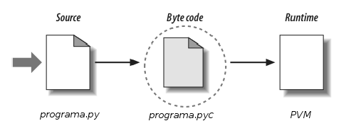

# O que é Python

## Python

Python é uma linguagem de programação interpretada, orientada a objetos, de alto nível e com semântica dinâmica. A simplicidade do Python reduz a manutenção de um programa. Python suporta módulos e pacotes, que encoraja a programação modularizada e reuso de códigos.

É uma das linguagens que mais tem crescido devido sua compatibilidade (roda na maioria dos sistemas operacionais) e capacidade de auxiliar outras linguagens. Programas como _Dropbox_, _Reddit_ e _Instagram_ são escritos em Python. Python também é a linguagem mais popular para análise de dados e conquistou a comunidade científica.

Mas antes que você se pergunte o que cada uma dessas coisas realmente significa, vamos começar a desbravar o mundo Python e entender como funciona essa linguagem de programação que tem conquistado cada vez mais adeptos.

## Breve História

Python foi criada em 1990 por Guido Van Rossum no Centro de Matemática Stichting (CWI, veja http://www.cwi.nl) na Holanda como uma sucessora da linguagem ABC. Guido é lembrado como o principal autor de Python, mas outros programadores ajudaram com muitas contribuições.

A linguagem ABC foi desenhada para uso de não programadores, mas logo de início mostrou certas limitações e restrições. A maior reclamação dos primeiros alunos não programadores dessa linguagem era a presença de regras arbitrárias que as linguagens de programação haviam estabelecido tradicionalmente - muita coisa de baixo nível ainda era feita e não agradou o público.

Guido então se lançou na tarefa de criar uma linguagem de script simples que possuísse algumas das melhores propriedades da ABC. Listas Python, dicionários, declarações básicas e uso obrigatório de indentação - conceitos que aprenderemos neste curso -  diferenciam Python da linguagem ABC. Guido pretendia que Python fosse uma segunda linguagem para programadores C ou C++ e não uma linguagem principal para programadores - o que mais tarde se tornou para os usuários de Python.

Em 1995, Guido continuou seu trabalho em Python na Corporation for National Research Initiatives (CNRI, veja http://www.cnri.reston.va.us/) in Reston, Virginia onde ele lançou outras versões da linguagem.

Em maio de 2000, Guido e o time principal de Python se mudaram para a BeOpen.com para formar o time BeOpen PythonLabs. Em outubro do mesmo ano, o time da PythonLabs se moveu para a Digital Creations (hoje, Zope Corporation, veja http://www.zope.org/). Em 2001, a Python Software Foundation (PSF, veja http://www.python.org/psf/), uma organização sem fins lucrativos, foi formada especialmente para manter a linguagem e hoje possui sua propriedade intelectual. A Zope Corporation é um membro patrocinador da PSF.

Todos os lançamentos de Python são de código aberto (veja http://www.opensource.org).

## Interpretador

Você provavelmente já ouviu ou leu em algum lugar que Python é uma linguagem interpretada ou uma linguagem de script. Em certo sentido, também é verdade que Python é tanto uma linguagem interpretada quanto uma linguagem compilada. Um compilador traduz linguagem Python em linguagem de máquina - código Python é traduzido em um código intermediário que deve ser executado por uma máquina virtual conhecida como PVM (Python Virtual Machine). É muito similar ao Java - há ainda um jeito de traduzir programas Python em _bytecode_ Java para JVM (Java Virtual Machine) usando a implementação Jython.

O interpretador faz esta 'tradução' em tempo real para código de máquina, ou seja, em tempo de execução. Já o compilador traduz o programa inteiro em código de máquina de uma só vez e então o executa, criando um arquivo que pode ser rodado (executável). O compilador gera um relatório de erros (casos eles existam) e o interpretador interrompe a tradução quando encontra um primeiro erro.

Em geral, o tempo de execução de um código compilado é menor que um interpretado já que o compilado é inteiramente traduzido antes de sua execução. Enquanto o interpretado é traduzido instrução por instrução. Python é uma linguagem interpretada mas, assim como Java, passa por um processo de compilação. Um código fonte Java é primeiramente compilado para um _bytecode_ e depois interpretado por uma máquina virtual.

Mas devemos compilar script Python? Como compilar? Normalmente, não precisamos fazer nada disso porque o Python está fazendo isso para nós, ou seja, ele faz este passo automaticamente. Na verdade, é o interpretador Pyhton, o CPython.  A diferença é que em Java é mais clara essa separação, o programador compila e depois executa o código.

CPython é uma implementação da linguagem Python. Para facilitar o entendimento, imagine que é um pacote que vem com um compilador e um interpretador Python (no caso, uma Máquina Virtual Python) além de outras ferramentas para usar e manter o Python. CPython é a implementação de referência (a que você instala do site http://python.org).

## Qual versão utilizar?

Para quem está começando, a primeira dúvida na hora da instalação é qual versão do Python devemos baixar. Aqui, depende do que se deseja fazer. O Python3 ainda possui algumas desvantagens em relação a versão 2, como o suporte de bibliotecas (que é mais reduzido) e pelo fato da maioria das distribuições Linux e o MacOS ainda utilizarem a versão 2 como padrão em seus sistemas. Porém, o Python3 é mais maduro e mais recomendável para o uso.

Existem casos que exigem o Python2 ao invés do Python3 como implementar algo em um ambiente que o programador não controla ou quando precisa utilizar algum pacote/módulo específico que não possui versão compatível com Python3. Vale ressaltar para quem deseja utilizar uma implementação alternativa do Python, como o IronPython ou Jython, que o suporte ao Python3 ainda é bastante limitado.

Atualmente existe a ferramenta **_2to3_** que permite que código Python3 seja gerado a partir de código Python2. Há também a ferramenta **_3to2_**, que visa converter o código Python3 de volta ao código Python2. No entanto, é improvável que o código que faz uso intenso de recursos do Python3 seja convertido com sucesso.

> **Para saber mais: módulo future**
>
> O módulo future do Python2 contém bibliotecas que fazem uma ponte entre as versões anteriores e as mais recentes.
> Basta importar e biblioteca **future**:
>
> ```python
>	>>> import __future__
> ```
>
> Para que várias ferramentas disponíveis na versão 3 funcionem na versão 2, ou seja, o módulo `__future__`
> permite usar funcionalidades do Python3 no Python2. Mas cuidado, algumas funcionalidades são sobrescritas
> e é importante sempre checar a documentação: https://docs.python.org/3/library/\_\_future\_\_.html
>

Optamos pelo uso da versão mais recente para este curso, a versão 3.6, e vamos introduzir as diferenças da versão Python2 em comentários durante os capítulos e nos apêndices da apostila.

## Download

Como dito acima, o Python já vem instalado nos sistemas Linux e Mac OS, mas será necessário fazer o download da última versão (Python 3.6) para acompanhar a apostila. O Python não vem instalado por padrão no Windows e o download deverá ser feito no site https://www.python.org/ , além de algumas configurações extras (veja apêndice desta apostila sobre instalação).

## Cpython, Jython, IronPython?

Existem outras implementações da linguagem como o Jython e o IronPython. A diferença é que estas implementações são apenas os compiladores. O _bytecode_ gerado pelo Jython é interpretado por uma JVM (Java Virtual Machine) e o _bytecode_ do IronPython por uma Virtual Machine .NET.

Outra implementação que vem crescendo é o PyPy, uma implementação escrita em Python que possui uma Virtual Machine Python. É mais veloz do que o CPython e vem com a tecnologia JIT (Just In Time) que já "traduz" o código fonte em código de máquina.

O Compilador Python traduz um *programa.py* para _bytecode_ - ele cria um arquivo correspondente chamado *programa.cpy*. Se quisermos ver o _bytecode_ pelo terminal, basta usar o módulo *disassembler* (dis) que suporta análise do _bytecode_ do CPython, desmontando-o. Você pode checar a documentação aqui: https://docs.python.org/3/library/dis.html.

## PEP - O que são e pra que servem

PEP, _Python Enhancement Proposals_ ou Propostas para Melhoramento no Python, como o nome diz são propostas de aprimoramento ou de novas funcionalidades para a linguagem. Qualquer um pode escrever uma proposta e a comunidade Python testa, avalia e decide se deve ou não fazer parte da linguagem. Caso aprovado, o recurso é liberado para as próximas versões.

No site oficial do Python (https://www.python.org/) você pode checar todas as PEPs da linguagem. A PEP 0 é aquela que contém o índice de todas as propostas de aprimoramento do Python e pode ser acessada aqui: https://www.python.org/dev/peps.

Ao longo do curso, de acordo com a aprendizagem e uso de certas funcionalidades, citaremos algumas PEPs mais importantes.

## Onde usar e objetivos

Python é uma linguagem de propósito geral. Muitas vezes precisamos lidar com tarefas laterais: buscar dados em um banco de dados, ler uma página na internet, exibir graficamente os resultados, criar planilhas etc. E Python possui vários módulos prontos para realizar essas tarefas.

Por esse e outros motivos que Python ganhou grande popularidade na comunidade científica. Além disso, Python é extremamente legível e uma linguagem expressiva, ou seja, de fácil compreensão. As ciências, por outro lado, possuem raciocínio essencialmente complicado e seria um problema adicional para cientistas conhecerem, além de seu assunto de pesquisa, assuntos complexos de um programa de computador como alocação de memória, gerenciamento de recursos etc. O Python faz isso automaticamente de maneira eficiente, possibilitando o cientista se concentrar no problema estudado.

## Primeiro programa

Vamos para nosso primeiro código! Um programa que imprime uma mensagem simples.

Para mostrar uma mensagem específica, fazemos:

 ```python
	print('Minha primeira aplicação Python!')
 ```

Certo, mas onde digitar esse comando? Como rodar uma instrução Python?

## Modo Interativo

Iremos, primeiro, aprender o **modo interativo** utilizando o terminal (Linux e MacOS) ou o prompt de comando (Windows) para rodar o programa acima. Abra o terminal e digite:

 ```bash
	dev@caelum:~$ python3
 ```

Isso vai abrir o modo interativo do Python na versão 3.6 da linguagem, também chamado de console do Python. Após digitar este comando, as seguintes linhas irão aparecer no seu console:

 ```python
	Python 3.6.4 (default, Jan 28 2018, 00:00:00)
	[GCC 4.8.4] on linux
	Type "help", "copyright", "credits" or "license" for more information.
	>>>
 ```

A primeira linha indica que a versão utilizada do Python é a versão 3.6.4. A segunda indica o sistema operacional (no caso, o Linux). A terceira mostra algumas palavras chaves do interpretador para acessar algumas informações - digite alguma delas e aperte `ENTER` para testar.

O **'\>\>\>'** indica que entramos no modo interativo do Python e basta começar a escrever os comandos. Vamos então escrever nosso primeiro programa Python:

 ```python
	>>> print('Minha primeira aplicação Python!')
 ```

Ao apertar `ENTER`, temos:

 ```python
	>>> print('Minha primeira aplicação Python!')
	Minha primeira aplicação Python!
 ```

O **print()** é uma **função** do Python utilizada para imprimir alguma mensagem na tela. Mais detalhes sobre funções são tratados em um capítulo específico desta apostila. Neste momento, entenda uma função como uma funcionalidade pronta que a linguagem fornece.

Uma mensagem deve estar delimitada entre aspas simples ('') ou duplas (""), como feito no exemplo acima com a mensagem: 'Minha primeira aplicação Python!'. O interpretador, no modo interativo, já vai mostrar a saída deste comando no console, logo abaixo dele.

Mas e se um programa possuir 1.000 linhas de código? Teremos que digitar essas mil linhas todas as vezes para rodar o programa? Isso, obviamente, seria um problema. Existe outro modo de desenvolvimento no Python mais utilizado, que evita digitar um programa longo no console toda vez que precisar executá-lo.

## Modo Script

O modo interativo é mais utilizado para testes, enquanto que o **modo script** é mais comumente utilizado na hora de desenvolver. No modo script, isolamos o código Python em um arquivo com extensão **.py**. Dessa maneira, o código é escrito uma única vez e executado pelo interpretador através do comando **python3** (ou o comando **python** se estiver utilizando o Python2).

Abra um editor de texto de sua preferência e escreva o programa anterior nele:

 ```python
	print('Minha primeira aplicação Python!')
 ```

  

Salve o arquivo como **programa.py**. Para executá-lo, abra o terminal, navegue até o diretório onde se encontra o arquivo **programa.py** e digite:

 ```bash
	dev@caelum:~$ python3 programa.py
 ```

Ao apertar `ENTER`, vai aparecer no console:

 ```bash
	dev@caelum:~$ python3 programa.py
	Minha primeira aplicação Python!
 ```

Veja que agora isolamos o código em uma arquivo e o executamos através do comando **python3**. Mas não devemos compilar script Python? Como compilar?

Normalmente não precisamos fazer nada disso porque o Python está fazendo isso nos bastidores, ou seja, ele faz este passo automaticamente. Se por algum motivo você queira compilar um programa Python manualmente, você deve usar o módulo **py_compile** no console do Python:

 ```python
	>>> import py_compile
	>>> py_compile.compile('programa.py')
	'__pycache__/programa.cpython-34.pyc'
 ```

O comando **import** importa o módulo **py_compile** que disponibiliza a função **compile()**. Ou podemos obter o mesmo resultado utilizando o seguinte comando no terminal:

 ```bash
	dev@caelum:~$ python3 -m py_compile programa.py
 ```

Também é possível compilar todos os arquivos Python de uma única vez, usando o módulo **compileall**:

 ```bash
	dev@caelum:~$ python3 -m compileall
 ```

Entretanto, estes passos não são necessários. O processo de compilação é feito automaticamente e não é preciso repetir todo este processo para rodar um programa Python.

Apenas rodando o programa, sem precisar compilá-lo, note que uma nova pasta chamada "\_\_pycache\_\_" é criada (caso ela não exista) no mesmo diretório que o programa foi executado. Dentro desta pasta é criado um arquivo **programa.cpython-34.pyc** - esta é a versão compilada do programa, o código _bytecode_ gerado pelo CPython.

Sempre que um programa Python é chamado, o Python checará se existe uma versão compilada com a extensão **.pyc** - este arquivo deve ser mais novo do que o de extensão **.py** (se o arquivo existir). O Python vai carregar o _bytecode_, o que vai acelerar o script. Caso não exista a versão _bytecode_, o Python criará o arquivo _bytecode_ antes de iniciar a execução do programa. A execução de um programa Python significa a execução de um código _bytecode_ na Python Virtual Machine.



Toda vez que um script Python é executado, um código _bytecode_ é criado. Se um script Python é importado como um módulo, o _bytecode_ vai armazenar seu arquivo **.pyc** correspondente.

Portanto, o passo seguinte não criará o arquivo _bytecode_, já que o interpretador vai verificar que não existe nenhuma alteração:

 ```bash
	dev@caelum:~$ python programa.py
	Minha primeira aplicação Python!
	dev@caelum:~$
 ```

## Exercício: Modificando o programa

1. Altere o programa para imprimir uma mensagem diferente.


1. Altere seu programa para imprimir duas linhas de código utilizando a função `print()`.


1. Sabendo que os caracteres `\n` representam uma quebra de linha, imprima duas linhas de texto usando uma única linha de código.


## O que pode dar errado?

Nem sempre as coisas acontecem como esperado. O Python tem uma sintaxe própria, um vocabulário próprio. Digitar algo que o interpretador não entende causará um erro no programa. Vejamos alguns exemplos:

### Esquecer os parênteses

 ```python
	>>> print 'Minha primeira aplicação Python!'
	Traceback (most recent call last):
	File "<stdin>", line 1
    	print 'Minha primeira aplicação Python!'
                			^
	SyntaxError: Missing parentheses in call to 'print'. Did you mean print('Minha primeira aplicação Python!')?
 ```

Não se assuste com a mensagem. Vamos entender o que ela quer dizer. Na primeira linha aparece a palavra `Traceback` que significa algo como: "O que o programa estava fazendo quando parou porque algo de errado aconteceu?". É por este motivo que a mensagem `most recent call last` (chamada mais recente) é mostrada.

A `Traceback` faz referência a um arquivo - que é o nome do arquivo Python chamado acima pelo nome de `stdin` que possui métodos para leitura, onde o programa lê a entrada do teclado. O programa acusa que este erro está na primeira linha do programa: `File "<stdin>", line 1`.

Logo em seguida é mostrado exatamente a parte do código que gerou o erro:
`print 'Minha primeira aplicação Python!'`. A próxima linha é a mensagem de erro: `SyntaxError`. Se você não faz a menor ideia do que esta mensagem significa é um bom começo e uma boa prática durante a aprendizagem pesquisar a respeito dela na internet, assim como demais erros que possam surgir.

Neste caso, é um `SyntaxError`, ou seja, `Erro de Sintaxe` - o Python não entendeu o que foi digitado. A mensagem diz que faltam os parênteses! Então, é fácil achar um erro quando ele acontece.

Algumas vezes você verá a palavra `Exception` em uma mensagem de erro. Uma `Exception` é um problema que ocorre enquanto o código está sendo executado. Já o `SyntaxError` é um problema detectado quando o Python verifica o código antes de executá-lo, ou seja, em tempo de compilação.

### Esquecer de fechar os parênteses

O interpretador vai aguardar (continuar imprimindo reticências cada vez que a tecla `ENTER` for apertada) até que o parêntese seja fechado:

 ```python
	>>> print('Minha primeira aplicação Python!'
	...
	...
	...
 ```

Neste caso não é uma exceção ou erro, a não ser que você digite qualquer outra coisa que não um fechamento de parêntese e aperte a tecla `ENTER`.

### Esquecer de colocar a mensagem entre aspas (simples ou duplas)

 ```python
	>>>	print(Minha primeira aplicação Python!)
	  File "<stdin>", line 1
    print(Minha primeira aplicação Python!)
                     ^
	SyntaxError: invalid syntax
 ```

Mais uma vez acusa erro de sintaxe.

Estes foram alguns erros que o programa pode gerar por desatenção do programador. São mais comuns de acontecer do que se imagina. Outros erros serão abordados em um capítulo específico desta apostila. Neste momento, iremos aprender outros recursos que a linguagem Python oferece, e nos familiarizar com sua sintaxe.
