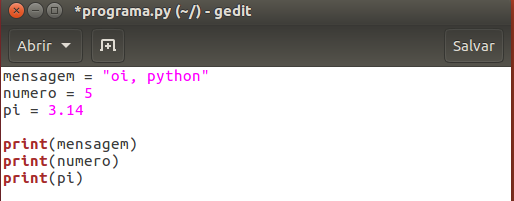

# Variáveis e tipos embutidos

Neste capítulo vamos conhecer os tipos da biblioteca padrão do Python. Os principais tipos internos são números, sequências, mapas, classes, objetos e exceções, mas iremos focar primeiramente nos números e sequências de texto (_strings_). São objetos nativos da linguagem, recursos que já vêm prontos para uso e chamados de _built-ins_.

Neste início da aprendizagem, trabalharemos com o modo interativo, e ao final produziremos uma pequena aplicação em um script.

## Tipos embutidos (_built-ins_)

Um valor, como um número ou texto, é algo comum em um programa. Por exemplo, '_Hello, World!_', 1, 2, todos são valores. Estes valores são de diferentes tipos: 1 e 2 são números inteiros e '_Hello World!_' é um texto, também chamado de **_String_**. Podemos identificar **strings** porque são delimitadas por aspas (simples ou duplas) - e é exatamente dessa maneira que o interpretador Python também identifica uma **string**.

A função `print()` utilizada no capítulo anterior também trabalha com inteiros:

 ```python
	>>> print(2)
	2
 ```

  

Veja que aqui não é necessário utilizar aspas por se tratar de um **número**. Caso você não tenha certeza qual é o tipo de um valor, pode usar a função `type()` para checar:

 ```python
	>>> type('Hello World')
	<class 'str'>

	>>> type(2)
	<class 'int'>
 ```

  

_Strings_ são do tipo `str` (abreviação para *string*) e inteiros do tipo `int` (abreviação para *integer*). Ignore a palavra `class` por enquanto, teremos um capítulo especial para tratar dela. Veremos que funções como `type()` e `print()` também são tipos embutidos no Python.

Outro tipo que existe no Python são os números decimais que são do tipo `float` (ponto flutuante):

 ```python
	>>> type(3.2)
	<class 'float'>
 ```

  

E qual será o tipo de valores como '2' e '3.2'? Eles se parecem com números mas são delimitados por aspas como *strings*. Utilize a função `type()` para fazer a verificação:

 ```python
	>>> type('2')
	<class 'str'>

	>>> type('3.2')
	<class 'str'>
 ```

  

Como estão delimitados por aspas, o interpretador vai entender esses valores como _strings_, ou seja, como texto.

O Python também possui um tipo específico para números complexos. Números complexos são definidos por dois valores: a parte real e a parte imaginária. No Python é escrito na forma **real + imag j**. No caso, o número imaginário (definido pela raiz de -1 e chamado de 'i' na matemática) é designado pela letra `j` no Python. Por exemplo:

 ```python
	>>> 2 + 3j
	>>> type(2 + 3j)
	<class 'complex'>
 ```

  

2 é a parte real e 3 a parte imaginária do número complexo. Utilizando a função `type()`, podemos nos certificar que seu tipo é `complex`.

## Variáveis

Podemos pedir para o Python lembrar de um valor que queiramos utilizar em outro momento do programa. O Python vai guardar este valor em uma **variável**. Variável é um nome que faz referência a um valor. É como uma etiqueta que colocamos naquele valor e quando precisarmos usar, chamamos pelo nome que foi dado na etiqueta.

Um comando de atribuição (o sinal de igualdade `=`) cria uma nova variável e atribui um valor a ela:

 ```python
	>>> mensagem = 'oi, python'
	'oi, python'

	>>> numero = 5
	5

	>>> pi = 3.14
	3.14
 ```

Três atribuições foram feitas neste código. Atribuímos a variável `mensagem` uma *string*; a variável `numero` um inteiro e a variável `pi` um valor aproximado do número pi. No modo interativo, o interpretador mostra o resultado após cada atribuição.

Para recuperar esses valores, basta chamar pelos nomes das variáveis definidas anteriormente:

 ```python
	>>> mensagem
	oi, python

	>>> numero
	5

	>>> pi
	3.14
 ```

  

Utilize a função `type()` para verificar seus tipos:

 ```python
	>>> type(mensagem)
	<class 'str'>

	>>> type(numero)
	<class 'int'>

	>>> type(pi)
	<class 'float'>
 ```

  

## Para saber mais: Nomes de variáveis

Programadores escolhem nomes para variáveis que sejam semânticos e que ao mesmo tempo documentem o código. Esses nomes podem ser bem longos, podem conter letras e números. É uma convenção entre os programadores Python começar a variável com letras minúsculas e utilizar o underscore (`_`) para separar palavras como: **meu_nome**, **numero_de_cadastro**, **telefone_residencial**. Esse padrão é chamado de ***snake case***. Variáveis também podem começar com underscore (`_`) mas deve ser evitado e utilizado em casos mais específicos.

Se nomearmos nossas variáveis com um nome ilegal, o interpretador vai acusar um erro de sintaxe:

 ```python
	>>> 1nome = 'python'
	  File "<stdin>", line 1
	  1nome = 'python'
		^
	SyntaxError: invalid syntax

	>>> numero@ = 10
	  File "<stdin>", line 1
	  numero@ = 10
	  	^
	SyntaxError: invalid syntax

	>>> class = 'oi'
	  File "<stdin>", line 1
	  class = oi
		^
	SyntaxError: invalid syntax
 ```

`1nome` é ilegal porque começa com um número, `numero@` é ilegal porque contém um caractere especial (o *@*) considerado ilegal para variáveis. E `class` é ilegal porque `class` é uma **palavra chave** em Python. O interpretador utiliza palavras chaves como **palavras reservadas** da linguagem, como um vocabulário próprio.

Python possui 33 palavras reservadas:

 ```
 and		del		    from		None		True
 as		    elif		global		nonlocal	try
 assert		else		if		    not		    while
 break		except		import		or		    with
 class		False		in		    pass		yield
 continue   finaly		is		    raise		def
 for		lambda		return
 ```

Portanto, não podemos utilizar essas palavras para nomear nossas variáveis.

## Instruções

Uma instrução (ou comando) é uma unidade de código que o Python pode executar. Por exemplo, a função `print()` para imprimir uma mensagem na tela é um comando:

 ```python
	>>> print("Hello, World!")
	Hello, World!
 ```

  

Quando executamos um comando no modo interativo, o interpretador Python apresenta o resultado, caso exista, deste comando. Um script contém uma sequência de instruções. Se existir mais de um comando, os resultados vão aparecendo durante a execução do programa:

 ```python
	print(1)
	x = 2
	print(x)
 ```

E produz a saída:

 ```python
	1
	2
 ```

   

Para rodar um script em Python, é preciso concentrar esses comandos em um mesmo lugar e pedir para o interpretador executá-los. Criamos um arquivo de extensão **.py** com estes comandos, como aprendemos no capítulo anterior.

Arquivo **programa.py**:



Note que devemos utilizar a função `print()` para exibir os resultados na tela já que o modo script, diferente do modo interativo, não exibe os resultados após a declaração de variáveis.

Navegue até o diretório onde se encontra o arquivo **programa.py** e digite o comando no terminal:

 ```bash
	dev@caelum:~$ python3 programa.py
 ```

Que vai gerar a saída:

 ```bash
	dev@caelum:~$ python3 programa.py
	oi, python
	5
	3.14
 ```

## Operadores Aritméticos

Operadores são símbolos especiais que representam cálculos como adições e multiplicações. Para fazer cálculos com números utilizamos os operadores +, -, \*, / e \*\* que representam, respectivamente, adição, subtração, multiplicação, divisão e potenciação.

Uma expressão é uma combinação de valores, variáveis e operadores, como `x + 17`, `1 + 1` etc. Quando digitamos uma expressão no modo interativo, o interpretador vai calcular e imprimir o resultado:

 ```python
	>>> 1 + 1
	2

	>>> 2 * 3
	6
 ```

  

Também podemos usar variáveis:

 ```python
	>>> x = 1
	>>> y = 3
	>>> x + y
	4

	>>> x - y
	-2

	>>> x * y
	3

	>>> x / y
	0.3333333333333333

	>>> x ** y
	1
 ```

  

Além dos operadores comentados, temos também o operador // que representa a divisão inteira:

 ```python
	>>> 7 // 2
	3
 ```

  

E o operador módulo % que resulta no resto da divisão entre dois números inteiros:

 ```python
	>>> 7 % 3
	1
 ```

  

7 divido por 3 é 2 e gera resto igual a 1. Esse operador é bem útil quando queremos checar se um número é divisível por outro.

Os principais operadores são:

| Operação  | Nome            |  Descrição                       |
|-----------|-----------------|----------------------------------|
|  a + b    | adição          | Soma entre _a_ e _b_             |
|  a - b    | subtração       | Diferença entre _a_ e _b_        |
|  a \* b   | multiplicação   | Produto entre _a_ e _b_          |
|  a / b    | divisão         | Divisão entre _a_ e _b_          |
|  a // b   | divisão inteira | Divisão inteira entre _a_ e _b_  |
|  a % b    | módulo          | Resto da divisão entre _a_ e _b_ |
|  a \*\* b | exponenciação   | _a_ elevado a potência de _b_    |

## Strings

O operador `+` também funciona com _strings_ de uma maneira diferente dos números. Ele funciona **concatenando** _strings_, ou seja, juntando duas _strings_:

 ```python
	>>> texto1 = 'oi'
	>>> texto2 = 'Python'
	texto1 + texto2
	oiPython
 ```

  

O operador `*` também funciona com _strings_, multiplicando seu conteúdo por um inteiro. Vamos checar esse resultado:

 ```python
	>>> texto1 = 'python '
	>>> texto1 * 3
	python python python
 ```

Ao multiplicarmos por 3, o Python replica a _string_ três vezes. Note a presença de um espaço após terminar de escrever a palavra na _string_. Caso o mesmo não estivesse presente, todas as palavras geradas ficariam "grudadas", ou seja, não haveria uma separação automática entre as mesmas.
  

 _Strings_ possuem muitas funcionalidades prontas chamadas de métodos. O método `upper()`, por exemplo, retorna o texto em letras maiúsculas. Já o método `capitalize()` retorna o texto capitalizado (com a primeira letra em maiúscula):

 ```python
	>>> texto1.upper()
	'PYTHON'

	>>> texto1.capitalize()
	'Python'
 ```

  

Outras funcionalidades de _strings_ estão presentes na documentação que pode ser acessada neste link: https://docs.python.org/3/library/stdtypes.html#string-methods

## Entrada do usuário

Agora vamos criar mais interatividade e pedir para o usuário entrar com um valor digitado do teclado.

O Python possui uma função que captura a entrada de valores: a função `input()`. Quando essa função é chamada, o programa para e espera o usuário digitar alguma coisa. Quando o usuário aperta a tecla `ENTER`, o programa processa e imprime o valor digitado em forma de _string_:

 ```python
	>>> entrada = input()
	'oi pyhton'

	>>> print(entrada)
	'oi python'
 ```

Mas o ideal é pedir algo específico ao usuário e dizer qual dado queremos receber. Podemos passar uma _string_ para a função `input()`:

```python
	>>> nome = input("digite seu nome:\n")
	digite seu nome:
	caelum

	>>> print(nome)
	caelum
```

O `\n` no final representa uma nova linha e o interpretador vai quebrar uma linha após imprimir a _string_. Por este motivo, o valor digitado pelo usuário aparece na próxima linha.

Com o conteúdo aprendido até aqui já é possível começar a escrever o primeiro script. Crie um arquivo **programa2.py** e acrescente um código que vai pedir que o usuário entre com algum valor e, em seguida, o programa deve imprimir este valor.

Arquivo **programa2.py**:

 ```python
	numero = input('Digite um número:\n')
	print(numero)
 ```

Podemos melhorar e imprimir uma mensagem como _O número digitado foi <numero>_:

 ```python
	numero = input('Digite um número:\n')
	print('O número digitado foi ' + numero)
 ```

Concatenamos a _string_ com a variável `numero` utilizando o operador `+`. Agora, se o usuário digitar o número 2, a saída será *O número digitado foi 2*. Outra maneira mais elegante é usar a função `format()`:

 ```python
	print('O número digitado foi {}'.format(numero))
 ```

A função `format()` vai substituir o `{}` pela variável `numero`. A princípio, pode parecer uma alternativa pior, já que escrevemos mais código para conseguir o mesmo resultado. Todavia, a função `format()` fornece mais facilidades. Suponha que o programa receba dois valores digitados pelo usuário e os imprima em uma única mensagem:

 ```python
	nome = input('Digite seu nome ')
	idade = input('Digite sua idade ')
	print('Seu nome é {} e sua idade é {}'.format(nome, idade))
 ```

Veja que essa forma facilita a impressão e formatação dos dados uma vez que não quebra a _string_ em várias partes como a concatenação faz. Além de que, com o operador `+`, sempre temos que lembrar dos espaços em branco entre as palavras:

 ```python
	print('Seu nome é ' + nome + ' e sua idade é ' + idade)
 ```

Neste caso a função `format()` é mais recomendada e facilita na impressão de mensagens na tela. Agora o script está melhor e podemos executá-lo pelo terminal:

 ```bash
	dev@caelum:~$ python3 programa2.py
 ```

A saída:

 ```bash
	digite seu nome:
	caelum
	digite sua idade:
	20
	Seu nome é caelum e sua idade é 20
 ```

> **Para saber mais: a função format()**
>
> A função `format()` faz parte de um conjunto de funções de formatação de _strings_ chamada **Formatter**. Para mais
> detalhes, acesse a documentação: https://docs.python.org/3/library/string.html#string.Formatter.
>
> Há outras funções de formatação e a `format()` é a principal delas e a mais utilizada. Com ela, podemos passar qualquer tipo de parâmetro, além de ser extremamente útil 
> para formatar números passando seu _format code_. Por exemplo, podemos
> arredondar o número flutuante 245.2346 para duas casas decimais através do código de formatação `:.2f`:
>
> ```python
>		>>> x = 245.2346
>		>>> print('{:.2f}'.format(x))
>		245.23
>	```
>
> O `:.2f` diz que queremos apenas duas casas decimais para a variável `x`. Na documentação oficial do Python você acessa
> os códigos de formatação ou através da PEP 3101: https://www.python.org/dev/peps/pep-3101/.

  

## Constantes

O Python possui poucas constantes embutidas. As mais utilizadas são **True**, **False** e **None**. Essas também são palavras chaves do Python, portanto palavras reservadas que não podemos utilizar como nomes de variáveis.

`True` e `False` são valores **booleanos** que representam, respectivamente, **verdadeiro** e **falso**. O Python também possui a função `bool()`, que retorna `True` quando o argumento passado é verdadeiro e retorna `False`, caso contrário.

Podemos representar `True` e `False` através de expressões. Por exemplo "O número 1 é igual a _string_ '1'?". Vamos perguntar ao Python:

 ```python
	>>> 1 == '1'
	False
 ```

```python
print(1 == '1')
```

O operador `==` é usado para verificar se algo é igual a outro. Não confundir com o `=`, que atribui um valor a uma variável. Também podemos verificar se um número é maior, utilizando o operador `>`, ou menor (`<`) do que outro:

 ```python
	>>> 2 > 1
	True

	>>> 2 < 1
	False
 ```

  

Podemos também utilizar a função `bool()` para fazer a verificação:

 ```python
	>>> bool(3 > 5)
	False

	>>> bool(1 == 1)
	True
 ```

  

O comando `bool()` não recebe apenas expressões, ele pode receber qualquer coisa e vai responder se tal valor é considerado `True` ou `False`:

 ```python
	>>> bool(0)
	False

	>>> bool('')
	False

	>>> bool(None)
	False

	>>> bool(1)
	True

	>>> bool(-100)
	True

	>>> bool(13.5)
	True

	>>> bool('teste')
	True

	>>> bool(True)
	True
 ```

  

Repare que a função resulta `False` em _strings_ vazias, quando um número é zero ou quando é `None`. Ainda não falamos o que o `None` representa. O `None` é um valor do tipo `NoneType`, e é usado para representar a abstenção de um valor - como quando um argumento padrão não é passado para uma função (que veremos em outro capítulo).

 ```python
	type(None)
	<class 'NoneType'>
 ```

   

Em outras linguagens de programação, é comum utilizar a palavra **Null** para representar a abstenção de valor. Para programadores mais experientes e com algum conhecimento em linguagens como Java e C#, é importante observar que diferente do **Null**, o **None** ocupa espaço na memória, é um objeto com referência.

No exemplo acima foram utilizados três operadores diferentes daqueles já vistos anteriormente: o `==` (igual),  o `>` (maior do que) e o `<` (menor do que). Estes operadores não são aritméticos, são conhecidos por **operadores de comparação**. O Python possui mais operadores deste tipo:

| Operação |  Descrição                |
|----------|---------------------------|
| a == b   | _a_ igual a _b_           |
| a != b   | _a_ diferente de _b_      |
| a < b    | _a_ menor do que _b_      |
| a > b    | _a_ maior do que _b_      |
| a <= b   | _a_ menor ou igual a _b_  |
| a >= b   | _a_ maior ou igual a _b_  |

Outros operadores que retornam valores **booleanos** são:

| Operação   |  Descrição                           |
|------------|--------------------------------------|
| a is b     | True se *a* e *b* são idênticos      |
| a is not b | True se *a* e *b* não são idênticos  |
| a in b     | True se *a* é membro de *b*          |
| a not in b | True se *a* não é membro de *b*      |

É importante saber que os operadores `==` e `is` funcionam de maneira diferente. Vamos usar o exemplo de duas listas e checar se elas são iguais:

 ```python
	>>> x = [1, 2, 3]
	>>> y = [1, 2, 3]
	>>> x == y
	True

	>>> x is y
	False
 ```

  

O operador `==` checa se o conteúdo das variáveis são iguais e seu comportamento pode variar de interpretador para interpretador - o exemplo acima é o comportamento padrão do CPython. Já o operador `is` checa se `a` e `b` são o mesmo **objeto**. Falaremos de objetos em um outro capítulo, mas é importante ter em mente que tudo em Python é um objeto e cada objeto possui uma referência na memória. O operador `is` vai checar exatamente se `x` e `y` são o mesmo objeto, ou seja, se possuem a mesma referência.

## Comando if

E se quisermos apresentar uma mensagem diferente para o usuário dependendo do valor de entrada? Vamos atribuir um valor para uma variável `numero` e pedir para o usuário entrar com um valor. Devemos verificar se os valores são iguais como um jogo de adivinhação em que o usuário deve adivinhar o número definido.

 ```python
	numero = 42
	chute = input('Digite um número: ')
 ```

Até aqui, nenhuma novidade. Agora, devemos mostrar a mensagem "Você acertou" caso o `numero` seja igual ao `chute`, e "Você errou" caso o `numero` seja diferente do `chute`. Em português, seria assim:

 ```python
	Se chute igual a número: "Você acertou"
	Se chute diferente de número: "Você errou"
 ```

Ou melhor:

 ```python
	Se chute igual a número: "Você acertou"
	Senão: "Você errou"
 ```

Podemos traduzir isso para código Python. O Python possui o operador condicional para representar a palavra **se** que é o **if** e a palavra **senão** que é o **else**. A sintaxe ficaria:

 ```python
	if chute == numero:
	print('Você acertou')
	else:
	print('Você errou')
 ```

Este código ainda não funciona porque o Python entende as instruções `if` e `else` como blocos e os blocos devem seguir uma **indentação**. Como `print('Você acertou')` é a instrução que deve ser executada caso a verificação do `if` seja verdadeira, devemos ter um recuo para a direita em quatros espaços:

 ```python
	if chute == numero:
	   print('Você acertou')
	else:
	   print('Você errou')
 ```

Caso contrário, o interpretador vai acusar erro de sintaxe. Dessa maneira, o código fica mais legível e o que em outras linguagens é uma escolha do programador, o Python te obriga a fazer forçando, desta maneira, a organizar o código. Tudo que estiver no bloco da primeira condição (do `if`) deve estar indentado, ou seja, recuado para direita. Assim como as instruções que estiverem no bloco do `else`.

No fim, nosso programa, que salvaremos em um arquivo chamado **adivinhacao.py** fica:

 ```python
	numero = 42
	chute = input('Digite um número: ')

	if chute == numero:
	   print('Você acertou')
	else:
	   print('Você errou')
 ```

  

E executamos no terminal:

 ```bash
	dev@caelum:~$ python3 adivinhacao.py
	Digite um número:
	25
	Você errou
 ```

Note que a condição de um **if** deve ser um booleano, ou seja, **True** ou **False**. Passamos a expressão `chute == numero` que vai checar se ela é verdadeira ou não. Caso seja verdadeira, vai executar o código dentro do bloco do **if**, senão, vai executar o código dentro do **else**. Agora, vamos chutar o número 42 e verificar se tudo está funcionando:

 ```bash
	dev@caelum:~$ python3 adivinhacao.py
	Digite um número:
	42
	Você errou
 ```

Algo de errado aconteceu! Digitamos o número correto e mesmo assim o programa não funcionou como esperado. Vamos entender o que aconteceu.

## Convertendo uma string para inteiro

A função `input()` lê o valor digitado pelo usuário como uma *string*.

 ```python
	chute = input('Digite um número: ')
 ```

Se o usuário digitar o número 42, a variável `chute` vai guardar o valor `"42"`, ou seja, um texto. Podemos checar isso através da função `type()` que retorna o tipo da variável. Vamos testar isso no terminal:

 ```python
	>>> chute = input('Digite um número: ')
	Digite um número: 42
	>>> type(chute)
	<class 'str'>
 ```

Agora fica mais claro porque o programa não está funcionando como o esperado. Quando o interpretador verificar `chute == numero` vai retornar **False** já que `"42"` (texto) é diferente de 42 (número).

Para funcionar, precisamos **converter** a _string_ "42" para um número inteiro. O **int** também funciona como uma função (mais para frente entenderemos que não é realmente uma função) que pode receber uma _string_ e retornar o inteiro correspondente:

 ```python
	>>> numero_em_texto = '12'
	'12'
	>>> type(numero_em_texto)
	<class 'str'>
	>>> numero = int(numero_em_texto)
	12
	>>> type(numero)
	<class 'int'>
 ```

Mas devemos tomar cuidado, nem toda *string* pode ser convertida para um número inteiro:

 ```python
	>>> texto = 'caelum'
	>>> numero = int(texto)
	Traceback (most recent call last):
  	  File "<stdin>", line 1, in <module>
	ValueError: invalid literal for int() with base 10: 'caelum'
 ```

O interpretador acusa um **ValueError** dizendo que o valor passado para `int()` é inválido, ou seja, é um texto que não representa um número inteiro.

## O comando elif

Podemos melhorar ainda mais o jogo: caso o chute não seja igual ao número secreto, podemos dar uma pista para o usuário se ele foi maior ou menor do que o chute inicial. Ou seja, devemos acrescentar esse tratamento caso o usuário erre o chute:

 ```python
	Se chute = número:
		"Você acertou!"
	Senão:
		Se chute maior do que número_secreto:
			"Você errou! O seu chute foi maior que o número secreto"
		Senão
			"Você errou! O seu chute foi menor que o número secreto"
 ```

Já sabemos traduzir isso para Python:

 ```python
    if(chute == numero_secreto):
        print('Você acertou!')
    else:
        if(chute > numero_secreto):
            print('Você errou! O seu chute foi maior que o número secreto')
        else:
            print('Você errou! O seu chute foi menor que o número secreto')
 ```

  

Mas neste caso podemos fazer um `else` com uma condição de entrada, o `elif`. Vamos utilizá-lo para deixar o código mais semântico, já que na prática não há diferença:

 ```python
    if (numero_secreto == chute):
        print('Você acertou!')
    elif (chute > numero_secreto):
        print('Você errou! O seu chute foi maior que o número secreto')
    elif (chute < numero_secreto):
        print('Você errou! O seu chute foi menor que o número secreto')
 ```

  

Podemos melhorar ainda mais a legibilidade do código para que os outros programadores, que podem ajudar a desenvolvê-lo no futuro, entendam melhor. Vamos deixar nossas condições mais claras. `chute == numero_secreto` quer dizer que o usuário acertou. Então, extraímos essa condição para uma variável:

 ```python
	acertou = chute == numero_secreto

	if(acertou):
	    print('Você acertou!')

	#restante do código
 ```

   

A variável `acertou` guarda uma expressão e, portanto é do tipo **booleano** e podemos usar como condição no comando `if`. Agora a condição `if` fica um pouco mais clara. Vamos fazer a mesma coisa para as outras duas condições:

 ```python
  acertou = chute == numero_secreto
	maior = chute > numero_secreto
	menor = chute < numero_secreto

    if(acertou):
        print('Você acertou!')
    elif(maior):
        print('Você errou! O seu chute foi maior que o número secreto')
    elif(menor):
        print('Você errou! O seu chute foi menor que o número secreto')
 ```

  

## Exercícios - Jogo da adivinhação

1. Crie um arquivo chamado _adivinhacao.py_ em uma pasta chamada _jogos_ dentro do diretório home:

	```
        |_ home
            |_ jogos
                |_ adivinhacao.py
	```

1. Abra o arquivo no editor de texto de sua preferência e comece a escrever um cabeçalho para o usuário saber do que se trata o programa:

	```python
        print('******************************')
        print('*    Jogo da adivinhação     *')
        print('******************************')
	```

1. Vamos definir a variável `numero_secreto` que vai guardar o valor a ser adivinhado pelo usuário:

	```python
        print('******************************')
        print('*    Jogo da adivinhação     *')
        print('******************************')

        numero_secreto = 42
	```

1. Capture a entrada do usuário usando a função `input()`:

	```python
        print('******************************')
        print('*    Jogo da adivinhação     *')
        print('******************************')

        numero_secreto = 42

        chute = input('Digite o seu número: ')
        print('Você digitou: ', chute)
	```

1. Compare o valor digitado pelo usuário com o `numero_secreto`. Se os valores forem iguais, mostre uma mensagem de acerto, caso contrário, mostre uma mensagem de erro:

	```python
        print('******************************')
        print('*    Jogo da adivinhação     *')
        print('******************************')

        numero_secreto = 42

        chute = input('Digite o seu número: ')
        print('Você digitou: ', chute)

        if(numero_secreto == chute):
            print('Você acertou!')
        else:
            print('Você errou!')
	```

1. Rode o código acima pelo terminal e teste o jogo chutando o número 42:

	```bash
		dev@caelum:~$ python3 jogos/adivinhacao.py
	```

1. O chute 42 não funciona como esperado. Esquecemos de converter o chute digitado pelo usuário para um número inteiro. Modifique o código e utilize a função `int()` para receber a entrada do usuário:

	```python
		chute = int(input('Digite o seu número: '))
	```

1. Rode o código novamente com a entrada igual a 42 e veja que agora funciona como esperado.

1. Vamos apresentar uma pista para o usuário e imprimir uma mensagem dizendo se o chute foi maior ou menor do que o número secreto. Para isso usaremos o `elif`:

	```python
        if (numero_secreto == chute):
            print('Você acertou!')
        elif (chute > numero_secreto):
            print('Você errou! O seu chute foi maior que o número secreto')
        elif (chute < numero_secreto):
            print('Você errou! O seu chute foi menor que o número secreto')
	```

1. Agora vamos melhorar a legibilidade do código extraindo as condições para variáveis:

	```python
        acertou = chute == numero_secreto
        maior = chute > numero_secreto
        menor = chute < numero_secreto

        if(acertou):
            print('Você acertou!')
        elif(maior):
            print('Você errou! O seu chute foi maior que o número secreto')
        elif(menor):
            print('Você errou! O seu chute foi menor que o número secreto')
	```

1. Rode o programa e teste com todas as situações possíveis.

## Comando while

Queremos dar mais de uma oportunidade para o usuário tentar acertar o número secreto, já que é um jogo de adivinhação. A primeira ideia é repetir o código, desde a função `input()` até o bloco do `elif`. Ou seja, para cada nova tentativa que quisermos dar ao usuário, copiaríamos esse código novamente.

Só que copiar código sempre é uma má prática, queremos escrever o código apenas uma vez. Se queremos repetir o código, fazemos um laço, ou um loop, que deve repetir a instrução dentro de bloco **enquanto** ela for verdadeira. O laço que devemos fazer é:

 ```python
    Enquanto ainda há tentativas, faça:
        chute_str = input('Digite o seu número: ')
        print('Você digitou: ', chute_str)
        chute = int(chute_str)

        acertou = numero_secreto == chute
        maior = chute > numero_secreto
        menor = chute < numero_secreto

        if (acertou):
            print('Você acertou!')
        elif (maior):
            print('Você errou! O seu chute foi maior que o número secreto')
        elif (menor):
            print('Você errou! O seu chute foi menor que o número secreto')

        print('Fim do Jogo!')
 ```

Como dito anteriormente, o Python não entende português e assim como o `if` ele tem um comando que substituirá a palavra `enquanto` do nosso exemplo. O **while** é esse comando que, assim como o `if`, recebe uma condição. A diferença é que o `if`, caso a condição seja verdadeira, executa apenas uma vez o código de seu bloco, já o `while` executa **enquanto** a condição for verdadeira, por exemplo:

 ```python
    x = 5
    enquanto x for maior do que 1, faça:
        imprime(x)
        x = x - 1
 ```

Que em Python, é equivalente a:

 ```python
    >>> x = 5
    >>> while(x > 1):
    ...     print(x)
    ...     x = x - 1
    5
    4
    3
    2
 ```

  

Mas tome cuidado, o que acontece se esquecermos essa linha do código `x = x - 1`?

 ```python
    >>> x = 5
    >>> while(x > 1):
    ...     print(x)
    5
    5
    5
    5
    5
    ...
 ```

O programa vai imprimir o número 5 infinitamente, já que a condição passada é sempre verdadeira e não muda dentro do bloco.

## Exercícios - Jogo com while

1. Daremos ao usuário do jogo um número máximo de tentativas. Abra o arquivo _adivinhacao.py_ na pasta **jogos** e atribua a variável `total_de_tentativas` com valor 3, e acrescente o bloco do comando `while`:

	```python
        numero_secreto = 42
        total_de_tentativas = 3

        while(ainda há total_de_tentativas):
            #executa o código
	```

1. Resta agora a expressão **ainda há**. A ideia é que o usuário tenha 3 tentativas, representada no código pela variável `total_de_tentativas`. A cada rodada subtraímos 1 do valor dessa variável, até o valor chegar a 0, que é quando devemos sair do `while`. Logo, vamos executá-lo enquanto a variável `total_de_tentativas` for maior do que 0:

	```python
        numero_secreto = 42
        total_de_tentativas = 3

        while (total_de_tentativas > 0):
            chute = int(input('Digite o seu número: '))
            print('Você digitou: ', chute)

            acertou = chute == numero_secreto
            maior = chute > numero_secreto
            menor = chute < numero_secreto

            if(acertou):
                print('Você acertou')
            elif(maior):
                print('Você errou! O seu chute foi maior que o número secreto')
            elif(menor):
                print('Você errou! O seu chute foi menor que o número secreto')

            total_de_tentativas = total_de_tentativas - 1
	```

  **OBS:** Não esqueça de indentar o código dentro do bloco `while` para não receber erro de sintaxe.

1. Além das tentativas, podemos apresentar qual o número da **rodada** que o usuário está jogando para deixar claro quantas tentativas ele têm. Para isso vamos criar a variável `rodada`, que começa com o valor 1:

	```python
		total_de_tentativas = 3
		rodada = 1
	```

1. E vamos imprimi-la antes do usuário digitar o seu chute:

	```python
		total_de_tentativas = 3
		rodada = 1

		while (total_de_tentativas > 0):
		    print('Tentativa {} de {}'.format(rodada, total_de_tentativas))
		    chute = int(input('Digite o seu número: '))
		    print('Você digitou: ', chute)

		    # restante do código aqui
	```

1. E para a variável `total_de_tentativas` continuar com o valor 3, não vamos mais subtrair 1 do seu valor, e sim adicionar 1 ao valor da variável `rodada`:

	```python
		total_de_tentativas = 3
		rodada = 1

		while (total_de_tentativas > 0):
	    	print('Tentativa {} de {}'.format(rodada, total_de_tentativas))

	    	chute = int(input('Digite o seu número: '))
			  print('Você digitou: ', chute)

	    	acertou = numero_secreto == chute
	    	maior = chute > numero_secreto
	    	menor = chute < numero_secreto

	    	if (acertou):
	        	print('Você acertou!')
	    	elif (maior):
	          print('Você errou! O seu chute foi maior que o número secreto')
	        elif (menor):
	          print('Você errou! O seu chute foi menor que o número secreto')

	    	rodada = rodada + 1

		print('Fim do jogo')
	```

1. Por fim, precisamos modificar a condição. Já que o `total_de_tentativas` permanecerá com o valor 3, o código precisa ficar executando enquanto o valor da rodada for menor ou igual ao total de tentativas:

	```python
		total_de_tentativas = 3
		rodada = 1

		while (rodada <= total_de_tentativas):
		    print('Tentativa {} de {}'.format(rodada, total_de_tentativas))
		    chute_str = input('Digite o seu número: ')

		    #restante do código
	```

	Agora conseguimos imprimir para o usuário quantas tentativas restantes ele possui! Teste chamando seu arquivo **adivinhacao.py** com o comando 'python3'.

1. Falta arrumar uma coisa: quando o usuário acerta, o jogo continua pedindo um novo chute. Queremos terminar a execução do programa quando o usuário acerta. Para isso usamos o comando **break**. Quando o interpretador encontrar o comando **break** ele para a execução do programa. vamos acrescentar isso quando o usuário acertar, ou seja, no primeiro comando `if` após a exibição da mensagem de acerto:

	```python
		if(acertou):
		    print('Você acertou!')
		    break
		elif(maior):
		    # restante do código
	```

1. Teste o programa e veja se tudo está funcionando como o esperado.

## Comando for

Ainda no código do jogo da adivinhação, implementamos o _loop_ `while`, no qual temos uma variável `rodada` que começa com o valor 1, e é incrementada dentro do _loop_, que por sua vez tem uma condição de entrada, que é a `rodada` ser menor ou igual ao total de tentativas, que é 3.

Ou seja, a `rodada` tem um valor inicial, que é 1, e vai até 3. Fazemos um laço começando com um valor inicial, até um valor final, sempre incrementando esse valor a cada iteração. Mas se esquecermos de incrementar a rodada, entramos em um _loop_ infinito.

Em casos como esse, existe um outro _loop_ que simplifica essa ideia de começar com um valor e incrementá-lo até chegar em um valor final: o _loop_ **for**.

Para entender o _loop_, ou laço **for**, podemos ir até o console do Python para ver o seu funcionamento. A ideia é definirmos o valor inicial e o valor final, que o _loop_ o incrementa automaticamente. Para isto utilizamos a função embutida `range()`, passando-os por parâmetro, definindo assim a série de valores. A sintaxe é a seguinte:

 ```python
	Para variável em uma série de valores:
		Faça algo
 ```

Isso, em Python, pode ficar assim:

 ```python
	for rodada in range(1, 10):
 ```

O `range(1, 10)` vai gerar o intervalo de números inteiros de 1 a 9. Na primeira iteração, o valor da variável `rodada` será 1, depois 2 e até chegar ao valor final da função `range()` menos 1, isto é, o segundo parâmetro da função não é inclusivo. No exemplo acima, a série de valores é de 1 a 9. Podemos confirmar isso imprimindo o valor da variável `rodada` no console do Python:

 ```python
	>>> for rodada in range(1,10):
	...     print(rodada)
	...
	1
	2
	3
	4
	5
	6
	7
	8
	9
 ```

  

Com a função `range()`, podemos definir um _step_ (um passo), que é o intervalo entre os elementos. Por padrão, o _step_ tem valor igual a 1, mas podemos alterar este valor passando um terceiro parâmetro para a função:

 ```python
	>>> for rodada in range(1,10,2):
	...     print(rodada)
	...
	1
	3
	5
	7
	9
 ```

  

Veja que o intervalo entre cada elemento da série agora é 2, a cada iteração o laço pula dois passos (incrementa 2). Mas não necessariamente precisamos usar a função `range()` no `for`, podemos passar os valores da sequência manualmente conseguindo o mesmo resultado:

 ```python
	>>> for rodada in [1,2,3,4,5]:
	...     print(rodada)
	...
	1
	2
	3
	4
	5
 ```

  

Tanto o `while` quanto o `for` podem ser usados no jogo. Conseguiremos o mesmo resultado, mas o código fica mais verboso com o `while`, além de corrermos o risco de esquecer de incrementar a rodada (`rodada = rodada + 1`) e nosso código entrar em um _loop_ infinito. Neste casos, é preferível utilizar o comando `for`.

## Exercícios - Utilizando o for no jogo

1. Substitua o comando `while` pelo `for` começando no 1 e indo até o `total_de_tentativas`. Não esqueça de remover a declaração da variável `rodada` e o seu incremento dentro do loop:

	```python
		numero_secreto = 42
		total_de_tentativas = 3

		for rodada in range(1, total_de_tentativas):
		    print('Tentativa {} de {}'.format(rodada, total_de_tentativas))

		    chute = int(input('Digite o seu número: '))
		    print('Você digitou: ', chute)

		    acertou = numero_secreto == chute
		    maior = chute > numero_secreto
		    menor = chute < numero_secreto

		    if (acertou):
		        print('Você acertou!')
			break
		    elif (maior):
		        print('Você errou! O seu chute foi maior que o número secreto')
		    elif (menor):
		        print('Você errou! O seu chute foi menor que o número secreto')

		print('Fim do jogo!')
	```

1. É importante saber que o `for` não é obrigado a ter parênteses. Podemos testar e ver que o programa dá apenas 2 tentativas. Isso porque, como foi falado anteriormente, o segundo parâmetro da função `range` não é inclusivo, no caso do nosso jogo, `range(1,3)` irá gerar a série 1 e 2 somente. Portanto, vamos somar 1 ao `total_de_tentativas` dentro da função range:

	```python
		for rodada in range(1, total_de_tentativas + 1):
	```

1. Teste novamente o jogo e veja que tudo está funcionando perfeitamente!

1. (opcional) Crie um nível de dificuldade para o jogo. Crie uma variável chamada `nível` e peça para o usuário escolher em qual nível ele deseja jogar. O nível é mensurável de acordo com o total de tentativas: nível 1(tentativas = 20), nível 2(tentativas = 10) e nível 3 (tentativas = 5).

1. (opcional) Acrescente um total de pontos ao jogador que deve iniciar com 1000 e a cada chute errado deve ser subtraído do total de pontos um valor que corresponde a diferença entre o chute e o número secreto. Para este exercício você vai precisar da função `abs()`. Veja na documentação do Python como ela funciona.
