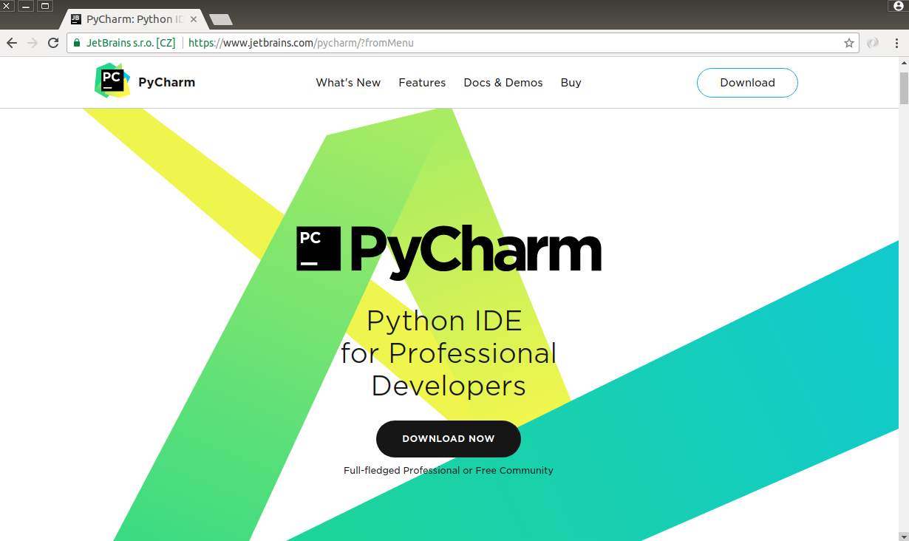
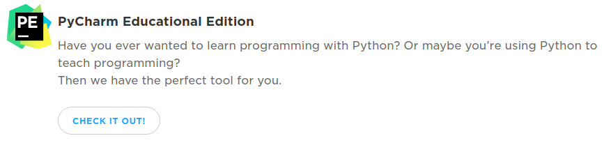
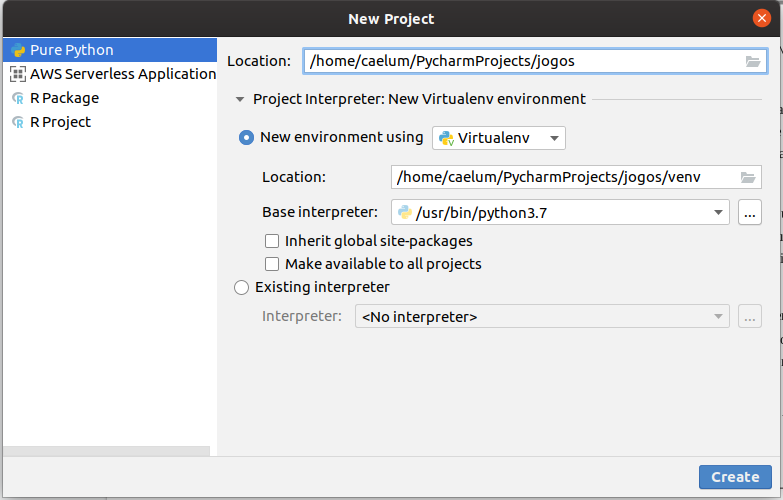
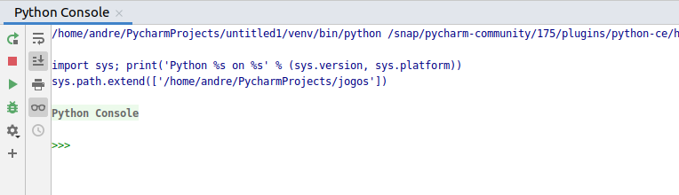

# Introdução ao Pycharm

## IDE

Ao adentrarmos em códigos que requerem maior complexidade, vemos que nem sempre o modo script de execução de códigos em Python não conseguirá atender todas as nossas necessidades durante a criação de nossas aplicações. Dessa forma, será necessário nos aprofundarmos a escrever nosso código em arquivos externos, de maneira a executar todo o código de uma vez de maneira mais estruturada e organizada.

Ao iniciar o primeiro contato com programação, uma das principais dúvidas de iniciantes é: "qual ferramenta vou utilizar para escrever código?". A maioria dos códigos das principais linguagens de programação permitem desenvolver em um arquivo utilizando um editor de texto comum. 

Alguns editores de texto possuem ferramentas mais sofisticadas que dão maior auxílio na hora de desenvolver como: indentação de código, diferenciação de funções, autocompletamento de código, dentre outras.

Outra ferramenta, mais utilizada para desenvolver código, é o que chamamos de Ambiente Integrado de Desenvolvimento ou IDE (sigla em inglês para _Integrated Development Enviroment_). Uma IDE é um software com muitas funcionalidades que auxiliam no desenvolvimento de código além de possuir a capacidade de rodar o código.

Neste capítulo, apresentaremos a IDE Pycharm e suas principais ferramentas.

## Pycharm

O Pycharm é multiplataforma com versões para Windows, MacOS e Linux. O PyCharm é desenvolvido pela empresa JetBrains e fornece análise de código, depurador gráfico, autocompletamento de código e capacidades de navegação que facilitam a escrita de código.

IDE's foram desenvolvidas para criar código mais rapidamente e com maior eficiência. Veremos aqui os principais recursos do PyCharm. Você perceberá que ele evita ao máximo atrapalhar e apenas gera trechos de códigos óbvios, sempre ao seu comando. 

No site oficial há guias e tutoriais para iniciantes. Se você se interessar, recomendamos usar o guia inicial neste link: https://www.jetbrains.com/help/pycharm/meet-pycharm.html

Com o PyCharm você pode desenvolver em Python. A versão Profissional dá suporte para desenvolvimento de aplicações web com Django, Flask e Pyramid. O Pycharm também suporta HTML, CSS, JavaScript e XML. Suporte para outras linguagens também podem ser adicionadas baixando plugins.

>**Outras IDEs**
>
>Uma nova tendência de IDE's para desenvolvimento em Python, especialmente para a área de Data Science, envolvem a utilização de ambientes computacionais diretamente utilizados na web, possibilitando uma interação mais dinâmica e colaborativa entre os seus parceiros de equipe. Sendo muitas vezes definidos como `Notebooks`, os mesmos possibilitam a execução de scripts em Python em blocos separados de código, facilitando a visualização e documentação do seu código, e observando os resultados em tempo real com maior eficácia. Um dos exemplos mais famosos é o Jupyter Notebook, que possui suporte a diversas bibliotecas e é de fácil instalação do ambiente na sua máquina, sendo utilizado por diversas empresas no ramo de dados até hoje.
>
>Outra IDE que está cada vez mais disseminada na atualidade para a geração de códigos Python é o Google Colaboratory, que possibilita a criação de `Notebooks` interativos  diretamente através de sua conta Google. Uma das maiores vantagens do Colaboratory a outras IDE's é que tudo é feito através da nuvem, desde o armazenamento dos dados dentro da sua conta Google até o processamento de dados feito pela GPU fornecida pela mesma. 
>
>Por fim, um outro ambiente bastante consolidado na comunidade Python nos últimos anos é o IDLE, que possui bem menos recursos do que o PyCharm mas ainda é bastante utilizado por diversos usuários.
>
>No site oficial da Python Brasil existem uma lista imensa de outras IDEs: https://wiki.python.org.br/IdesPython.
>

## Download e Instalação do PyCharm

Se você ainda não possui o PyCharm, faça o download nesta página: https://www.jetbrains.com/pycharm/ . 

Existem duas versões, a **Professional** e a **Commmunity**. A versão paga (a _Professional_) possui funcionalidades extras como suporte para desenvolvimento de aplicações web e integração com banco de dados. Para o curso, a versão **Community** será suficiente. Para o _download_, siga as instruções dependendo de seu sistema operacional.

Se você precisar de ajuda para fazer a instalação, consulte as instruções de instação neste link: https://www.jetbrains.com/help/pycharm/install-and-set-up-pycharm.html

## Criando um Projeto

Ao abrir o PyCharm pela primeira vez, uma janela chamada `Create Project` aparecerá. É nela que definimos todas as configurações necessárias.

Podemos criar um novo projeto a qualquer momento. Para fazer isso, basta clicar em `File -> New Project` no menu superior da janela principal do PyCharm.

Primeiro, especificamos o nome do projeto - no nosso caso será apenas *jogos*. Note que o PyCharm sugere um local padrão para salvar o projeto. Você pode aceitar este local ou configurar manualmente no campo `Location`. Vamos optar pelo caminho padrão. Ao fazer isso, a IDE vai criar uma pasta chamada `PyCharmProjects` na sua pasta home.

Após isso, escolhemos a versão do interpretador que usaremos no projeto. O PyCharm cria um ambiente isolado da instalação padrão do sistema operacional (no caso do Linux e MacOS). Isso é muito importante e não causa concorrência com outras bibliotecas instaladas em seu computador. Por fim, clicamos em `Create` e nosso projeto é criado.

Nosso projeto tem uma estrutura padrão. A pasta `venv` é o ambiente isolado do sistema operacional. Nela contém a versão do interpretador Python que selecionamos na criação do projeto e seus módulos embutidos (_builtins_) - você pode checar isso na pasta `lib`. A qualquer momento podemos incluir novas bibliotecas ao projeto.

Por fim, vamos importar o nosso último código gerado no capítulo anterior, o `adivinhacao.py`. Vá na aba File -> Open e selecione o arquivo para o seu projeto.

## Executando código

Agora vamos testar nossa classe. O Pycharm possui um console do Python embutido, para abrí-lo vá em `Tools -> Python Console`. Você vai notar que a janela do console vai abrir abaixo do arquivo adivinhacao.py:

Repare que o console também possui a ferramenta de autocomplete. Para reiniciá-lo basta clicar no primeiro ícone do menu esquerdo do console. 

A IDE também permite abrir o terminal e usar o modo interativo para testes. O atalho para abrir o terminal é `ALT + F12`. O Python Console do Pycharm é mais aconselhável para isso e o terminal é mais utilizado para instalar novas libs ao seu projeto.

Para executar vá em `Run -> Run` ou clique com o botão direito do mouse no interior do arquivo _adivinhacao_ e escolha a opção `Run 'adivinhacao'`. Ou ainda, digite o atalho `CTRL+Shift+F10` que vai ter o mesmo efeito. Depois de ter rodado pela primeira vez, para você rodar novamente basta clicar no ícone de uma pequena seta verde no menu superior da IDE:

## Principais Atalhos

O Pycharm possui muitos atalhos úteis na hora de desenvolver. Abaixo estão os principais deles para você conhecer e praticar:

* ALT + INSERT: cria novo arquivo

* ALT + ENTER: sugere ações e conserta erros rápidos

* CTRL + ESPAÇO: autocomplete

* CTRL + N: busca classes

* CTRL + SHIFT + N: busca arquivos

* CTRL + ALT + M: extrair código para um método

* CTRL + ALT + V: extrair para uma variável

* CTRL + ALT + SHIFT + T: refatoração (renomear)

* CTRL + A: seleciona tudo

* CTRL + SHIFT + LEFT/RIGHT: seleciona parte do texto a esquerda ou a direita.

* CTRL + SHIFT + PAGE DOWN/PAGE UP - move linha para cima ou para baixo

* ALT + J: procura próxima palavra selecionada

A JetBrains fez uma tabela com todos os atalhos que você pode checar neste link: resources.jetbrains.com/storage/products/pycharm/docs/PyCharm_ReferenceCard.pdf
