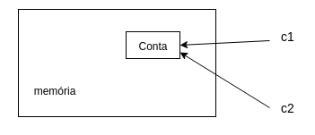
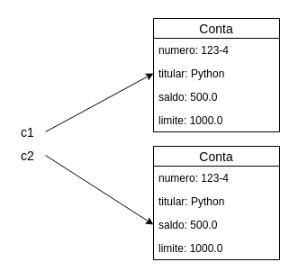

# Orientação a Objetos

Considere um programa para um banco financeiro. É fácil perceber que uma entidade importante para o nosso sistema será uma conta. Primeiramente, suponha que você tem uma conta nesse banco com as seguintes características: titular, número, saldo e limite. Vamos começar inicializando essas características:

```python
>>> numero = '123-4'
>>> titular = "João"
>>> saldo = 120.0
>>> limite = 1000.0
```

E se a necessidade de representar mais de uma conta surgir? Vamos criar mais uma:

```python
>>> numero1 = '123-4'
>>> titular1 = "João"
>>> saldo1 = 120.0
>>> limite1 = 1000.0
>>>	
>>> numero2 = '123-5'
>>> titular2 = "José"
>>> saldo2 = 200.0
>>> limite2 = 1000.0
```

Nosso banco pode vir a crescer e ter milhares de contas e, da maneira que está o programa, seria muito trabalhoso dar manutenção. 

E como utilizar os dados de uma determinada conta em outro arquivo? Podemos utilizar a estrutura do dicionário que aprendemos anteriormente e agrupar essas características. Isso vai ajudar a acessar os dados de uma conta específica:

```python
conta = {"numero": '123-4', "titular": "João", "saldo": 120.0, "limite": 1000.0}
```

Agora é possível acessar os dados de uma conta pelo nome da chave:

```python
>>> conta['numero']
'123-4'
>>> conta['titular']
'João'
```

Para criar uma segunda conta, crie outro dicionário:

```python
conta2 = {"numero": '123-5', "titular": "José", "saldo": 200.0, "limite": 1000.0}
```

Avançamos em agrupar os dados de uma conta, mas ainda precisamos repetir seguidamente essa linha de código a cada conta criada. Podemos isolar esse código em uma função responsável por criar uma conta:

```python
def cria_conta():
    conta = {"numero": '123-4', "titular": "João", "saldo": 120.0, "limite": 1000.0}
    return conta
```

Mas ainda não é o ideal, já que queremos criar contas com outros valores e tornar a criação dinâmica. Vamos então receber esse valores como parâmetros da função, e por fim retornamos a conta:

```python
def cria_conta(numero, titular, saldo, limite):
    conta = {"numero": numero, "titular": titular, "saldo": saldo, "limite": limite}
    return conta
```

Desta maneira é possível criar várias contas com dados diferentes:

```python
>>> conta1 = cria_conta('123-4', 'João', 120.0, 1000.0)
>>> conta2 = cria_conta('123-5', 'José', 200.0, 1000.0)
```

Para acessar o número de cada uma delas, fazemos:

```python
>>> conta1['numero']
'123-4'
>>> conta2['numero']
'123-5'
```

  

## Funcionalidades

Já descrevemos as características de uma conta e nosso próximo passo será descrever suas funcionalidades. O que fazemos com uma conta? Ora, podemos depositar um valor em uma conta, por exemplo. Vamos criar uma função para representar esta funcionalidade. Além do valor a ser depositado, precisamos saber qual conta receberá este valor:

```python
def deposita(conta, valor):
    conta['saldo'] = conta['saldo'] + valor
```

Veja que estamos repetindo conta['saldo'] duas vezes nessa linha de código. O Python permite escrever a mesma coisa de uma maneira mais elegante utilizando o **'+='**:

```python
def deposita(conta, valor):
    conta['saldo'] += valor
```

Podemos fazer algo semelhante com a função `saca()`:

```python
def saca(conta, valor):
    conta['saldo'] -= valor
```

Antes de testar essas funcionalidades, crie outra que mostra o extrato da conta:

```python
def extrato(conta):
    print("numero: {} \nsaldo: {}".format(conta['numero'], conta['saldo']))
```

O extrato imprime as informações da conta utilizando a função `print()`. Agora podemos testar o código (supondo que o mesmo esteja em um arquivo chamado `teste.py`):

```python

    conta = cria_conta('123-4', 'João', 120.0, 1000.0)
    deposita(conta, 15.0)
    extrato(conta)

    #numero: '123-4'
    #saldo: 135.0

    saca(conta, 20.0)
    extrato(conta)

    #numero: '123-4'
    #saldo 115.0
```

Ótimo! Nosso código funcionou como o esperado. Aplicamos algumas funções como `deposita()` e `saca()`, e ao final pudemos checar o saldo final com a função `extrato()`.

## Exercício: Criando uma conta

1. Crie uma pasta chamada `oo` em sua workspace e crie um arquivo chamado *teste_conta.py*

1. Crie a função chamada `cria_conta()`, que recebe como argumento `numero`, `titular`, `saldo` e `limite`:
	
	```python
	def cria_conta(numero, titular, saldo, limite):
	```

1. Dentro de `cria_conta()`, crie uma variável do tipo dicionário chamada `conta` com as chaves recebendo os valores dos parâmetros (`numero`, `titular`, `saldo` e `limite`), e ao final, retorne a `conta`:
	
	```python
    def cria_conta(numero, titular, saldo, limite):
	    conta = {"numero": numero, "titular": titular, "saldo": saldo, "limite": limite}
	    return conta
	```

1. Crie uma função chamada `deposita()` no mesmo arquivo `teste_conta.py` que recebe como argumento uma `conta` e um `valor`. Dentro da função, adicione o `valor` ao `saldo` da conta:

	```python
	def deposita(conta, valor):
	    conta['saldo'] += valor
	```

1. Crie outra função chamada `saca()` que recebe como argumento uma `conta` e um `valor`. Dentro da função, subtraia o `valor` do `saldo` da conta:

	```python
	def saca(conta, valor):
	    conta['saldo'] -= valor
	```

1. E por fim, crie uma função chamada `extrato()`, que recebe como argumento uma `conta` e imprime o `numero` e o `saldo`:

	```python
	def extrato(conta):
	    print("numero: {} \nsaldo: {}".format(conta['numero'], conta['saldo']))
	```


1. Navegue até a pasta `oo` , digite os comandos no arquivo *teste_conta.py* e teste as funcionalidades:

	```python
	    conta = cria_conta('123-7', 'João', 500.0, 1000.0)
	    deposita(conta, 50.0)
	    extrato(conta)

        #numero: '123-7'
        #saldo: 550.0

	    saca(conta, 20.0)
	    extrato(conta)
        
        #numero: '123-7'
        #saldo 530.0
	```

1. (Opcional) Acrescente uma documentação para o seu módulo `teste_conta.py` e utilize a função `help()` para testá-la.

Neste exercício criamos uma conta e juntamos suas características (número, titular, limite, saldo)  e funcionalidades (sacar, depositar, tirar extrato) num mesmo arquivo. Mas o que fizemos até agora foi baseado no conhecimento procedural que tínhamos do Python3. 

Por mais que tenhamos agrupado os dados de uma conta, essa ligação é frágil no mundo procedural e se mostra limitada. Precisamos pensar sobre o que escrevemos para não errar. O paradigma orientado a objetos vem para sanar essa e outras fragilidades do paradigma procedural que veremos a seguir.

## Classes e Objetos

Ninguém deveria ter acesso ao saldo diretamente. Além disso, nada nos obriga a validar esse valor e podemos esquecer disso cada vez que utilizá-lo. Nosso programa deveria obrigar o uso das funções `saca()` e `deposita()` para alterar o saldo e não permitir alterar o valor diretamente:

```python
conta3['saldo'] = 100000000.0
```

ou então:

```python
conta3['saldo'] = -3000.0
```

Devemos manipular os dados através das funcionalidades `saca()` e `deposita()` e proteger os dados da conta. Pensando no mundo real, ninguém pode modificar o saldo de sua conta quando quiser, a não ser quando vamos fazer um saque ou um depósito. A mesma coisa deve acontecer aqui.

Para isso, vamos primeiro entender o que é `classe` e `objeto`, conceitos importantes do paradigma **orientado a objetos** e depois veremos como isso funciona na prática.

Quando preparamos um bolo, geralmente seguimos uma receita que define os ingredientes e o modo de preparação. A nossa conta é um objeto concreto assim como o bolo que também precisa de uma receita pré-definida. E a "receita" no mundo OO recebe o nome de **classe**. Ou seja, antes de criarmos um objeto, definiremos uma classe.

Outra analogia que podemos fazer é entre o projeto de uma casa (a planta da casa) e a casa em si. O projeto é a **classe** e a casa, construída a partir desta planta, é o **objeto**. O projeto da conta, isto é, a definição da conta, é a classe. O que podemos construir (instanciar) a partir dessa classe, as contas de verdade, damos o nome de objetos.
	
Pode parecer óbvio, mas a dificuldade inicial do paradigma da orientação a objetos é justamente saber distinguir o que é classe e o que é objeto. É comum o iniciante utilizar, obviamente de forma errada, essas duas palavras como sinônimos.
	
O próximo passo será criar nossa classe `Conta` dentro de um novo arquivo Python, que receberá o nome de *conta.py*. Criar uma classe em Python é extremamente simples em termos de sintaxe. Vamos começar criando uma classe vazia. Depois criaremos uma instância, um objeto dessa classe, e utilizaremos a função `type()` para analisar o resultado:

```python
class Conta:
    pass
```

```python
    #Em outro arquivo:
    from conta import Conta
    
    conta = Conta()
    print(type(conta))
    #<class '__main__.Conta'>
```

  

Vemos <class '\_\main\_\_.Conta'\> pois o módulo onde se encontra a classe `Conta` é no módulo principal, ou seja, na nossa `__main__`. Agora, temos uma classe `Conta`.

Como Python é uma linguagem dinâmica, podemos modificar esse objeto `conta` em tempo de execução. Por exemplo, podemos acrescentar **atributos** a ele:

```python
    conta.titular = "João"
    print(conta.titular)
    #'João'

    conta.saldo = 120.0
    print(conta.saldo)
    #120.0
```

  

Mas o problema do código é que ainda não garantimos que toda instância de `Conta` tenha um atributo `titular` ou `saldo`. Portanto, queremos uma forma padronizada da conta de maneira que possamos criar objetos com determinadas configurações iniciais.

Em linguagens orientadas a objetos, existe uma maneira padronizada de criar atributos em um objeto. Geralmente fazemos isso através de uma função construtora - algo parecido com nossa função `cria_conta()` do exercício anterior.

## Construtor

Em Python, alguns nomes de métodos estão reservados para o uso da própria linguagem. Um desses métodos é o `__init__()` que vai inicializar o objeto. Seu primeiro parâmetro, assim como todo método de instância, é a própria instância. Por convenção, chamamos este argumento de **self**. Vejamos um exemplo:

```python
class Conta:
    def __init__(self, numero, titular, saldo, limite):
        self.numero = numero
        self.titular = titular
        self.saldo = saldo
        self.limite = limite
```

Agora, quando uma classe é criada, todos os seus atributos serão inicializados pelo método `__init__()`. Apesar de muitos programadores chamarem este método de construtor, ele não cria um objeto conta. Existe outro método, o `__new__()` que é chamado antes do `__init_()` pelo interpretador do Python. O método `__new__()` é realmente o construtor e é quem realmente cria uma instância de `Conta`. O método `__init__()` é responsável por inicializar o objeto, tanto é que já recebe a própria instância (self) criada pelo construtor como argumento. Dessa maneira, garantimos que toda instância de uma `Conta` tenha os atributos que definimos.

Agora, se executarmos a linha de código abaixo, vai acusar um erro:

```python
    conta = Conta()
Traceback (most recent call last):
	File "<stdin>", line 1, in <module>
TypeError: __init__() missing 4 required positional arguments: 'numero', 'titular', 'saldo', and 'limite
```

O erro acusa a falta de 4 argumentos na hora de criar uma `Conta`. A classe `Conta` agora nos obriga a passar 4 atributos (numero, titular, saldo e limite) para criar uma conta:

```python
    conta = Conta('123-4', 'João', 120.0, 1000.0)
```

Veja que em nenhum momento chamamos o método `__init__()`. Quem está fazendo isso por debaixo dos panos é o próprio Python quando executa `conta = Conta()`. Como vimos, ele chama o método `__new__()` que devolve um instância do objeto e em seguida chama o método `__init__()` toda vez que criamos uma conta. Podemos ver isto funcionando imprimindo uma mensagem dentro do método `__init__()`:

```python
def __init__(self, titular, numero, saldo, limite):
    print("inicializando uma conta")
    self.titular = titular
    self.numero = numero
    self.saldo = saldo
    self.limite = limite
```

e testar novamente:

```python
    conta = Conta('123-4', 'João', 120.0, 1000.0)
inicializando uma conta
```

Ao criar uma `Conta`, estamos pedindo para o Python criar uma nova instância de `Conta` na memória, ou seja, o Python alocará memória suficiente para guardar todas as informações da `Conta` dentro da memória do programa. O `__new__()`, portanto, devolve uma **referência**, uma seta que aponta para o objeto em memória e é guardada na variável `conta`.

Para manipularmos nosso objeto `conta` e acessarmos seus atributos, utilizamos o operador "." (ponto):

```python
    print(conta.titular)
    #'João'
    print(conta.saldo)
    #120.0
```

Como o **self** é a referência do objeto, ele chama `self.titular` e `self.saldo` da classe `Conta`.
	
Agora, além de funcionar como esperado, nosso código não permite criar uma conta sem os atributos que definimos anteriormente. Discuta com seus colegas e instrutor as vantagens da orientação a objetos até aqui.
	
## Métodos

Como vimos, além dos atributos, nossa conta deve possuir funcionalidades. No arquivo *teste_conta.py* criamos as funções `saca()`, `deposita()` e `extrato()`. No paradigma orientado a objetos, as funcionalidades de um objeto são chamados de **métodos** - do ponto de vista do código, são as funções dentro de uma classe.

Vamos criar o método `deposita()` na classe `Conta`. Aqui, assim como o método `__init__()`, o método `deposita()` deve receber a instância do objeto (self) além do valor a ser depositado:

```python
class Conta:

    # método __init__() omitido

    def deposita(self, valor):
        self.saldo += valor
```

Isso acontece porque o método precisa saber qual objeto conta ele deve manipular, qual conta vai depositar um determinado valor - e podemos ter muitas contas criadas no nosso sistema.

Utilizamos o operador '.' (ponto) através do objeto `conta` para chamar o método `deposita`:

```python
>>> conta.deposita(20.0)
```

Ao ler esse código, o interpretador associa o objeto `conta` ao argumento `self` do método - note que não precisamos passar a `conta` como argumento, isso é feito por debaixo dos panos pelo Python.

Faremos o mesmo para os métodos `saca()` e `extrato()`:


```python
class Conta:

    # outros métodos omitidos
	
    def saca(self, valor):
        self.saldo -= valor
		
    def extrato(self):
        print("numero: {} \nsaldo: {}".format(self.numero, self.saldo))
```
	
Agora vamos testar nossos métodos:

```python

    conta = Conta('123-4', 'João', 120.0, 1000.0)
    conta.deposita(20.0)
    conta.extrato()
    #numero: '123-4'
    #saldo: 140.0
    conta.saca(15)
    conta.extrato()
    #numero: '123-4'
    #saldo: 125.0
```

  

O saldo inicial era de 120 reais. Depositamos 20 reais, sacamos 15 reais e tiramos o extrato que resultou em 125 reais.

Por fim, o código de nossa `Conta` vai ficar assim:

```python
class Conta:

    def __init__(self, numero, titular, saldo, limite):
        self.numero = numero
        self.titular = titular
        self.saldo = saldo
        self.limite = limite

    def deposita(self, valor):
        self.saldo += valor

    def saca(self, valor):
        self.saldo -= valor

    def extrato(self):
        print("numero: {} \nsaldo: {}".format(self.numero, self.saldo))
```

## Métodos com retorno

Em outras linguagens como C++ e Java, um método sempre tem que definir o que retorna, nem que defina que não há retorno. Como vimos no capítulo sobre funções, no Python isso não é necessário - mas podemos retornar algo no método `saca()`, por exemplo, indicando se a operação foi bem sucedida ou não. Neste caso, podemos retornar um valor booleano:

```python
def saca(self, valor):
    if (self.saldo < valor):
        return False
    else:
        self.saldo -= valor
        return True
```

Veja que a declaração do método não mudou, mas agora ele nos retorna algo (um _boolean_). A palavra chave **return** indica que o método vai terminar ali, retornando tal informação.

Exemplo de uso:

```python
    minha_conta.saldo = 1000
    consegui = minha_conta.saca(2000)
    if(consegui):
       print(“consegui sacar”)
    else:
        print(“não consegui sacar”)

#'não consegui sacar'
```

Ou então, podemos eliminar a variável temporária, se desejado:

```python
    minha_conta.saldo = 1000
    if(minha_conta.saca(2000)):
        print(“consegui sacar”)
    else:
        print(“não consegui sacar”)

    #'não consegui sacar'
```

Mais adiante, veremos que algumas vezes é mais interessante lançar uma exceção (_exception_) nesses casos.

## Objetos são acessados por referência

O programa pode manter na memória não apenas uma `Conta`, mas mais de uma:

```python
    minha_conta = Conta()
    minha_conta.saldo = 1000

    meu_sonho = Conta()
    meu_sonho.saldo = 1500000
```

Quando criamos uma variável para associar a um objeto, na verdade, essa variável não guarda o objeto, e sim uma maneira de acessá-lo, chamada de **referência** (o self).

```python
    c1 = Conta()
```

Ao fazer isso, já sabemos que o Python está chamando os métodos mágicos `__new__()` e `__init__()` que são responsáveis por construir e iniciar um objeto do tipo `Conta`.

O correto é dizer que `c1` se refere a um objeto. Não é correto dizer que `c1` é um objeto, pois `c1` é uma variável referência. Todavia, é comum ouvir frases como “tenho um objeto `c1` do tipo `Conta`”, mas isso é apenas uma abreviação para encurtar a frase “Tenho uma referência `c1` a um objeto tipo `Conta`”.

Vamos analisar o código abaixo:

```python
    c1 = Conta('123-4', 'João', 120.0, 1000.0) 
    c2 = c1 
    print(c2.saldo)
    #120.0
    c1.deposita(100.0) 
    print(c1.saldo) 
    #220.0 
    c2.deposita(30.0) 
    print(c2.saldo)
    #250.0 
    print(c1.saldo) 
    #250.0
```

  

O que aconteceu aqui? O operador “=” copia o valor de uma variável. Mas qual é o valor da variável `c1`? É o objeto? Não. Na verdade, o valor guardado é a referência (endereço) de onde o objeto se encontra na memória principal.



Ao fazer `c2 = c1`, `c2` passa a fazer referência para o mesmo objeto que `c1` referencia nesse instante. Quando utilizamos `c1` ou `c2` neste código, estamos nos referindo ao MESMO objeto – são duas referências que apontam para o mesmo objeto.

Podemos notar isso através da função interna `id()` que retorna a referência de um objeto:

```python
    print(id(c1))
    #140059774918104
    print(id(c2))
    #140059774918104
```

  

Internamente, `c1` e `c2` vão guardar um número que identifica em que posição da memória aquela `Conta` se encontra. Dessa maneira, ao utilizarmos o “.” (ponto) para navegar, o Python vai acessar a `Conta` que se encontra naquela posição de memória, e não uma outra conta. Para quem conhece, é parecido com um ponteiro, porém você não pode manipulá-lo.

Outra maneira de notar esse comportamento é que o interpretador Python chamou os métodos `__new__()` e `__init__()` apenas uma vez (na linha `c1 = Conta('123-4', 'João', 120.0, 1000.0)`), então só pode haver um objeto `Conta` na memória. Compará-las com o operador “==” vai nos retornar `True`, pois o valor que elas carregam é o mesmo:

```python
    print(id(c1) == id(c2))
    #True
    print(c1 == c2)
    #True
```

  

Podemos então ver outra situação:

```python
    c1 = Conta("123-4", "Python", 500.0, 1000.0)
    c2 = Conta("123-4", "Python", 500.0, 1000.0)
    if(c1 == c2):
        print(“contas iguais”)
```

O operador "==" compara o conteúdo das variáveis, mas essas variáveis não guardam o objeto, e sim o endereço em que ele se encontra. Como em cada uma dessas variáveis guardamos duas contas criadas diferentemente, elas estão em espaços diferentes da memória, o que faz o teste no `if` valer `False`. As contas podem ser equivalentes no nosso critério de igualdade, porém elas não são o mesmo objeto. Quando se trata de objetos, pode ficar mais fácil pensar que o "==" compara se os objetos (referências, na verdade) são o mesmo, e não se possuem valores iguais.



Para saber se dois objetos têm o mesmo conteúdo, você precisa comparar atributo por atributo. Futuramente, veremos uma solução mais elegante para isso também.

## Método transfere

E a funcionalidade que transfere dinheiro entre duas contas? Podemos ficar tentados a criar um método que recebe dois parâmetros: `conta1` e `conta2` do tipo `Conta`. Cuidado: já sabemos que os métodos de nossa classe `Conta` sempre recebem a referência, o **self** - portanto o método recebe apenas um parâmetro do tipo `Conta`, a conta destino (além do valor):

```python
class Conta:

    # código omitido

    def transfere(self, destino, valor):
        self.saldo -= valor
        destino.saldo += valor
```

Para deixar o código mais robusto, poderíamos verificar se a conta possui a quantidade a ser transferida disponível. Para ficar ainda mais interessante, você pode chamar os métodos `deposita` e `saca` já existentes para fazer essa tarefa:

```python
class Conta:

    # código omitido
		
    def transfere(self, destino, valor):
        retirou = self.saca(valor)
        if (retirou == False):
            return False
        else:
            destino.deposita(valor)
            return True
```

Quando passamos uma `Conta` como argumento, o que será que acontece na memória? Será que o objeto é clonado?

No Python, a passagem de parâmetro funciona como uma simples atribuição como no uso do “=”. Então, esse parâmetro vai copiar o valor da variável do tipo `Conta` que for passado como argumento para a variável `destino`.  E qual é o valor de uma variável dessas? Seu valor é um endereço, uma referência, nunca um objeto. Por isso não há cópia de objetos aqui.

Esse último código poderia ser escrito com uma sintaxe muito sucinta. Como?

>**Transfere Para**
>
>Perceba que o nome deste método poderia ser `transfere_para()` ao invés de só `transfere()`. A chamada do método fica muito mais natural, é possível ler a frase em português que ela tem um sentido:
>	
>	conta1.transfere_para(conta2, 50.0):
>
>A leitura deste código seria "conta1 transfere para conta2 50 reais".

  

## Continuando com atributos

Os atributos de uma classe podem receber um valor padrão - assim como os argumentos de uma função. Nosso banco pode ter um valor de limite padrão para todas as contas e apenas em casos específicos pode atribuir um valor limite diferente.

Para aplicarmos essa regra de negócio, podemos atribuir um valor padrão ao limite, por exemplo, 1000.0 reais:

```python
class Conta:

    def __init__(self, numero, titular, saldo, limite=1000.0):
        self.numero = numero
        self.titular = titular
        self.saldo = saldo
        self.limite = limite
```

E podemos inicializar uma conta:

```python
    conta = Conta('123-4', 'joão', 120.0)
```

Veja que agora não somos obrigados a passar o valor do `limite` já que ele possui um valor padrão de 1000.0 e podemos acessá-lo pela `conta`:

```python
    print(conta.limite)
1000.0
```

Quando declaramos as variáveis na classe `Conta`, aprendemos que podemos atribuir um valor padrão para cada uma delas. Imagine que comecemos a aumentar nossa classe `Conta` e adicionar nome, sobrenome e cpf do titular da conta. Começaríamos a ter muitos atributos e, se você pensar direito, uma `Conta` não tem nome, nem sobrenome nem cpf, quem tem esses atributos é um **cliente**. Assim, podemos criar uma nova classe e fazer uma **agregação** - agregar um cliente a nossa conta. Portanto, nossa classe `Conta` **tem um** `Cliente `.

O atributos de uma `Conta` também podem ser referências para outras classes. Suponha a seguinte classe `Cliente`:

```python
class Cliente:

    def __init__(self, nome, sobrenome, cpf):
        self.nome = nome
        self.sobrenome = sobrenome
        self.cpf = cpf

class Conta:

    def __init__(self, numero, cliente, saldo, limite):
        self.numero = numero
        self.titular = cliente
        self.saldo = saldo
        self.limite = limite
```

E quando criarmos um `Conta`, precisamos passar um `Cliente` como `titular`:

```python
    cliente = Cliente('João', 'Oliveira', '1111111111-1')
    minha_conta = Conta('123-4', cliente, 120.0, 1000.0)
```

Aqui aconteceu uma atribuição, o valor da variável `cliente` é copiado para o atributo `titular` do objeto ao qual `minha_conta` se refere. Em outras palavras, `minha_conta` tem uma referência ao mesmo `Cliente` que `cliente` se refere, e pode ser acessado através de `minha_conta.titular`.

Você pode realmente navegar sobre toda estrutura de informação, sempre usando o ponto:

```python
    print(minha_conta.titular)
    #<__main__.Cliente object at 0x7f83dac31dd8>
```

Veja que a saída é a referência a um objeto do tipo `Cliente`, mas podemos acessar seus  atributos de uma forma mais direta e até mais elegante:

```python
    print(minha_conta.titular.nome)
    #'João'
```

  

## Tudo é objeto

Python é uma linguagem totalmente orientada a objetos. Tudo em Python é um objeto! Sempre que utilizamos uma função ou método que recebe parâmetros, estamos passando objetos como argumentos. Não é diferente com nossas classes. Quando uma conta recebe um cliente como titular, ele está recebendo uma instância de `Cliente`, ou seja, um objeto.

O mesmo acontece com `numero`, `saldo` e `limite`. *Strings* e números são classes no Python. Por este motivo que aparece a palavra **class** quando pedimos para o Python nos devolver o tipo de uma variável através da função **type**:

```python
    print(type(conta.numero))
    #<class 'str'>
    print(type(conta.saldo))
    #<class 'float'>
    print(type(conta.titular))
    #<class '__conta__.Cliente'>
```

Um sistema orientado a objetos é um grande conjunto de classes que vai se comunicar, delegando responsabilidades para quem for mais apto a realizar determinada tarefa. A classe `Banco` usa a classe `Conta`, que usa a classe `Cliente`, que usa a classe `Endereco`, etc... Dizemos que esses objetos colaboram, trocando mensagens entre si. Por isso, acabamos tendo muitas classes em nosso sistema, e elas costumam ter um tamanho relativamente curto.

## Composição

Fizemos, no ponto anterior, uma **agregação**. Agora nossa classe `Conta` **tem um** `Cliente` e associamos estas duas classes. Todavia, nossa classe `Cliente` existe independente da classe `Conta`. Suponha agora que nossa `Conta` possua um histórico, contendo a data de abertura da conta e suas transações. Podemos criar uma classe para representar o histórico, como no exemplo abaixo:

```python
import datetime

class Historico:

    def __init__(self):
        self.data_abertura = datetime.datetime.today()
        self.transacoes = []

    def imprime(self):
        print("data abertura: {}".format(self.data_abertura))
        print("transações: ")
        for t in self.transacoes:
            print("-", t)  
```

Agora precisamos modificar nossa classe `Conta` de modo que ela tenha um `Historico`. Mas aqui, diferente da relação do cliente com uma conta, a existência de um histórico depende da existência de uma `Conta`:

```python 
class Conta:

    def __init__(self, numero, cliente, saldo, limite=1000.0):
        self.numero = numero
        self.cliente = cliente
        self.saldo = saldo
        self.limite = limite
        self.historico = Historico()
```

E podemos, em cada método para manipular uma `Conta`, acrescentar a operação nas transações de seu `Historico`:

```python
class Conta:

    #código omitido
	
    def deposita(self, valor):
        self.saldo += valor
        self.historico.transacoes.append("depósito de {}".format(valor))

    def saca(self, valor):
        if (self.saldo < valor):
            return False
        else:
            self.saldo -= valor
            self.historico.transacoes.append("saque de {}".format(valor))

    def extrato(self):
        print("numero: {} \nsaldo: {}".format(self.numero, self.saldo))
        self.historico.transacoes.append("tirou extrato - saldo 
		de {}".format(self.saldo))

    def transfere_para(self, destino, valor):
        retirou = self.saca(valor)
        if (retirou == False):
            return False
        else:
            destino.deposita(valor)
            self.historico.transacoes.append("transferencia de {} 
			para conta {}".format(valor, destino.numero))
            return True
```

E testamos:

```python
    cliente1 = Cliente('João', 'Oliveira', '11111111111-11')
    cliente2 = Cliente('José', 'Azevedo', '222222222-22')
    conta1 = Conta('123-4', cliente1, 1000.0)
    conta2 = Conta('123-5', cliente2, 1000.0)
    conta1.deposita(100.0)
    conta1.saca(50.0)
    conta1.transfere_para(conta2, 200.0)
    conta1.extrato

    #numero: 123-4 
    #saldo: 850.0

    conta1.historico.imprime()

    #data abertura: 2018-05-10 19:44:07.406533
    #transações: 
    #- depósito de 100.0
    #- saque de 50.0
    #- saque de 200.0
    #- transferencia de 200.0 para conta 123-5
    #- tirou extrato - saldo de 850.0

    conta2.historico.imprime()

    #data abertura: 2018-05-10 19:44:07.406553
    #transações: 
    #- depósito de 200.0

```

Quando a existência de uma classe depende de outra classe, como é a relação da classe Histórico com a classe Conta, dizemos que a classe `Historico` compõe a classe `Conta`. Esta associação chamamos **Composição**.

Mas, e se dentro da nossa `Conta` não colocássemos `self.historico = Historico()`, e ao invés disso tentássemos acessá-lo diretamente? Faz algum sentido fazer `historico = Historico()?`

Quando o objeto é inicializado, ele vai receber o valor default que definimos na classe:

```python
class Conta:
    
    def __init__(self, numero, cliente, saldo, limite):
        #iniciando outros parâmetros
        self.historico = Historico()
```

Com esse código, toda nova `Conta` criada já terá um novo `Historico` associado, sem necessidade de instanciá-lo logo em seguida da instanciação de uma `Conta`.

Atenção: para quem não está acostumado com referências, pode ser bastante confuso pensar sempre em como os objetos estão na memória para poder tirar as conclusões de o que ocorrerá ao executar determinado código, por mais simples que ele seja. Com o tempo, você adquire a habilidade de rapidamente saber o efeito de atrelar as referências, sem ter de gastar muito tempo para isso. É importante nesse começo você estar sempre pensando no estado da memória. Além disso, lembrar que no Python “uma variável nunca carrega um objeto, e sim uma referência para ele” facilita muito.

## Para saber mais: outros métodos de uma classe

O interpretador adiciona alguns atributos especiais somente para leitura a vários tipos de objetos de uma classe, sendo um deles o `__dict__`.

Isso acontece porque a classe `Conta` possui alguns métodos, dentre eles o `__init__()` e o `__new__()`, que são chamados para criar e inicializar um objeto desta classe, respectivamente. Caso você queira saber quais outros métodos são implementados pela classe `Conta`, você pode usar a função embutida `dir()`, que irá listar todos métodos e atributos que a classe possui.

```python
>>> dir(Conta)
['__class__', '__delattr__', '__dict__', '__dir__', '__doc__', '__eq__', 
'__format__', '__ge__', '__getattribute__', '__gt__', '__hash__', '__init__', '__init_subclass__', '__le__', '__lt__', '__module__', '__ne__', '__new__', '__reduce__', '__reduce_ex__', '__repr__', '__setattr__', '__sizeof__', '__str__', '__subclasshook__', '__weakref__', 'extrato', 'deposita', 'limite', 'numero', 'saca', 'saldo', 'transfere_para', 'titular']
```

Dessa lista, já conhecemos o `__init__()`, o `__new__()` e os métodos e atributos que definimos quando construímos a classe `Conta`. Na verdade, quando usamos a função `dir()`, o interpretador chama o atributo `__dir__` dessa lista. Um outro atributo bastante útil é o `__dict__`, que retorna um dicionário com os atributos da classe.

```python
    cliente = Cliente('João', 'Oliveira', '111111111-11')
    conta = Conta('123-4', cliente, 1000.0)
    print(conta.__dict__)
    #{'saldo': 1000.0, 'numero': '123-4', 'titular': <__main__.Cliente object at                  0x7f0b6d028f28>, 'limite': 1000.0}
```

Mas não é comum acessá-lo dessa maneira. Esses métodos iniciados e terminados com dois _underscores_ são chamados pelo interpretador, e são conhecidos como métodos mágicos. Existe outra função embutida do Python, a função `vars()`, que chama exatamente o `__dict__` de uma classe. Obtemos o mesmo resultado usando `vars(conta)`:

```python
    vars(conta)
    #{'saldo': 1000.0, 'numero': '123-4', 'titular': <__main__.Cliente object at                    0x7f0b6d028f28>, 'limite': 1000.0}
```

Repare que o `__dict__` e o `vars()` retornam exatamente um dicionário de atributos de uma conta como tínhamos modelado no início deste capítulo. Portanto, nossas classes utilizam dicionários para armazenar informações da própria classe.

Os demais métodos mágicos estão disponíveis para uso e não utilizaremos por enquanto. Voltaremos a falar deles em um outro momento.

## Exercício: Primeira classe Python

1. Crie um arquivo chamado `conta.py` na pasta `oo` criada no exercício anterior.

1. Crie a classe Conta sem nenhum atributo e salve o arquivo.

	```python
	class Conta:
		pass
	```

1. Vá até a pasta onde se encontra o arquivo `conta.py` e crie um novo arquivo, chamado `conta_teste.py`. Dentro deste arquivo importe a classe Conta do módulo conta.

	```python
	    from conta import Conta
	```

1. Crie uma instância (objeto) da classe `Conta` e utilize a função `type()` para verificar o tipo do objeto:

	```python
	    conta = Conta()
	    type(conta)
	<class 'conta.Conta'>
	```
	
    Além disso, crie alguns atributos e tente acessá-los.

1. Abra novamente o arquivo conta.py e escreva o método `__init__()`, recebendo os atributos anteriormente definidos por nós que toda conta deve ter (numero titular, saldo e limite):

	```python
	class Conta:

		def __init__(self, numero, titular, saldo, limite):
			self.numero = numero
			self.titular = titular
			self.saldo = saldo
			self.limite = limite
	```

1. No arquivo `conta_teste.py`, Tente criar uma conta sem passar qualquer argumento no construtor:

	```python
	    conta = Conta()
	Traceback (most recent call last):
	  File "<stdin>", line 1, in <module>
	TypeError: __init__() missing 4 required positional arguments: 'numero', 'titular', 'saldo', and 'limite
	```

	Note que o interpretador acusou um erro. O método `__init__()` exige 4 argumentos 'numero', 'titular', 'saldo' e 'limite'.

1. Agora vamos seguir o exigido pela classe, pela receita de uma conta:

	```python
	    conta = Conta('123-4', 'João', 120.0, 1000.0)
	```

1. O interpretador não acusou nenhum erro. Vamos imprimir o `numero` e `titular` da conta:

	```python
	    print(conta.numero)
	'123-4'
	    print(conta.titular)
	'João'
	```

1. Crie o método `deposita()` dentro da classe `Conta`. Esse método deve receber uma referência do próprio objeto e o valor a ser adicionado ao saldo da conta.

	```python
	def deposita(self, valor):
	    self.saldo += valor
	```

1. Crie o método `saca()` que recebe como argumento uma referência do próprio objeto e o valor a ser sacado. Esse método subtrairá o valor do saldo da conta.

	```python
	def saca(self, valor):
	    self.saldo -= valor
	```

1. Crie o método `extrato()`, que recebe como argumento uma referência do próprio objeto. Esse método imprimirá o saldo da conta:

	```python
	def extrato(self):
	    print("numero: {} \nsaldo: {}".format(self.numero, self.saldo))
	```

1. Modifique o método `saca()` fazendo retornar um valor que representa se a operação foi ou não bem sucedida. Lembre que não é permitido sacar um valor maior do que o saldo.

	```python
	def saca(self, valor):
	    if (self.saldo < valor):
            return False
        else:
            self.saldo -= valor
            return True
	```

1. Crie o método `transfere_para()` que recebe como argumento uma referência do próprio objeto, uma `Conta` destino e o valor a ser transferido. Esse método deve sacar o valor do próprio objeto e depositar na conta destino:

	```python
	def transfere_para(self, destino, valor):
		retirou = self.saca(valor)
		if (retirou == False):
			return False
		else:
			destino.deposita(valor)
			return True
	```

1. Por fim, crie duas contas no arquivo teste-conta.py e verifique os métodos criados.

	```python
    conta.deposita(50.0)
    conta.extrato()
    conta.saca(20.0)
    conta.extrato()
	```


1. (Opcional) Crie uma classe para representar um cliente do nosso banco que deve ter `nome`, `sobrenome` e `cpf`. Instancie uma `Conta` e passe um cliente como `titular` da conta. Modifique o método `extrato()` da classe `Conta` para imprimir, além do número e o saldo, os dados do cliente. Podemos criar uma `Conta` sem um `Cliente`? E um `Cliente` sem uma `Conta`?

1. (Opcional) Crie uma classe que represente uma data, com dia, mês e ano. Crie um atributo `data_abertura` na classe `Conta`. Crie uma nova conta e faça testes no console do Python.

1. (Desafio) Crie uma classe `Historico` que represente o histórico de uma `Conta` seguindo o exemplo da apostila. Faça testes no console do Python criando algumas contas, fazendo operações e por último mostrando o histórico de transações de uma `Conta`. Faz sentido criar um objeto do tipo `Historico` sem uma `Conta?`

Agora, além de funcionar como esperado, nosso código não permite criar uma conta sem os atributos que definimos anteriormente. Discuta com seus colegas e instrutor as vantagens da orientação a objetos até aqui.

