# Pycharm e Orientação a objetos

O Pycharm é especialmente útil durante a criação de código que envolve orientação a objetos. Neste próximo passo, criaremos um novo projeto, desta vez para conter todo o conteúdo necessário para a implementação da nossa aplicação de banco.

## Criando um Projeto

Novamente no Pycharm, abra uma janela chamada `Create Project` aparecerá. É nela que definimos todas as configurações necessárias.

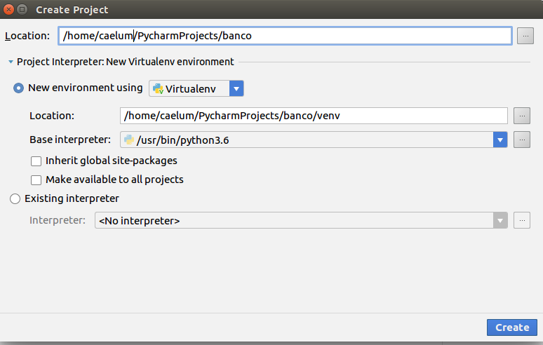

Podemos criar um novo projeto a qualquer momento. Para fazer isso, basta clicar em `File -> New Project` no menu superior da janela principal do PyCharm.

Primeiro, especificamos o nome do projeto - no nosso caso será apenas *banco*. Note que o PyCharm sugere um local padrão para salvar o projeto. Você pode aceitar este local ou configurar manualmente no campo `Location`. Vamos optar pelo caminho padrão. Ao fazer isso, a IDE vai criar uma pasta chamada `PyCharmProjects` na sua pasta home.

Após isso, escolhemos a versão do interpretador que usaremos no projeto. O PyCharm cria um ambiente isolado da instalação padrão do sistema operacional (no caso do Linux e MacOS). Isso é muito importante e não causa concorrência com outras bibliotecas instaladas em seu computador. Por fim, clicamos em `Create` e nosso projeto é criado.

Nosso projeto tem uma estrutura padrão. A pasta `venv` é o ambiente isolado do sistema operacional. Nela contém a versão do interpretador Python que selecionamos na criação do projeto e seus módulos embutidos (_builtins_) - você pode checar isso na pasta `lib`. A qualquer momento podemos incluir novas bibliotecas ao projeto.

Vamos iniciar nosso projeto criando a classe `Conta`. Antes, precisamos criar uma pasta raiz do projeto. Vá em `File -> New -> Directory`. 

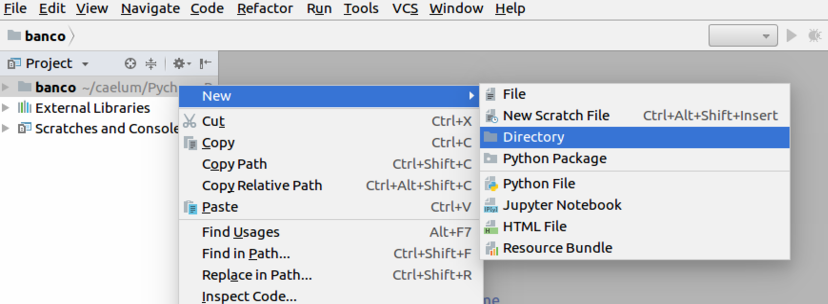

Definimos um nome para nosso diretório e clicamos em 'OK'. Vamos criar um diretório chamado `src`:


Para defini-lo como pasta raiz, vamos clicar com o botão direito do mouse no diretório, navegar até `Mark Directory as` e escolher `Sources Root`. Você notará que a pasta muda da cor cinza para azul.

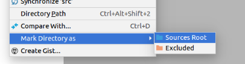

## Criando uma classe

Agora vamos criar o arquivo `conta.py` que conterá nossa classe `Conta`. Para isso, clique com o botão direito do mouse em `src` e vá em `New -> Python File`:

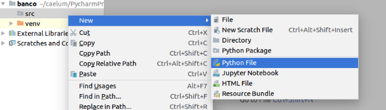

Digite o nome do arquivo e clique em 'OK'. Vamos nomear o arquivo como `conta`:

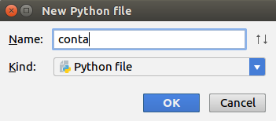

Uma nova aba vai aparecer com o nome do módulo que criamos, à direita do menu de navegação do projeto. Vamos começar a escrever o código de nossa classe `Conta`. Você vai notar que quando começamos a digitar a palavra `class` o PyCharm vai te oferecer sugestões para você escolher. Comece escrevendo a palavra `class` (exemplo: 'cl') e ele vai terminar de digitar pra você:

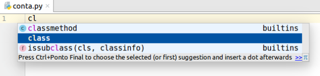

Vamos agora escrever o método `__init__()`. Aqui também o Pycharm vai nos ajudar. Escreva apenas `"def i"` e o PyCharm vai te dar novamente sugestões:

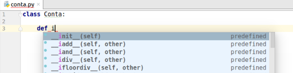

Escolha a primeira opção `__init__(self)` e aperte `ENTER`. Vai gerar o código:

``` python
class Conta:

    def __init__(self):
```

Faça o método inicializador receber como parâmetro os valores do atributos de uma `Conta`, ou seja, receber o `numero`, `titular`, `saldo` e `limite`:

``` python
class Conta:

    def __init__(self, numero, titular, saldo, limite=1000.0):
        self.numero = numero
        self.titular = titular
        self.saldo = saldo
        self.limite = limite
```

## Executando código

Agora vamos testar nossa classe. O Pycharm possui um console do Python embutido, para abrí-lo vá em `Tools -> Python Console`. Você vai notar que a janela do console vai abrir abaixo do arquivo conta:

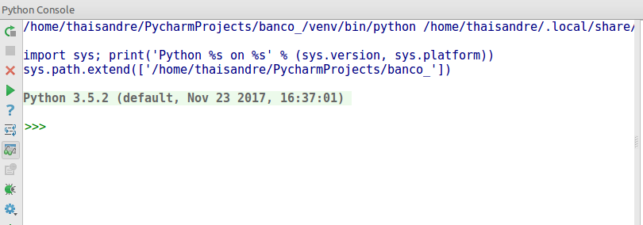

Vamos importar o módulo `conta` com o comando `from src.conta import Conta`, instanciar uma `Conta` e acessar seus atributos:

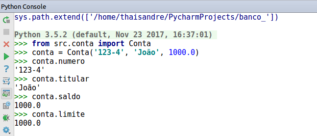

Repare que o console também possui a ferramenta de autocomplete. Para reiniciá-lo basta clicar no primeiro ícone do menu esquerdo do console. 

A IDE também permite abrir o terminal e usar o modo interativo para testes. O atalho para abrir o terminal é `ALT + F12`. O Python Console do Pycharm é mais aconselhável para isso e o terminal é mais utilizado para instalar novas libs ao seu projeto.

Mas usaremos o console apenas para testes. Vamos executar o código diretamente do nosso arquivo conta. Para isso precisamos acrescentar a condicional `if __name__ == '__main__':` e fazer os mesmos testes que fizemos no console dentro desta condição `if`. Basta você escrever "main" e digitar `ENTER` que o Pycharm cria a condicional para você:

``` python
if __name__ == '__main__':
```

Agora vamos instanciar e imprimir os atributos de uma `Conta` como fizemos utilizando o Python Console. Não esqueça de utilizar a função *print* na hora de mostrar os atributos, já que não estamos mais no modo interativo:

``` python
if __name__ == '__main__':
    conta = Conta('123-4', 'João', 1000.0)
    print(conta.numero)
    print(conta.titular)
    print(conta.saldo)
    print(conta.limite)
```

Para executar vá em `Run -> Run` ou clique com o botão direito do mouse no interior do arquivo _conta_ e escolha a opção `Run 'conta'`. Ou ainda, digite o atalho `CTRL+Shift+F10` que vai ter o mesmo efeito. Depois de ter rodado pela primeira vez, para você rodar novamente basta clicar no ícone de uma pequena seta verde no menu superior da IDE:


## Criando métodos

Vamos criar nosso primeiro método. Primeiro, dentro da condicional `main`, vamos digitar a seguinte linha de código:

``` python
conta.deposita(100.0)
```

Se executarmos esse código, o nosso programa quebra já que a classe `Conta` ainda não possui o método `deposita()`. Para criá-lo, coloque o cursor do mouse na palavra "deposita" e use o atalho `ALT + ENTER`, várias sugestões do Pycharm irão aparecer. Clique em `Add method deposita() to class Conta`:

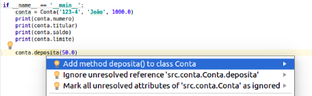

E o Pycharm vai criar a declaração do método para você:

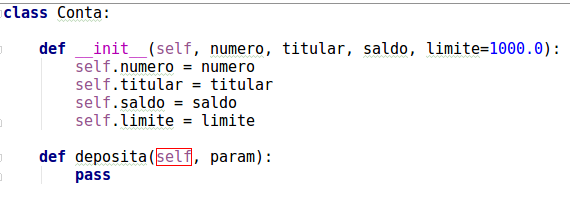

Viu como é fácil e rápido? Agora basta trocar a palavra `param` por `valor`, apagar a palavra `pass` e adicionar a implementação do método:

``` python
def deposita(self, valor):
    self._saldo += valor
```

No próximo exercício, vamos criar nosso primeiro projeto do banco e nossa classe `Conta` utilizando o Pycharm e praticar o que aprendemos de orientação a objetos e sobre a IDE até aqui.

## Exercício - Criando projeto banco no PyCharm

1. Abra o Pycharm e vá em `File -> New Project`. A janela abaixo vai aparecer. Troque a palavra **untitled** pelo nome do nosso projeto que será **banco**:

    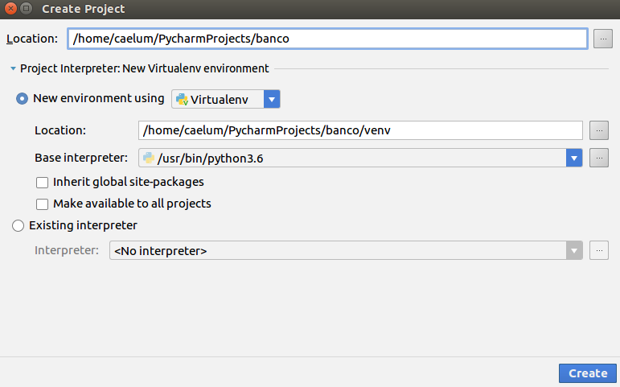

    Verifique se a versão do Python está correta em **Base interpreter** e clique em `OK`.

1. No menu esquerdo vai aparecer a estrutura do projeto. Vamos definir uma pasta raiz onde ficarão nossos arquivos de código python. Clique com o botão direito na pasta **banco** e escolha a opção *New Folder*. Uma nova janela vai aparecer para você entrar com o nome do diretório, digite *src* e `OK`:

    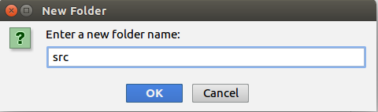

1. Após isso, clicamos com o botão direito na pasta **src** e selecionamos `Mark Directory as -> Sources Roots` para avisar o PyCharm que esta pasta será um diretório fonte de nosso projeto, onde ficarão nossos arquivos .py.

    

    Repare que a pasta ficará da cor azul depois de executar desta ação:

    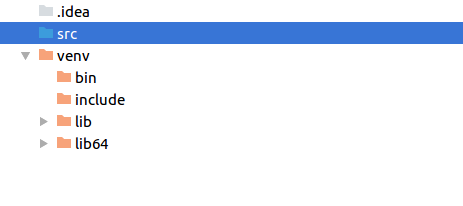

1. Agora vamos criar nossa classe `Conta` que ficará no arquivo `conta.py`. Vamos fazer isso utilizando um atalho do PyCharm. Coloque o cursor do mouse na pasta **src** e digite `ALT + Insert`. Escolha a opção *Python File*. Uma nova janela vai abrir, digite "conta" e clique em `OK`.

    

1. O arquivo será aberto a esquerda. Vamos começar a criar nossa classe. Ao  escrevermos a função __init__ a própria IDE vai mostrar as opções em uma janela, basta clicar que ele auto-completa para você já com a argumento 'self'. Adicione os atributos de uma `Conta` como fizemos no exercício do capítulo anterior:

    ```python
    class Conta:

        def __init__(self, numero, titular, saldo, limite):
            self._numero = numero
            self._titular = titular
            self._saldo = saldo
            self._limite = limite
    ```
    Aproveite a crie as properties de cada atributo. Abuse do `CTRL+ESPAÇO` para a IDE auto completar para você e do `ALT + ENTER` para sugestões. 

1. Em seguida criamos a condicional para que o PyCharm rode algumas linhas de código caso o `__name__` seja igual a `__main__`, ou seja, o programa principal. O Pycharm também facilita esta criação, basta digitar a palavra 'main' e apertar `CTRL + ESPAÇO` que a estrutura do if é construída para você:

    ```python
    if __name__ == '__main__':
    ```
    Vamos criar uma nova conta e imprimir o titular:

    ```python
    if __name__ == '__main__':
        conta = Conta('123-4','joão',1200.0, 1000.0)
        print(conta.titular)
    ```

1. Para rodar, basta clicar com o botão direito do mouse e escolher a opção `Run 'conta'` ou utilizar o atalho `Ctrl+Shift_F10`. Ou ainda escolher a opção da barra de ferramentas com o símbolo de `play` da cor verde. O resultado vai aparecer no console, na janela inferior da IDE.

    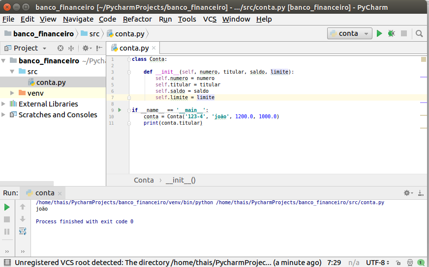

1. Crie os métodos `deposita()`, `saca()`, `extrato()` e `transfere_para()` como fizemos no último exercício. Aproveite os recursos da IDE que aprendemos para criar todos esses métodos. A propriedade _setter_ do saldo é necessária?

1. Crie duas contas e teste os métodos que você criou no exercício anterior.

1. (Opcional) Crie um arquivo python chamado `cliente.py` e crie a classe `Cliente` com `nome`, `sobrenome` e `cpf`. Teste o código passando um cliente como titular de um `Conta`