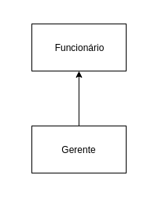
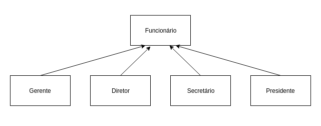

# Herança e Polimorfismo

## Repetindo código?

Como toda empresa, nosso banco possui funcionários. Um funcionário tem um nome, um cpf e um salário. Vamos modelar a classe `Funcionario`:

```python
class Funcionario:

    def __init__(self, nome, cpf, salario):
        self._nome = nome
        self._cpf = cpf
        self._salario = salario

    # outros métodos e propriedades
```

Além de um funcionário comum, há também outros cargos, como os gerentes. Os gerentes guardam a mesma informação que um funcionário comum, mas possuem outras informações, além de ter funcionalidades um pouco diferentes. Um gerente no nosso banco possui também uma senha numérica que permite o acesso ao sistema interno do banco, além do número de funcionários que ele gerencia:

```python
class Gerente:

    def __init__(self, nome, cpf, salario, senha, qtd_gerenciados):
        self._nome = nome
        self._cpf = cpf
        self._salario = salario
        self._senha = senha
        self._qtd_gerenciados = qtd_gerenciados

    def autentica(self, senha):
        if self._senha == senha:
            print("acesso permitido")
            return True
        else:
           print("acesso negado")
           return False

    # outros métodos (comuns a um Funcionario)
```

Se tivéssemos um outro tipo de funcionário que tem características diferentes do funcionário comum, precisaríamos criar uma outra classe e copiar o código novamente.

Além disso, se um dia precisarmos adicionar uma nova informação para todos os funcionários, precisaremos passar por todas as classes de funcionário e adicionar esse atributo. O problema acontece novamente por não centralizarmos as informações principais do funcionário em um único lugar!
        
Existe um jeito de relacionarmos uma classe de tal maneira que uma delas **herda** tudo que o outra tem. Isto é uma relação de **herança**, uma relação entre classe 'mãe' e classe 'filha'. No nosso caso, gostaríamos de fazer com que `Gerente` tivesse tudo que um `Funcionario` tem, gostaríamos que ela fosse uma extensão de `Funcionario`. Fazemos isso acrescentando a classe mãe entre parenteses junto a classe filha:
        
``` python
class Gerente(Funcionario):

    def __init__(self, senha, qtd_funcionarios):
        self._senha = senha
        self._qtd_funcionarios = qtd_funcionarios
                
    def autentica(self, senha):
        if self._senha == senha:
            print("acesso permitido")
            return True
        else:
            print("acesso negado")              
            return False
```

Todo momento que criarmos um objeto do tipo `Gerente` queremos que este objeto também herde os atributos definidos na classe `Funcionario`, pois um **Gerente é um Funcionário**.

Como a classe `Gerente` já possui um método `__init__()` com outros atributos, o método da classe `Funcionario` é **sobrescrito** pelo `Gerente`. Se queremos incluir os mesmos atributos de instância de `Funcionario` em um `Gerente`, devemos chamar o método `__init__()` de `Funcionario` dentro do método `__init__()` de Gerente:

```python
class Gerente(Funcionario):

    def __init__(self, senha, qtd_funcionarios):
        Funcionario.__init__(nome, cpf, salario)
        self._senha = senha
        self._qtd_funcionarios = qtd_funcionarios
                
    def autentica(self, senha):
        if self._senha == senha:
            print("acesso permitido")
            return True
        else:
            print("acesso negado")              
            return False
```



Dizemos que a classe `Gerente` herda todos os atributos e métodos da classe mãe, no nosso caso, a `Funcionario`. Como Python tem tipagem dinâmica, precisamos garantir isso através do construtor da classe. Além de `senha` e `qtd_funcionarios` passamos também os atributos `nome`, `cpf` e `salario` que todo funcionário tem:

```python
class Gerente(Funcionario):

    def __init__(self, nome, cpf, salario, senha, qtd_funcionarios):
        self._senha = senha
        self._qtd_funcionarios = qtd_funcionarios
```

Como estes são atributos de um `Funcionario` e não queremos repetir o código do método `__init__()` de `Funcionario` dentro da classe `Gerente`, podemos chamar este método da classe mãe como fizemos no exemplo acima ou podemos utilizar um método do Python chamado **super()**:
 
```python
class Gerente(Funcionario):

    def __init__(self, nome, cpf, salario, senha, qtd_funcionarios):
        super().__init__(nome, cpf, salario)
        self._senha = senha
        self._qtd_funcionarios = qtd_funcionarios
```

Para ser mais preciso, ela também herda os atributos e métodos 'privados' de `Funcionario`. O `super()` é usado para fazer referência a superclasse, a classe mãe - no nosso exemplo a classe `Funcionario`. 

>**Para saber mais: super e sub classe**
>
>A nomenclatura mais encontrada é que Funcionario é a **superclasse** de Gerente, e Gerente é a **subclasse** de Funcionario. Dizemos também que todo Gerente **é um** Funcionario. Outra forma é dizer que Funcionario é a classe **mãe** de Gerente e Gerente é a classe **filha** de Funcionario.

Da mesma maneira, podemos ter uma classe `Diretor` que estenda `Gerente`, e a classe `Presidente` pode estender diretamente de `Funcionario`. Fique claro que essa é uma relação de negócio. Se `Diretor` vai estender de `Gerente` ou não, vai depender, para você, `Diretor` é um `Gerente`?



## Reescrita de métodos

Todo fim de ano, os funcionários do nosso banco recebem uma bonificação. Os funcionários comuns recebem 10% do valor do salário e os gerentes, 15%.

Vamos ver como fica a classe `Funcionario`:
    
```python
class Funcionario:

    def __init__(self, nome, cpf, salario):
        self._nome = nome
        self._cpf = cpf
        self._salario = salario

    # outros métodos e properties

    def get_bonificacao(self):
        return self._salario * 0.10     
```

Se deixarmos a classe `Gerente` como ela está, ela vai herdar o método `get_bonificacao()`

```python 
gerente = Gerente('José', '222222222-22', 5000.0, '1234', 0)
print(gerente.get_bonificacao())
```

  

O resultado aqui será 500. Não queremos essa resposta, pois o gerente deveria ter 750 de bônus nesse caso. Para consertar isso, uma das opções seria criar um novo método na classe `Gerente`, chamado, por exemplo, `get_bonificacao_do_gerente()`. O problema é que teríamos dois métodos em `Gerente`, confundindo bastante quem for usar essa classe, além de que cada um gerenciaria uma resposta diferente.
    
No Python, quando herdamos um método, podemos alterar seu comportamento. Podemos **reescrever** (sobrescrever, override) este método, assim como fizemos com o `__init__`:
    
```python
class Gerente(Funcionario):

    def __init__(self, nome, cpf, salario, senha, qtd_gerenciaveis):
        super().__init__(nome, cpf, salario)
        self._senha = senha
        self._qtd_gerenciaveis = qtd_gerenciaveis
        
    def get_bonificacao(self):
        return self._salario * 0.15

    # metodos e properties
```

Agora, o método está correto para o `Gerente`. Refaça o teste e veja que o valor impresso é o correto (750):
    
```python 
gerente = Gerente('José', '222222222-22', 5000.0, '1234', 0)
print(gerente.get_bonificacao())
```

  

Utilize o método `vars()` para acessar os atributos de `Gerente` e ver que a classe herda todos os atributos de `Funcionario`:

```python
funcionario = Funcionario('João', '111111111-11', 2000.0)
print(vars(funcionario))

gerente = Gerente('José', '222222222-22', 5000.0, '1234', 0)
print(vars(gerente))
```

Saída:

```python
{'_salario': 2000.0, '_nome': 'João', '_cpf': '111111111-11'}
{'_cpf': '222222222-22', '_salario': 5000.0, '_nome': 'José', '_qtd_funcionarios': 0, '_senha': '1234'}   
```

## Invocando o método reescrito

Depois de reescrito, não podemos mais chamar o método antigo que fora herdado da classe mãe, pois realmente alteramos o seu comportamento. Todavia, podemos invocá-lo no caso de estarmos dentro da classe.
    
Imagine que para calcular a bonificação de um `Gerente`, devemos fazer igual ao cálculo de um `Funcionario`, adicionando 1000.0 reais. Poderíamos fazer assim:
    
```python 
class Gerente(Funcionario):

    def __init__(self, senha, qtd_gerenciaveis):
        self._senha = senha
        self._qtd_gerenciaveis = qtd_gerenciaveis
        
    def get_bonificacao():
        return self._salario * 0.10 + 1000.0
    
    # métodos e properties
```

Aqui teríamos um problema: o dia que o `get_bonificacao()` do `Funcionario` mudar, precisaremos mudar o método do `Gerente` para acompanhar a nova bonificação. Para evitar isso, o `get_bonificacao()` do `Gerente` pode chamar o do `Funcionario` utilizando o método **super()**.

```python
class Gerente(Funcionario):

    def __init__(self, senha, qtd_gerenciaveis):
        self._senha = senha
        self._qtd_gerenciaveis = qtd_gerenciaveis
        
    def get_bonificacao():
        return super().get_bonificacao() + 1000

    # métodos e properties
```

Essa invocação vai procurar o método com o nome `get_bonificacao()` de uma superclasse de `Gerente`. No caso, ele logo vai encontrar esse método em `Funcionario`.
    
Essa é uma prática comum, pois em muitos casos o método reescrito geralmente faz algo a mais que o método da classe mãe. Chamar ou não o método de cima é uma decisão e depende do seu problema. Algumas vezes, não faz sentido invocar o método que reescrevemos.

Para escrever uma classe utilizando o Python 2, é preciso acrescentar a palavra 'object' quando definimos uma classe:

```python
class MinhaClasse(object):
    pass
```

Isso acontece porque toda classe é filha de **object** - que é chamada a mãe de todas as classes. No Pyhton, toda classe herda de _object_. No Python 3, não precisamos acrescentar o _object_, mas não quer dizer que esta classe e a herança não existam, apenas que a mesma é implícita. Quando criamos uma classe vazia e utilizamos o método `dir()` para checar a lista de seus atributos, reparamos que ela não é vazia:

```python
class MinhaClasse():
    pass

if __name__ == '__main__':
    mc = MinhaClasse()
    print(dir(mc))
```

  

Gerando a saída:

```python
['__class__', '__delattr__', '__dict__', '__dir__', '__doc__', '__eq__',
'__format__', '__ge__', '__getattribute__', '__gt__', '__hash__',
'__init__', '__init_subclass__', '__le__', '__lt__', '__module__'
'__ne__', '__new__', '__reduce__', '__reduce_ex__', '__repr__',
'__setattr__', '__sizeof__', '__str__', '__subclasshook__', '__weakref__']
```

Todos estes atributos são herdados da classe _object_ e podemos reescrever qualquer um deles na nossa subclasse. Todos eles são os conhecidos métodos 'mágicos' (começam e iniciam com dois _underscores_, e por este motivo, também chamados de _dunders_). 

Vimos o comportamento do `__init__()`, `__new__()` e do `__dict__`. Outros métodos mágicos famosos são `__str__()` e `__repr__()` - métodos que retornam a representação do objeto como uma _string_. Quando chamamos `print(mc)` temos a saída

```python
<__main__.MinhaClasse object at 0x7f11c1f59a58>
```

Esse é o modelo padrão de impressão de um objeto, implementado na classe `object`. A função `print()` na verdade usa a `string` definida pelo método `__str__()` de uma classe. Vamos reescrever este método:

```python
class MinhaClasse:

    def __str__(self):
        return '< Instância de {}; endereço:{}>'.format(self.__class__.__name__, id(self))
```

Agora, quando executamos `print(mc)`, a saída é:

```python
<Instância de MinhaClasse; endereço:0x7f11c1f59a58>
```

  

O Python sempre chama o método `__str__()` quando utiliza a função `print()` em um objeto. Novamente, estamos utilizando reescrita de métodos. 

O método `__repr__()` também retorna uma `string`, e podemos utilizar a função `repr()` para checar seu retorno:

```python
class MinhaClasse():
    pass

if __name__ == '__main__':
    mc = MinhaClasse()
    print(repr(mc))
```

Que vai gerar a mesma saída padrão do `__str__()`:

```python
<__main__.MinhaClasse object at 0x7f11c1f59a58>
```

Mas diferente do `__str__()`, não é comum sobrescrever este método. Ele é sobrescrito quando precisamos utilizá-lo junto com a função `eval()` do Python. A função `eval()` recebe uma `string`e tenta executar essa `string` como um comando do Python. Veja um exemplo de uso:

``` python
>>> x = 1
>>> eval("x+1")
2
```

Vamos a um exemplo utilizando classes:

``` python
class Ponto:

    def __init__(self, x, y):
        self.x = x
        self.y = y

    def __str__(self):
        return "({}, {})".format(self.x, self.y)

    def __repr__(self):
        return "Ponto({}, {})".format(self.x + 1, self.y + 1)

if __name__ == '__main__':
    p1 = Ponto(1, 2)
    p2 = eval(repr(p1))

    print(p1)
    print(p2)

```

Se executarmos o código acima, temos:

```
(1, 2)
(2, 3)
```

  

Repare que utilizamos a função `repr()` passando uma instância de `Ponto`. O Python vai chamar então o método `__repr__()` da classe `Ponto`, que retorna a `string` "Ponto(2, 3)" já que `p1.x = 1` e `p1.y = 2`. Ao passá-la de argumento para a função `eval()`, teremos: `p2 = eval('Ponto(2, 3))`. Como a função `eval()` vai tentar executar essa `string` como um comando Python válido ele terá sucesso, e portanto `p2` será uma nova instância da classe `Ponto` com `p2.x = 2` e `p2.y = 3`.

Para concluir, é importante entender que tanto `__str__()` quanto `__repr__()` retornam uma `string` que representa o objeto, mas com propósitos diferentes. O método `__str__()` é utilizado para apresentar mensagens para os usuários da classe, de maneira mais amigável. Já o método `__repr__()` é usado para representar o objeto de maneira técnica, inclusive podendo utilizá-lo como comando válido do Python, como vimos no exemplo da classe `Ponto`. 

>## Para saber mais - Métodos Mágicos
> 
> Os métodos mágicos são úteis, pois permitem que os objetos de nossas classes possuam uma interface de acesso semelhante aos objetos embutidos do Python. O método `__add__()`, por exemplo, serve para executar a adição de dois objetos e é chamada sempre quando fazemos a operação de adição (obj + obj) utilizando o operador '+'. Por exemplo, quando fazemos `1 + 1` no Python, o que o interpretador faz é chamar o método `__add__()` da classe `int`. Vimos que uma `list` também implementa o método `__add__()`, já que a operação de adição é definida para esta classe:
> 
>```python
>>>> lista = [1, 2, 3]
>>>> lista + [4, 5]
>[1, 2, 3, 4, 5]
>```
>
> O mesmo ocorre para as operações de multiplicação, divisão, módulo e potência que são definidas pelos métodos mágicos `__mul__()`, `__div__()`, `__mod__()` e `__pow__()`, respectivamente. 
> 
> Podemos definir cada uma dessas operações em nossas classes sobrescrevendo tais métodos mágicos. Além desses, o Python possui muitos outros que você pode acessar aqui: https://docs.python.org/3/reference/datamodel.html#Basic_customization
> 

## Polimorfismo

O que guarda uma variável do tipo `Funcionario`? Uma referência para um `Funcionario`, nunca o objeto em si.
    
Na herança, vimos que todo `Gerente` é um `Funcionario`, pois é uma extensão deste. Podemos nos referir a um `Gerente` como sendo um `Funcionario`. Se alguém precisa falar com um `Funcionario` do banco, pode falar com um `Gerente`! Porque? Pois `Gerente` **é um** `Funcionario`. Essa é a semântica da herança.
    
Polimorfismo é a capacidade de um objeto poder ser referenciado de várias formas (cuidado, polimorfismo não quer dizer que o objeto fica se transformando, muito pelo contrário, um objeto nasce de um tipo e morre daquele tipo, o que pode mudar é a maneira como nos referimos a ele).

A situação que costuma aparecer é a que temos um método que recebe um argumento do tipo `Funcionario`:

```python
class ControleDeBonificacoes:

    def __init__(self, total_bonificacoes=0):
        self._total_bonificacoes = total_bonificacoes

    def registra(self, funcionario):
        self._total_bonificacoes += funcionario.get_bonificacao()

    @property
    def total_bonificacoes(self):
        return self._total_bonificacoes
```

E podemos fazer:

```python
if __name__ == '__main__':
    funcionario = Funcionario('João', '111111111-11', 2000.0)
    print("bonificacao funcionario: {}".format(funcionario.get_bonificacao()))

    gerente = Gerente("José", "222222222-22", 5000.0 '1234', 0)
    print("bonificacao gerente: {}".format(gerente.get_bonificacao()))

    controle = ControleDeBonificacoes()
    controle.registra(funcionario)
    controle.registra(gerente)

    print("total: {}".format(controle.total_bonificacoes))

```

que gera a saída:

```
bonificacao funcionario: 200.0
bonificacao gerente: 1500.0
total: 1700.0
```

  

Repare que conseguimos passar um `Gerente` para um método que "recebe" um `Funcionario` como argumento. Pense como numa porta na agência bancária com o seguinte aviso: "Permitida a entrada apenas de Funcionários". Um gerente pode passar nessa porta? Sim, pois `Gerente` **é um** `Funcionario`.

Qual será o valor resultante? Não importa que dentro do método `registra()` do `ControleDeBonificacoes` receba `Funcionario`. Quando ele receber um objeto que realmente é um `Gerente`, o seu método reescrito será invocado. Reafirmando: **não importa como nos referenciamos a um objeto, o método que será invocado é sempre o que é dele**.

No dia em que criarmos uma classe `Secretaria`, por exemplo, que é filha de `Funcionario`, precisaremos mudar a classe `ControleDeBonificacoes`? Não. Basta a classe `Secretaria` reescrever os métodos que lhe parecerem necessários. É exatamente esse o poder do polimorfismo, juntamente com a reescrita de método: diminuir o acoplamento entre as classes, para evitar que novos códigos resultem em modificações em inúmeros lugares.

Repare que quem criou `ControleDeBonificacoes` pode nunca ter imaginado a criação da classe `Secretaria` ou `Engenheiro`. Contudo, não será necessário reimplementar esse controle em cada nova classe: reaproveitamos aquele código.

Pensar desta maneira em linguagens com tipagem estática é o mais correto, já que as variáveis são tipadas e garantem, através do compilador, que o método só funcionará se receber um **tipo** `Funcionario`. Mas não é o que acontece em linguagens de tipagem dinâmica como Python. Vamos supor que temos uma classe para representar os clientes do banco:

```python
class Cliente:

    def __init__(self, nome, cpf, senha):
        self._nome = nome
        self._cpf = cpf
        self._senha = senha

    # métodos e properties    
```

Nada impede de registrarmos um `Cliente` em `ControleDeBonificacoes`. Vamos ver o que acontece:

```python
cliente = ('Maria', '333333333-33', '1234')
controle = ControleBonificacoes()
controle.registra(cliente)
```

Saída:

```python   
  File "<stdin>", line 99, in <module>
    controle.registra(cliente)
  File "<stdin">, line 67, in regista
    self._total_bonificacoes += funcionario.get_bonificacao()   
AttributeError: 'Cliente' object has no attribute 'get_bonificacao'
```

Veja que lança um `AttibuteError` com a mensagem dizendo que `Cliente` não possui o atributo `get_bonificacao`. Portanto, aqui não importa se o objeto recebido no método `registra()` é um `Funcionario`, mas se ele possui o método `get_bonificacao()`. 

O método `registra()` utiliza um método da classe `Funcionario` e, portanto, funcionará com qualquer instância de uma subclasse de `Funcionario` ou qualquer instância de uma classe que implemente o método `get_bonificacao()`.

Podemos evitar este erro verificando se o objeto passado possui ou não um atributo `get_bonificacao()` através da função `hasattr()`:

```python
class ControleDeBonificacoes:

    def __init__(self, total_bonificacoes=0):
        self._total_bonificacoes = total_bonificacoes

    def registra(self, obj):
        if(hasattr(obj, 'get_bonificacao')):
            self._total_bonificacoes += obj.get_bonificacao()
        else:
            print('instância de {} não implementa o método get_bonificacao()'.format(self.__class__.__name__))    

    # demais métodos    

```

A função `hasattr()` recebe dois parâmetros, o objeto e o atributo (na forma de `string`) - e verifica se o objeto possui aquele atributo, ou seja, se o atributo está contido no `__dict__` do objeto. Então, fazemos a pergunta: `get_bonificacao()` é atributo de `Funcionario`? Se sim, entra no bloco `if` e podemos chamar o método tranquilamente, evitando erros.

Agora, se tentarmos chamar o método `registra()` passando um `Cliente` recebemos a saída:

```
'Cliente' object has no attribute 'get_bonificacao
```

Portanto, o tipo passado para o método `registra()` não importa aqui, e sim se o objeto passado implementa ou não o método `get_bonificacao()`. Ou seja, basta que o objeto atenda a um determinado **protocolo**. 

Existe uma função no Python que funciona de forma semelhante mas considera o tipo da instância, é a função **isinstance()**. Ao invés de passar uma instância, passamos a classe no segundo parâmetro.

```python
class ControleDeBonificacoes:

    def __init__(self, total_bonificacoes=0):
        self.__total_bonificacoes = total_bonificacoes

    def registra(self, obj):
        if(isinstance(obj, Funcionario)):
            self.__total_bonificacoes += obj.get_bonificacao()
        else:
            print('instância de {} não implementa o método get_bonificacao()'
                .format(self.__class__.__name__))    
```

Mas essa não é a maneira Pythônica. Você deve escrever o código esperando somente uma interface do objeto, não o tipo dele. A interface é o conjunto de métodos públicos de uma classe. No caso da nossa classe `ControleDeBonificacoes`, o método `registra()` espera um objeto que possua o método `get_bonificacao()`, e não um objeto do tipo `Funcionario`.

## Duck Typing

Uma característica de linguagens dinâmicas como Python é a chamada **Duck Typing**, a tipagem de pato. É uma característica de um sistema de tipos em que a semântica de uma classe é determinada pela sua capacidade de responder a alguma mensagem, ou seja, responder a determinado atributo (ou método). O exemplo canônico (e a razão do nome) é o teste do pato: *se ele se parece com um pato, nada como um pato e grasna como um pato, então provavelmente é um pato*.

Veja o exemplo abaixo:

```python
class Pato:
    def grasna(self):
        print('quack!')

class Ganso:
    def grasna(self):
        print('quack!')

if __name__ == '__main__':
    pato = Pato()
    print(pato.grasna())

    ganso = Ganso()
    print(ganso.grasna())                        
```

Que gera a saída:

```
quack!
quack!
```

Você deve escrever o código esperando somente uma interface do objeto, não um tipo de objeto. No caso da nossa classe `ControleDeBonificacoes`, o método `registra()` espera um objeto que possua o método `get_bonificacao()` e não apenas um funcionário.

O *Duck Typing* é um estilo de programação que não procura o tipo do objeto para determinar se ele tem a interface correta. Ao invés disso, o método ou atributo é simplesmente chamado ou usado ('se parece como um pato e grasna como um pato, então deve ser um pato'). *Duck Typing* evita testes usando as funções `type()`, `isinstance()` e até mesmo a `hasattr()`- ao invés disso, deixa o erro estourar na frente do programador.

A maneira Pythônica para garantir a consistência do sistema não é verificar os tipos e atributos de um objeto, mas pressupor a existência do atributo no objeto e tratar uma exceção, caso ocorra, através do comando `try/except`:

```python
    try:
        self._total_bonificacoes += obj.get_bonificacao()
    except AttributeError as e:
        print(e)    

```

Estamos pedindo ao interpretador para tentar executar a linha de código dentro do comando `try` (tentar). Caso ocorra algum erro, ele vai tratar este erro com o comando `except` e executar algo, como imprimir o erro (similar ao exemplo). Não se preocupe de entender os detalhes sobre este código e o uso do `try/except` neste momento, teremos um capítulo só para falar deles.

O que é importante é que a maneira _pythônica_ de se fazer é assumir a existência do atributo e capturar (tratar) um exceção quando o atributo não pertencer ao objeto e seguir o fluxo do programa. Por ora, faremos esta checagem utilizando a função `hasattr()`.


>**Herança _versus_ acoplamento**
>
> Note que o uso de herança **aumenta** o acoplamento entre as classes, isto é, o quanto uma classe depende de outra. A relação entre classe mãe e filha é muito forte e isso acaba fazendo com que o programador das classes filhas tenha que conhecer a implementação da classe mãe e vice-versa - fica difícil fazer uma mudança pontual no sistema.
>
> Por exemplo, imagine se tivermos que mudar algo na nossa classe `Funcionario`, mas não quiséssemos que todos os funcionários sofressem a mesma mudança. Precisaríamos passar por cada uma das filhas de `Funcionario` verificando se ela se comporta como deveria ou se devemos sobrescrever o tal método modificado.
>
> Esse é um problema da herança, e não do polimorfismo, que resolveremos mais tarde.

## Exercício: Herança e Polimorfismo

Vamos ter mais de um tipo de conta no nosso sistema. Portanto, além das informações que já tínhamos na conta, temos agora o tipo: se queremos uma conta corrente ou uma conta poupança. Além disso, cada uma deve possuir uma taxa. 

1. Adicione na classe `Conta` um novo método chamado `atualiza()` que atualiza a conta de acordo com a taxa percentual:
    
    ``` python
    class Conta:

        #outros métodos

        def atualiza(self, taxa):
            self._saldo += self._saldo * taxa
    ```

1. Crie duas subclasses da classe `Conta`: `ContaCorrente` e `ContaPoupanca`. Ambas terão o método `atualiza()` reescrito: a `ContaCorrente` deve atualizar-se com o dobro da taxa e a `ContaPoupanca` deve atualizar-se com o triplo da taxa. Além disso, a `ContaCorrente` deve reescrever o método `deposita()` a fim de retirar uma taxa bancária de dez centavos de cada depósito.

    * Crie a classe **ContaCorrente** no arquivo `conta.py` e faça com que ela seja subclasse (filha) da classe `Conta`.
    
    ``` python
    class ContaCorrente(Conta):
        pass
    ```

    * Crie a classe **ContaPoupanca** no arquivo `conta.py` e faça com que ela seja subclasse (filha) da classe `Conta`:

    ``` python
    class ContaPoupanca(Conta):
        pass
    ```

    * Reescreva o método `atualiza()` na classe `ContaCorrente`, seguindo o enunciado:

    ``` python
    class ContaCorrente(Conta):

        def atualiza(self, taxa):
            self._saldo += self._saldo * taxa * 2
    ```

    * Reescreva o método `atualiza()` na classe `ContaPopanca`, seguindo o enunciado:

    ``` python
    class ContaPoupanca(Conta):

        def atualiza(self, taxa):
            self._saldo += self._saldo * taxa * 3
    ```

    * Na classe `ContaCorrente`, reescreva o método `deposita()` para descontar a taxa bancária de dez centavos:

    ``` python
    class ContaCorrente(Conta):

        def atualiza(self, taxa):
            self._saldo += self._saldo * taxa * 2

        def deposita(self, valor):
            self._saldo += valor - 0.10    
    ```

1. Agora, teste suas classes no próprio módulo `conta.py`. Acrescente a condição quando o módulo for igual a `__main__` para executarmos no console no PyCharm. Instancie essas classes, atualize-as e veja o resultado:

    ``` python
    if __name__ == '__main__'
        c = Conta('123-4', 'Joao', 1000.0)
        cc = ContaCorrente('123-5', 'Jose', 1000.0)
        cp = ContaPoupanca('123-6', 'Maria', 1000.0)

        c.atualiza(0.01)
        cc.atualiza(0.01)
        cp.atualiza(0.01)

        print(c.saldo)
        print(cc.saldo)
        print(cp.saldo)
    ```

1. Implemente o método `__str__()` na classe `Conta`. Faça com que ele imprima uma representação mais amigável de um `Conta` contendo todos os seus atributos.

    ``` python
    def __str__(self):
        return "Dados da Conta: \nNumero: {} \nTitular: {} \nSaldo: {} \nLimite:{}".format(self._numero, self._titular, self._limite, self._saldo)

    ```

    Teste chamando o método `print(cc)`.

1. Vamos criar uma classe que seja responsável por fazer a atualização de todas as contas bancárias e gerar um relatório com o saldo anterior e saldo novo de cada uma das contas. Na pasta `src`, crie a classe `AtualizadorDeContas`:

    ```python
    class AtualizadorDeContas:

        def __init__(self, selic, saldo_total=0):
            self._selic = selic
            self._saldo_total = saldo_total

        #propriedades    

        def roda(self, conta):
            print("Saldo da Conta: {}".format(conta.saldo))
            self._saldo_total += conta.atualiza(self._selic)
            print("Saldo Final: {}".format(self._saldo_total))

Dica: Para o valor de _saldo_total ser atualizado corretamente, atualize todas as funções ```atualiza``` nas outras classes para retornarem o valor correto com ```return self._saldo```
    
    Não esqueça de fazer os _imports_ necessários para o código funcionar!

1. Na 'main', vamos criar algumas contas e rodá-las a partir do `AtualizadorDeContas`:
    ```python
    if __name__ == '__main__':
        c = Conta('123-4', 'Joao', 1000.0)
        cc = ContaCorrente('123-5', 'José', 1000.0)
        cp = ContaPoupanca('123-6', 'Maria', 1000.0)

        adc = AtualizadorDeContas(0.01)

        adc.roda(c)
        adc.roda(cc)
        adc.roda(cp)

        print('Saldo total: {}'.format(adc.saldo_total))
    ```

1. (opcional) Se você precisasse criar uma classe `ContaInvestimento`, e seu método `atualiza()` fosse complicadíssimo, você precisaria alterar a classe `AtualizadorDeContas`? 

1. (opcional, Trabalhoso) Crie uma classe `Banco` que possui uma lista de contas. Repare que em uma lista de contas você pode colocar tanto `ContaCorrente` quanto `ContaPoupanca`. Crie um método `adiciona()` que adiciona uma conta na lista de contas; um método `pegaConta()` que devolve a conta em determinada posição da lista e outro `pegaTotalDeContas()` que retorna o total de contas na lista. Depois teste criando diversas contas, insira-as no `Banco` e depois, com um laço `for`, percorra todas as contas do `Banco` para passá-las como argumento para o método `roda()` do `AtualizadorDeContas`.

1. (opcional) Que maneira poderíamos implementar o método `atualiza()` nas classes `ContaCorrente` e `ContaPoupança` poupando reescrita de código?

1. (opcional) E se criarmos uma classe que não é filha de `Conta` e tentar passar uma instância no método roda de `AtualizadorDeContas`? Com o que aprendemos até aqui, como podemos evitar que erros aconteçam nestes casos?

## Classes Abstratas

Vamos recordar nossa classe `Funcionario`:

``` python
class Funcionario:

    def __init__(self, nome, cpf, salario=0):
        #inicialização dos atributos

    #propriedades e outros métodos
    
    def get_bonificacao(self):
        return self._salario * 1.2
```

Considere agora nosso `ControleDeBonificacao`:

``` python
class ControleDeBonificacoes:

    def __init__(self, total_bonificacoes=0):
        self.__total_bonificacoes = total_bonificacoes

    def registra(self, obj):
        if(hasattr(obj, 'get_bonificacao')):
            self.__total_bonificacoes += obj.get_bonificacao()
        else:
            print('instância de {} não implementa o método get_bonificacao()'.format(self.__class__.__name__))  

    #propriedades
```


Nosso método `registra()` recebe um objeto de qualquer tipo. Todavia, estamos esperando que seja um `Funcionario` já que este implementa o método `get_bonificacao()`, isto é, podem ser objetos do tipo `Funcionario` e qualquer de seus subtipos. Dessa forma, qualquer subclasse que eventualmente venha ser escrita, sem prévio conhecimento do autor da `ControleDeBonificacao` podem ser implementadas.

Estamos utilizando aqui a classe `Funcionario` para o polimorfismo. Se não fosse por ela, teríamos um grande prejuízo: precisaríamos criar um método `registra()` para receber cada um dos tipos de `Funcionario`, um para `Gerente`, um para `Diretor`, etc. Repare que perder esse poder é muito pior do que a pequena vantagem que a herança traz em herdar código.

Todavia, em alguns sistemas, como é o nosso caso, usamos uma classe com apenas esses intuitos: de economizar um pouco código e ganhar polimorfismo para criar métodos mais genéricos, que se encaixem a diversos objetos.

Faz sentido ter um objeto do tipo `Funcionario`? Esta pergunta é bastante relevante, já que instanciar um `Funcionario` pode gerar um objeto que não faz sentido no nosso sistema. Nossa empresa tem apenas `Diretores`, `Gerentes`, `Secretários`, etc... `Funcionario` é apenas uma classe que idealiza um tipo, define apenas um rascunho.

Vejamos um outro caso em que não faz sentido ter um objeto de determinado tipo, apesar da classe existir. Imagine a classe `Pessoa` e duas filhas: `PessoaFisica` e `PessoaJuridica`. Quando puxamos um relatório de nossos clientes (uma lista de objetos de tipo `Pessoa`, por exemplo), queremos que cada um deles seja ou uma `PessoaFisica` ou uma `PessoaJuridica`. A classe `Pessoa`, nesse caso, estaria sendo usada apenas para ganhar o polimorfismo e herdar algumas coisas - não faz sentido permitir instanciá-la.

Para o nosso sistema, é inadmissível que um objeto seja apenas do tipo `Funcionario` (pode existir um sistema em que faça sentido ter objetos do tipo `Funcionario` ou apenas `Pessoa`, mas, no nosso caso, não). Para resolver esses problemas, temos as **classes abstratas**.

Utilizaremos uma módulo do Python chamado **abc** que permite definirmos classes abstratas. Uma classe abstrata deve herdar de **ABC** (_Abstract Base Classes_). ABC é a superclasse para classes abstratas.

Uma classe abstrata não pode ser instanciada e deve conter pelo menos um método abstrato. Vamos ver isso na prática.

Vamos tornar nossa classe `Funcionario` abstrata:

``` python
import abc

class Funcionario(abc.ABC):
    
    # métodos e propriedades
```

Definimos nossa classe `Funcionario` como abstrata. Agora vamos tornar nosso método `get_bonificacao()` abstrato. Um método abstrato pode ter implementação, mas não faz sentido em nosso sistema, portanto vamos deixá-lo sem implementação. Para definirmos um método abstrato, utilizamos o decorador `@abstractmethod`:

``` python
class Funcionario(abc.ABC):

    @abc.abstractmethod
    def get_bonificacao(self):
        pass
```

Agora, se tentarmos instanciar um objeto do tipo `Funcionario`:

``` python
if __name__ == '__main__':
    f = Funcionario()

```
Acusa um erro:

```python
TypeError: Can't instantiate abstract class Funcionario with abstract methods get_bonificacao  
```

  

Apesar de não conseguir instanciar a classe `Funcionario`, conseguimos instanciar suas filhas que são objetos que realmente existem em nosso sistema (objetos concretos):

```python
class Gerente(Funcionario):
    # outros métodos e propriedades

    def get_bonificacao(self):
        return self._salario * 0.15

if __name__ == '__main__':
    gerente = Gerente('jose', '222222222-22', 5000.0, '1234', 0)
    print(gerente.get_bonificacao())
```

  

Vamos criar a classe `Diretor` que herda de `Fucionario` sem o método `get_bonificacao()`:

```python
class Diretor(Funcionario):
    def __init__(self, nome, cpf, salario):
        super().__init__(nome, cpf, salario)

if __name__ == '__main__':
    diretor = Diretor('joao', '111111111-11', 4000.0)            
```

Quando rodamos o código:

```python
TypeError: Can't instantiate abstract class Diretor with abstract methods get_bonificacao  
```

  

Não conseguimos instanciar uma subclasse de `Funcionario` sem implementar o método abstrato `get_bonificacao()`. Agora, tornamos o método `get_bonificacao()` **obrigatório** para todo objeto que é subclasse de `Funcionario`. Caso venhamos a criar outras classes, como `Secretaria` e `Presidente`, que sejam filhas de `Funcionario`, seremos obrigados e criar o método `get_bonificacao()`, caso contrário, o código vai acursar erro quando executado.

## Exercícios - classes abstratas

1. Torne a classe `Conta` abstrata.

    ``` python
    import abc

    class Conta(abc.ABC):

        def __init__(self, numero, titular, saldo=0, limite=1000.0):
            self._numero = numero
            self._titular = titular
            self._saldo = saldo
            self._limite = limite

        # outros métodos e propriedades
    ```

1. Torne o método `atualiza()` abstrato:

    ``` python
    class Conta(abc.ABC):

        # código omitido

        @abc.abstractmethod
        def atualiza():
            pass
    ```

1. Tente instânciar uma `Conta`:

    ``` python
    if __name__ == '__main__':
        c = Conta()
    ```
    O que ocorre?

1. Agora, instancie uma `ContaCorrente` e uma `ContaPoupanca`, e teste o código chamando o método `atualiza()`.

    ``` python
    if __name__ == '__main__':
        cc = ContaCorrente('123-4', 'João', 1000.0)
        cp = ContaPoupanca('123-5', 'José', 1000.0)

        cc.atualiza(0.01)
        cp.atualiza(0.01)

        print(cc.saldo)
        print(cp.saldo)
    ```

1. Crie uma classe chamada `ContaInvestimento`:

    ``` python
    class ContaInvestimeto(Conta):
        pass
    ```

1. Instancie uma `ContaInvestimeto`:

    ```python
    ci = ContaInvestimento('123-6', 'Maria', 1000.0)
    ```

1. Não conseguimos instanciar uma `ContaInvestimento` que herda `Conta` sem implementar o método abstrato `atualiza()`. Vamos criar uma implementação dentro da classe `ContaInvestimento`:

    ``` python
    def atualiza(self, taxa):
        self._saldo += self._saldo * taxa * 5
    ```

1. Agora teste instanciando uma `ContaInvestimento` e chame o método `atualiza()`:
    ``` python
    ci = ContaInvestimento('123-6', 'Maria', 1000)
    ci.deposita(1000.0)
    ci.atualiza(0.01)
    print(ci.saldo)
    ```

1. (opcional) Crie um atributo `tipo` nas classes `ContaCorrente`, `ContaPoupanca` e `ContaInvestimento`. Faça com que o `tipo` também seja impresso quando usamos a função `print()`