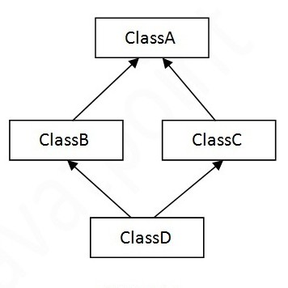
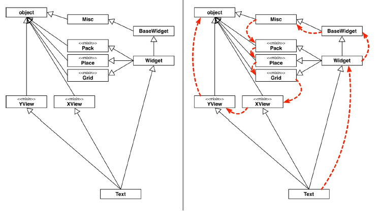

# Herança Múltipla e Interfaces

Imagine que um Sistema de Controle do Banco pode ser acessado, além dos Gerentes, pelos Diretores do Banco. Teríamos uma classe `Diretor`.

``` python
class Diretor(Funcionario):

    def autentica(self, senha):
        # verifica se a senha confere
```

E a classe `Gerente`:

``` python
class Gerente(Funcionario):

    def autentica(self, senha):
        # verifica se a senha confere e também se o seu departamento tem acesso
```

Repare que o método de autenticação de cada tipo de `Funcionario` pode variar muito. Mas vamos aos problemas. Considere o `SistemaInterno` e seu controle: precisamos receber um `Diretor` ou `Gerente` como argumento, verificar se ele se autentica e colocá-lo dentro do sistema.

Vimos que podemos utilizar a função `hasattr()` para verificar se um objeto possui o método `autentica()`:

``` python
class SistemaInterno:

    def login(self, funcionario):
        if (hasattr(obj, 'autentica')):
            # chama método autentica
        else:
            # imprime mensagem de ação inválida    
```

Mas podemos esquecer, no futuro, quando modelarmos a classe `Presidente` (que também é um funcionário e autenticável), de implementar o método `autentica()`. Não faz sentido colocarmos o método `autentica()` na classe `Funcionario` já que nem todo funcionário é autenticável.

Uma solução mais interessante seria criar uma classe no meio da árvore de herança, a `FuncionarioAutenticavel`:

``` python
class FuncionarioAutenticavel(Funcionario):

    def autentica(self, senha):
        # verifica se a senha confere
```

E as classes `Diretor`, `Gerente` e qualquer outro tipo de `FuncionarioAutenticavel` que vier a existir em nosso sistema bancário passaria a estender de `FuncionarioAutenticavel`. Repare que `FuncionarioAutenticavel` é forte candidata a classe abstrata. Mais ainda, o método `autentica()` poderia ser um método abstrato.

O uso de herança simples resolve o caso, mas vamos a uma outra situação um pouco mais complexa: todos os clientes também devem possuir acesso ao `SistemaInterno`. O que fazer?

Uma opção é fazer uma herança sem sentido para resolver o problema, por exemplo, fazer `Cliente` estender de `FuncionarioAutenticavel`. Realmente resolve o problema, mas trará diversos outros. `Cliente` definitivamente não é um `FuncionarioAutenticavel`. Se você fizer isso, o `Cliente` terá, por exemplo, um método `get_bonificacao()`, um atributo `salario` e outros membros que não fazem o menor sentido para esta classe.

Precisamos, para resolver este problema, arranjar uma forma de referenciar `Diretor`, `Gerente` e `Cliente` de uma mesma maneira, isto é, achar um fator comum.

Se existisse uma forma na qual essas classes garantissem a existência de um determinado método, através de um contrato, resolveríamos o problema. Podemos criar um "contrato" que define tudo o que uma classe deve fazer se quiser ter um determinado status. Imagine:

```
contrato Autenticavel

    - quem quiser ser Autenticavel precisa saber fazer:
        autenticar dada uma senha, devolvendo um booleano
```

Quem quiser pode assinar este contrato, sendo assim obrigado a explicar como será feita essa autenticação. A vantagem é que, se um `Gerente` assinar esse contrato, podemos nos referenciar a um `Gerente` como um `Autenticavel`.

Como Python admite **herança múltipla**, podemos criar a classe `Autenticavel`:

``` python
class Autenticavel:

    def autentica(self, senha):
        # verifica se a senha confere
```

E fazer `Gerente`, `Diretor` e `Cliente` herdarem essa classe:

``` python
class Gerente(Funcionario, Autenticavel):
    # código omitido

class Diretor(Funcionario, Autenticavel):
    # código omitido

class Cliente(Autenticavel):
    # código omitido        
```

Ou seja, `Gerente` e `Diretor` além de funcionários são autenticáveis! Assim, podemos utilizar o `SistemaInterno` para funcionários autenticáveis e clientes:

``` python
class SistemaInterno:

    def login(self, obj):
        if (hasattr(obj, 'autentica')):
            obj.autentica()
            return True
        else:
            print('{} não é autenticável'.format(self.__class__.__name__))
            return False

if __name__ == '__main__':
    diretor = Diretor('João', '111111111-11', 3000.0, '1234')
    gerente = Gerente('José', '222222222-22', 5000.0, '1235')
    cliente = Cliente('Maria', '333333333-33', '1236')

    sistema = SistemaInterno()
    sistema.login(diretor)
    sistema.login(gerente)
    sistema.login(cliente)
```

Note que uma classe pode herdar de muitas outras classes. Mas vamos aos problemas que isso pode gerar. Por exemplo, várias classes podem possuir o mesmo método.

## Problema do diamante 

O exemplo anterior pode parecer uma boa maneira de representar classes autenticáveis, mas se começássemos a estender esse sistema, logo encontraríamos algumas complicações. Em um banco de verdade, as divisões entre gerentes, diretores e clientes nem sempre são claras. Um `Cliente`, por exemplo, pode ser um `Funcionario`, um `Funcionario` pode ter outras subcategorias como fixos e temporários.

No Python, é possível que uma classe herde de várias outras classes. Poderíamos, por exemplo, criar uma classe `A`, que será superclasse das classes `B` e `C`. A herança múltipla não é muito difícil de entender se uma classe herda de várias classes que possuem propriedades completamente diferentes, mas as coisas ficam complicadas se duas superclasses implementam o mesmo método ou atributo.

Se as classes `B` e `C` herdarem a classe `A` e a classe `D` herdar as classes `B` e `C`, e as classes `B` e `C` têm um método `m2()`, qual método a classe `D` herda? 

``` python
class A:
    def m1(self):
        print('método de A')

class B(A):
    def m2(self):
        print('método de B')

class C(A):
    def m2(self):
        print('método de C')                

class D(B, C):
    pass        
```



Essa ambiguidade é conhecida como o problema do diamante, ou problema do losango, e diferentes linguagens resolvem esse problema de maneiras diferentes. O Python segue uma ordem específica para percorrer a hierarquia de classes e essa ordem é chamada de MRO: _Method Resolution Order_ (Ordem de Resolução de Métodos).

Toda classe tem um atributo `__mro__` que retorna uma tupla de referências das superclasses na ordem MRO - da classe atual até a classe `object`. Vejamos o MRO da classe `D`:

``` python
print(D.mro())
```

Saída:
``` python
(<class '__main__.D'>, <class '__main__.B'>, <class '__main__.C'>, <class '__main__.A'>, <class 'object'>)
```

A ordem é sempre da esquerda para direita. Repare que o Python vai procurar a chamada do método `m2()` primeiro na classe `D`, não encontrando vai procurar em `B` (a primeira classe herdada). Caso não encontre em `B`, vai procurar em `C` e só então procurar em `A` - e por último na classe `object`.

Também podemos acessar o atributo `__mro__` através do método `mro()` chamado pela classe que retorna uma lista ao invés de uma tupla:

``` python
print(D.mro())

saída:
[<class '__main__.D'>, <class '__main__.B'>, <class '__main__.C'>, <class '__main__.A'>, <class 'object'>]

```

Portanto, seguindo o MRO, a classe `D` chama o método `m2()` da classe `B`:


``` python
d = D()
d.m1()
d.m2()
```

Saída:
```
método de A
método de B

```

  

Felizmente, a função `super()` sabe como lidar de forma inteligente com herança múltipla. Se usá-la dentro do método, todos os métodos das superclasses devem ser chamados seguindo o MRO.

``` python
class A:
    def m1(self):
        print('método de A')

class B(A):

    def m1(self):
        super().m1()

    def m2(self):
        print('método de B')

class C(A):
    def m1(self):
        super().m1()

    def m2(self):
        print('método de C')                

class D(B, C):
    def m1(self):
        super().m1()

    def m2(self):
        super().m2()       

if __name__ == '__main__':
    d = D()
    d.m1()
    d.m2()            
```

Gera a saída:
```
método de A
método de B
```

  

## Mix-ins 

Se usarmos herança múltipla, geralmente é uma boa ideia projetarmos nossas classes de uma maneira que evite o tipo de ambiguidade descrita acima - apesar do Python possuir o MRO, em sistemas grandes a herança múltipla ainda pode causar muitos problemas. 

Uma maneira de fazer isso é dividir a funcionalidade opcional em _mix-ins_. Um _mix-in_ é uma classe que não se destina a ser independente - existe para adicionar funcionalidade extra a outra classe através de herança múltipla. A ideia é que classes herdem estes _mix-ins_, essas "misturas de funcionalidades".

Por exemplo, nossa classe `Autenticavel` pode ser um _mix-in_, já que ela existe apenas para acrescentar a funcionalidade de ser _autenticável_, ou seja, para herdar seu método `autentica`.

Nossa classe `Autenticavel` já se comporta como um `Mix-In`. No Python não existe uma maneira específica de criar _mix-ins_. Os programadores, por convenção e para deixar explícito a classe como um _mix-in_, colocam o termo _'MixIn'_ no nome da classe e utilizam através de herança múltipla:

``` python
class AutenticavelMixIn:
    def autentica(self, senha):
        # verifica senha
```

Cada _mix-in_ é responsável por fornecer uma peça específica de funcionalidade opcional. Podemos ter outros _mix-ins_ no nosso sistema:

``` python
class AtendimentoMixIn:
    def cadastra_atendimento(self):
        # faz cadastro atendimento
 
    def atende_cliente(self):
        # faz atendimento

class HoraExtraMixIn:

    def calcula_hora_extra(self, horas):
        # calcula horas extras
```
    
E podemos misturá-los nas classes de nosso sistema:

``` python
class Gerente(Funcionario, AutenticavelMixIn, HoraExtraMixIn):
    pass

class Diretor(Funcionario, AutenticavelMixIn):
    pass

class Cliente(AutentivavelMixIn):
    pass    

class Escriturario(Funcionario, AtentimentoMixIn):
    pass    
```

Repare que nossos _mix-ins_ não têm um método `__init__()` . Muitos _mix-ins_ apenas fornecem métodos adicionais, mas não inicializam nada. Isso às vezes significa que eles dependem de outras propriedades que já existem em suas filhas. Cada _mix-in_ é responsável por fornecer uma peça específica de funcionalidade opcional - é um jeito de compor classes.

Poderíamos estender este exemplo com mais misturas que representam a capacidade de pagar taxas, a capacidade de ser pago por serviços, e assim por diante - poderíamos então criar uma hierarquia de classes relativamente plana para diferentes tipos de classes de funcionário que herdam `Funcionario` e alguns _mix-ins_ .

Essa é uma das abordagens de se usar herança múltipla, mas ela é bastante desencorajada. Caso você utilize, opte por _mix-ins_ sabendo de suas desvantagens. Usando em sistemas grandes, podem ocorrer colisões com nomes de métodos, métodos substituídos acidentalmente, hierarquia de classes pouco clara e dificuldade de ler e entender classes compostas por muitos _mix-ins_, dentre outras desvantagens. O problema da herança múltipla permanece.

Outra abordagem possível é definir funções fora de classes, digamos em um módulo e fazer chamadas dessas funções passando nossos objetos. Mas isso é um afastamento radical do paradigma orientado a objetos, que é baseada em métodos definidos dentro das classes.

## Para sabe mais -  Tkinter

Tkinter é um _framework_ que faz parte da biblioteca padrão do Python utilizado para criar interface gráfica. É um caso onde _mix-ins_ trabalham bem já que se trata de um pequeno _framework_, mas também é suficientemente grande para que seja possível ver o problema. Veja um exemplo de parte de sua hierarquia de classe:
  



A imagem acima foi retirada do livro [`Python Fluente`](http://shop.oreilly.com/product/0636920032519.do) de Luciano Ramalho - mostrando parte do complicado modelo de classes utilizando herança múltipla do pacote `Tkinter`. A setas representam o MRO que deve iniciar na classe `Text`. A classe `Text` implementa um campo de texto editável e tem muitas funcionalidades próprias, além de herdar muitos métodos de outras classes.

Uma outra classe do pacote que não aparece neste diagrama é a `Label`, utilizada para mostrar um texto ou _bitmap_ na tela. Você pode testar no Pycharm, aproveitando a ferramenta de *autocomplete*, chamando `Tkinter.Label.` e a IDE vai te mostrar 181 sugestões de atributos em uma única classe! Ou você pode utilizar a função `help()` para checar a origem de cada um deles.

```python
from tkinter import *

help(Label)
```

Esse pacote tem mais de 20 anos e é um exemplo de como a herança múltipla era utilizada quando os programadores não consideravam suas desvantagens. Apesar da maioria das classes se comportarem como *mix-ins*, o padrão de nomenclatura não era utilizado. Felizmente, o `Tkinter` é um _framework_ estável.

## Exercícios - Mix-Ins

1. Nosso banco precisa tributar dinheiro de alguns bens que nossos clientes possuem. Para isso vamos criar uma classe `Tributavel` com um método que devolve o imposto sobre a conta:

    ```python
    class Tributavel:

        def get_valor_imposto(self):
            pass
    ```

    Lemos essa classe da seguinte maneira: "Todos que quiserem ser *tributáveis* precisam saber retornar o valor do imposto". Alguns bens são tributáveis e outros não. Por exemplo: `ContaPoupanca` não é tributável, já para `ContaCorrente` você precisa pagar 1% da conta e o `SeguroDeVida` tem uma faixa fixa de 50 reais mais 5% do valor do seguro.

1. Transforme a classe `Tributavel` em um *mix-in*:

    ```python
    class TributavelMixIn:

        def get_valor_imposto(self)
            pass
    ```

1. Faça a classe `ContaCorrente` herdar da classe `TributavelMixIn` e implemente o método "exigido" pelo MixIn:

    ```python
    class ContaCorrente(Conta, TributavelMixIn):
        # código omitido

        def get_valor_imposto(self):
            return self._saldo * 0.01
    ```

1. Crie a classe `SeguroDeVida` que vai herdar de `TributavelMixIn`. Crie seus respectivos atributos e implemente o método do MixIn:

    ``` python
    class SeguroDeVida(TributavelMixIn):

        def __init__(self, valor, titular, numero_apolice):
            self._valor = valor
            self._titular = titular
            self._numero_apolice = numero_apolice

        def get_valor_imposto(self):
            return 50 + self._valor * 0.05
    ```

1. Vamos criar a classe `ManipuladorDeTributaveis` em um arquivo chamado *manipulador.py*. Essa classe deve ter um método chamado `calcula_impostos()` que recebe uma lista de tributáveis e retorna o total de impostos cobrados:

    ```python
    class ManipuladorDeTributaveis:

        def calcula_impostos(self, lista_tributaveis):
            total = 0
            for t in lista_tributaveis:
                total += t.get_valor_imposto()

            return total    
    ```

1. Ainda no arquivo `manipulador.py`, vamos testar o código. Crie alguns objetos de `ContaCorrente` e de `SeguroDeVida`. Em seguida, crie uma lista de tributáveis e insira seus objetos nela. Instancie um `ManipuladorDeTributaveis` e chame o método `calcula_impostos()` passando a lista de tributáveis criada e imprima o valor total dos impostos:

    ```python
    if __name__ == '__main__':
        from conta import ContaCorrente, SeguroDeVida, TributavelMixIn

        cc1 = ContaCorrente('123-4', 'João', 1000.0)
        cc2 = ContaCorrente('123-4', 'José', 1000.0)
        seguro1 = SeguroDeVida(100.0, 'José', '345-77')
        seguro2 = SeguroDeVida(200.0, 'Maria', '237-98')

        lista_tributaveis = []
        lista_tributaveis.append(cc1)
        lista_tributaveis.append(cc2)
        lista_tributaveis.append(seguro1)
        lista_tributaveis.append(seguro2)

        manipulador = ManipuladorDeTributaveis()
        total = manipulador.calcula_impostos(lista_tributaveis)

        print(total)
    ```

Vimos que herança múltipla pode ser perigosa, e se nosso sistema crescer pode gerar muita confusão e conflito de nomes de métodos. Uma maneira mais eficaz nestes casos é usar classes abstratas como interfaces, que veremos a seguir.

## Interfaces

O Python não possui uma palavra reservada **interface**. Mesmo sem uma palavra reservada para a mesma, toda classe possui uma interface. Interfaces são os atributos públicos definidos (que em Python são tanto atributos quanto métodos) em uma classe - isso inclui os métodos especiais como `__str__()` e `__add__()`.

Uma interface vista como um conjunto de métodos para desempenhar um papel é o que os programadores da _SmallTalk_ chamavam de **protocolo**, e este termo foi disseminado em comunidades de programadores de linguagens dinâmicas. Esse protocolo funciona como um contrato.

Os protocolos são independentes de herança. Uma classe pode implementar vários protocolos, como os _mix-ins_. Protocolos são interfaces e são definidos apenas por documentação e convenções em linguagens dinâmicas, por isso são considerados informais. Os protocolos não podem ser verificados estaticamente pelo interpretador.

O método `__str__()`, por exemplo, é esperado que retorne uma representação do objeto em forma de `string`. Nada impede de fazermos outras coisas dentro do método como deletar algum conteúdo ou fazer algum cálculo; ao invés de retornarmos apenas a `string`. Mas há um entendimento prévio comum do que este método deve fazer e está presente na **documentação** do Python. Este é um exemplo onde o contrato semântico é descrito em um manual. Algumas linguagens de tipagem estática, como Java, possuem interfaces em sua biblioteca padrão e podem garantir este contrato em tempo de compilação.

A partir do Python 2.6, a definição de interfaces utilizando o módulo ABC é uma solução mais elegante do que os _mix-ins_. Nossa classe `Autenticavel` pode ser uma classe abstrata com o método abstrato `autentica()`:

``` python
import abc

class Autenticavel(abc.ABC):

    @abc.abstractmethod
    def autentica(self, senha):
        pass
```

Como se trata de uma interface em uma linguagem de tipagem dinâmica como o Python, a boa prática é documentar esta classe garantindo o contrato semântico:

``` python
import abc

class Autenticavel(abc.ABC):
    """Classe abstrata que contém operações de um objeto autenticável.

    As subclasses concretas devem sobrescrever o método autentica
    """

    @abc.abstractmethod
    def autentica(self, senha):
        """ Método abstrato que faz verificação da senha.
        Devolve True se a senha confere, e False caso contrário.
        """
```

E nossas classes `Gerente`, `Diretor` e `Cliente` herdariam a classe `Autenticavel`. Mas qual a diferença de herdar muitos _mix-ins_ e muitas ABCs? Realmente, aqui não há grande diferença e voltamos ao problema anterior dos *mix-ins* - muito acoplamento entre classes que gera a herança múltipla.

Mas a novidade das ABCs é seu método `register()`. As ABCs introduzem uma subclasse virtual, que são classes que não herdam de uma classe mas são reconhecidas pelos métodos `isinstance()` e `issubclass()`. Ou seja, nosso `Gerente` não precisa herdar a classe `Autenticavel`, basta registrarmos ele como uma implementação da classe `Autenticavel`. 

``` python
Autenticavel.register(Gerente)
```

E testamos os métodos `isinstance()` e `issubclass()` com uma instância de `Gerente`:

``` python
gerente = Gerente('João', '111111111-11', 3000.0)
print(isinstance(Autenticavel))
print(issubclass(Autenticavel))
```

Que vai gerar a saída:

```
True
True
```

O Python não vai verificar se existe uma implementação do método `autentica` em `Gerente` quando registrarmos a classe. Ao registrarmos a classe `Gerente` como uma `Autenticavel`, prometemos ao Python que a classe implementa fielmente a nossa interface `Autenticavel` definida. O Python vai acreditar nisso e retornar **True** quando os métodos `isinstance()` e `issubclass()` forem chamados. Se mentirmos, ou seja, não implementarmos o método `autentica()` em `Gerente`, uma exceção será lançada quando tentarmos chamar este método.

Vejamos um exemplo com a classe `Diretor`. Não vamos implementar o método `autentica()` e registrar uma instância de `Diretor` como um `Autenticavel`:

```python
class Diretor(Funcionario):
    # código omitido

if __name__ == '__main__':
    Autenticavel.register(Diretor)

    d = Diretor('José', '22222222-22', 3000.0)

    d.autentica('?')
```

E temos como saída:

```python
Traceback (most recent call last):
  File <stdin>, line 47, in <module>
    d.autentica('?')  
AttributeError: 'Diretor' object has no attribute 'autentica'

```

Novamente, podemos tratar a exceção ou utilizar os métodos `isinstance()` ou `issubclass()` para verificação. Apesar de considerada má práticas por muitos pythonistas, o módulo de classes abstratas justifica a utilização deste tipo de verificação. A verificação não é de tipagem, mas se um objeto está de acordo com a interface:

``` python
if __name__ == '__main__':
    Autenticavel.register(Diretor)

    d = Diretor('José', '22222222-22', 3000.0)

    if (isinstance(d, Autenticavel)):
        d.autentica('?')
    else:
        print("Diretor não implementa a interface Autenticavel")    
```

E portanto, nossa classe `SistemaInterno` ficaria assim:

``` python
from autenticavel import Autenticavel

class SistemaInterno:

    def login(self, obj):
        if (isinstance(obj, Autenticavel)):
            obj.autentica(obj.senha)
            return True
        else:
            print("{} não é autenticável".format(self.__class__.__name__))
            return False
```

Dessa maneira fugimos da herança múltipla e garantimos um contrato, um protocolo. Classes abstratas complementam o *duck typing*, provendo uma maneira de definir interfaces quando técnicas como usar `hasattr()` são ruins ou sutilmente erradas. Você pode ler mais a respeito no documento da PEP que introduz classes abstratas -  é a PEP 3119 e você pode acessar seu conteúdo neste link: https://www.python.org/dev/peps/pep-3119/

Algumas ABCs também podem prover métodos concretos, ou seja, não abstratos. Por exemplo, a classe `Interator` do módulo `collections` da biblioteca padrão do Python possui um método `__iter__()` retornando ele mesmo. Esta ABC pode ser considerada uma classe *mix-in*.

O Python já vem com algumas estruturas abstratas (ver módulos collections, numbers e io).

## (Opcional) Exercícios - Interfaces e classes Abstratas

1. Nosso banco precisa tributar dinheiro de alguns bens que nossos clientes possuem. Para isso, vamos criar uma classe `Tributavel` no módulo _tributavel.py_, e adicionar um método que devolve o imposto sobre a conta:

    ``` python
    class Tributavel:

        def get_valor_imposto(self):
            pass
    ```
    Lemos essa classe da seguinte maneira: "todos que quiserem ser _tributáveis_ precisam saber retornar o valor do imposto". Alguns bens são tributáveis e outros não, `ContaPoupanca` não é tributável, já para `ContaCorrente` você precisa pagar 1% da conta e o `SeguroDeVida` tem uma faixa fixa de 50 reais mais 5% do valor do seguro.

1. Torne a classe `Tributavel` uma classe abstrata:

    ```python
    import abc

    class Tributavel(abc.ABC):
        
        def get_valor_imposto(self)
            pass
    ```

1. O método `get_valor_imposto()` também deve ser abstrato:

    ``` python
    import abc

    class Tributavel(abc.ABC):

        @abc.abstractmethod
        def get_valor_imposto(self, valor):
            pass         
    ```

1. Nada impede que os usuários de nossa classe tributavel implementem o método `get_valor_imposto` de maneira não esperada por nós. Então, vamos acrescentar a documentação utilizando *docstring* que aprendemos no capítulo de módulos:

    ``` python
    import abc

    class Tributavel(abc.ABC):
        """ Classe que contém operações de um objeto autenticável
        
        As subclasses concretas devem sobrescrever o método get_valor_imposto.
        """
        @abc.abstractmethod
        def get_valor_imposto(self):
            """ aplica taxa de imposto sobre um determinado valor do objeto """
            pass
    ```

1. Utiliza a função `help()` passando a classe `Tributavel` para acessar a documentação.

1. Faça a classe `ContaCorrente` herdar da classe `Tributavel`:

    ```python
    class ContaCorrente(Conta, Tributavel):
        # código omitido

        def get_valor_imposto(self):
            return self._saldo * 0.01
    ```
1. Crie a classe `SeguroDeVida`, com os atributos `valor`, `titular` e `numero_apolice`, que também deve ser um tributável. Implemente o método `get_valor_imposto()` de acordo com a regra de negócio definida pelo exercício:

    ``` python
    class SeguroDeVida(Tributavel):

        def __init__(self, valor, titular, numero_apolice):
            self._valor = valor
            self._titular = titular
            self._numero_apolice = numero_apolice

        def get_valor_imposto(self):
            return 50 + self._valor * 0.05
    ```

1. Vamos criar a classe `ManipuladorDeTributaveis` em um arquivo chamado _manipulador_tributaveis.py_. Essa classe deve ter um método chamado `calcula_impostos()` que recebe umas lista de tributáveis e retorna o total de impostos cobrados:

    ``` python
    class ManipuladorDeTributaveis:

        def calcula_impostos(self, lista_tributaveis):
            total = 0
            for t in lista_tributaveis:
                total += t.get_valor_imposto()
            return total    
    ```

1. Nossas classes `ContaCorrente` e `SeguroDeVida` já implementam o método `get_valor_imposto()`. Vamos instanciar cada umas delas e testar a chamada do método:

    ``` python
    if __name__ == '__main__':
        cc = ContaCorrente('123-4', 'João', 1000.0)
        seguro = SeguroDeVida(100.0, 'José', '345-77')

        print(cc.get_valor_imposto())
        print(seguro.get_valor_imposto())
    ```

1. Crie uma lista com os objetos criados no exercício anterior, instancie um objeto do tipo `list` e passe a lista chamando o método `calcula_impostos()`.

    ``` python
    if __name__ == '__main__':

        # código omitido

        lista_tributaveis = []
        lista_tributaveis.append(cc)
        lista_tributaveis.append(seguro)

        mt = ManipuladorDeTributaveis()
        total = mt.calcula_impostos(lista_tributaveis)
        print(total)
    ```

1. Nosso código funciona, mas ainda estamos utilizando herança múltipla! Vamos melhorar nosso código. Faça com que `ContaCorrente` e `SeguroDeVida` não mais herdem da classe `Tributavel`:

    ``` python
    class ContaCorrente(Conta):
        # código omitido

    class SeguroDeVida:
        # código omitido
    ```
    Vamos registrar nossas classes `ContaCorrente` e `SeguroDeVida` como subclasses virtuais de `Tributavel`, de modo que funcione como uma **interface**.

    ``` python
    if __name__ == '__main__':
        from tributavel import Tributavel

        cc = ContaCorrente('João', '123-4')
        cc.deposita(1000.0)

        seguro = SeguroDeVida(100.0, 'José', '345-77')

        Tributavel.register(ContaCorrente)
        Tributavel.register(SeguroDeVida)

        lista_tributaveis = []
        lista_tributaveis.append(cc)
        lista_tributaveis.append(seguro)

        mt = ManipuladorDeTributaveis()
        total = mt.calcula_impostos(lista_tributaveis)
        print(total)
    ```

1. Modifique o método `calcula_impostos()` da classe `ManipuladorDeTributaveis` para checar se os elementos da listas são tributáveis através do método `isinstance()`. Caso um objeto da lista não seja um tributável, vamos imprimir uma mensagem de erro e apenas os tributáveis serão somados ao total:

    ``` python
    class ManipuladorDeTributaveis:

        def calcula_impostos(self, lista_tributaveis):
            total = 0
            for t in lista_tributaveis:
                if (isinstance(t, Tributavel)):
                    total += t.get_valor_imposto()
                else:
                    print(t.__repr__(), "não é um tributável")    
            return total    
    ```
    Teste novamente com a lista de tributáveis que fizemos no exercício anterior e veja se tudo continua funcionando.

1. `ContaPoupanca` não é um tributável. Experimente instanciar uma `ContaPoupanca`, adicionar a lista de tributáveis e calcular o total de impostos através do `ManipuladorDeTributaveis`:

    ``` python
    if __name__ == '__main__':
        #código omitido do exercício anterior omitido

        cp = ContaPoupanca('123-6', 'Maria')
        lista_tributaveis.append(cp)

        total = mt.calcula_impostos(lista_tributaveis)
        print(total)
    ```
    O que acontece?

1. (Opcional) Agora, além de `ContaCorrente` e `SeguroDeVida`, nossa `ContaInvestimento` também deve ser um tributável, cobrando 3% do saldo. Instancie uma `ContaInvestimento`.

    ``` python
    class ContaInvestimento(Conta):

        def atualiza(self, taxa):
            self._saldo += self._saldo * taxa * 5

        def get_valor_imposto(self):
            return self._saldo * 0.03
    ```

    Registre a classe `ContaInvestimento` como tributável. Adicione a `ContaInvestimento` criada na lista de tributáveis do exercício anterior e calcule o total de impostos através do `ManipuladorDeTributaveis`.

    ```python
    if __name__ == "__main__":

        # código omitido

        ci = ContaInvestimento('Ana', '123-0')
        ci.deposita(100.0)
        Tributavel.register(ContaInvestimento)

        lista_tributaveis.append(ci)
        mt = ManipuladorDeTributaveis()

        total = mt.calcula_impostos(lista_tributaveis)
        print(total)
    ``` 

Neste capítulo, aprendemos sobre herança múltipla e suas desvantagens mesmo utilizando *mix-ins*. Além disso, aprendemos a utilizar classes abstratas como interfaces registrando as classes e evitando os problemas com a herança múltipla. Agora nossa classe abstrata `Tributavel` funciona como um protocolo. No capítulo sobre o módulo _collections_, veremos na prática alguns conceitos vistos neste capítulo.

