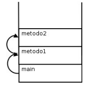
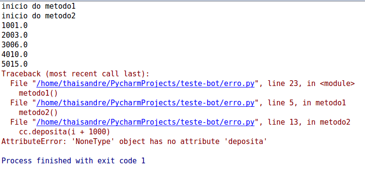
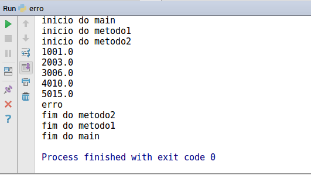
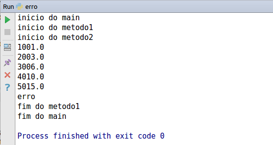
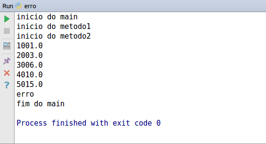

# Exceções e Erros

Voltando às contas que criamos no capítulo 8, o que aconteceria ao tentarmos chamar o método `saca()` com um valor fora do limite? O sistema mostraria uma mensagem de erro, mas quem chamou o método `saca()` não saberá que isso aconteceu.
    
Como avisar àquele que chamou o método de que ele não conseguiu fazer aquilo que deveria?
    
Os métodos dizem qual o contrato que eles devem seguir. Se, ao tentar chamar o método `sacar()`, ele não consegue fazer o que deveria, ele precisa, ao menos, avisar ao usuário que o saque não foi feito.
    
Veja no exemplo abaixo: estamos forçando uma `Conta` a ter um valor negativo, isto é, a estar em um estado inconsistente de acordo com a nossa modelagem.

``` python
conta = Conta('123-4', 'João')
conta.deposita(100.0)
conta.saca(3000.0)

#o método saca funcionou?
```

Em sistemas de verdade, é muito comum que quem saiba tratar o erro é aquele que chamou o método, e não a própria classe! Portanto, nada mais natural sinalizar que um erro ocorreu.
    
A solução mais simples utilizada antigamente é a de marcar o retorno de um método como boolean e retornar `True` se tudo ocorreu da maneira planejada, ou `False`, caso contrário:

``` python
if (valor > self.saldo + self.limite):
    print("nao posso sacar fora do limite")
    return False
else:
    self.saldo -= valor
    return True
```

Um novo exemplo de chamada do método acima:

``` python
conta = Conta('123-4', 'João')
conta.deposita(100.0)
conta.limite = 100.0

if (not conta.saca(3000.0)):
    print("nao saquei")
```

Repare que tivemos de lembrar de testar o retorno do método, mas não somos obrigados a fazer isso. Esquecer de testar o retorno desse método teria consequências drásticas: a máquina de autoatendimento poderia vir a liberar a quantia desejada de dinheiro, mesmo se o sistema não tivesse conseguido efetuar o método `saca()` com sucesso, como no exemplo a seguir:

``` python
conta = Conta("123-4", "João")
conta.deposita(100.0)

# ...

valor = 5000.0
conta.saca(valor) # vai retornar False, mas ninguém verifica

caixa_eletronico.emite(valor)
```

Mesmo invocando o método e tratando o retorno de maneira correta, o que faríamos se fosse necessário sinalizar quando o usuário passou um valor negativo como _valor_? Uma solução seria alterar o retorno de `boolean` para `int` e retornar o código do erro que ocorreu. Isso é considerado uma má prática (conhecida também como uso de "magic numbers").

Além de você perder o retorno do método, o valor devolvido é "mágico" e só legível perante extensa documentação, além de não obrigar o programador a tratar esse retorno e, no caso de esquecer isso, seu programa continuará rodando já num estado inconsistente.
    
Por esses e outros motivos, utilizamos um código diferente para tratar aquilo que chamamos de exceções: os casos onde acontece algo que, normalmente, não iria acontecer. O exemplo do argumento do saque inválido ou do id inválido de um cliente é uma exceção à regra.
    
Uma exceção representa uma situação que normalmente não ocorre e representa algo de estranho ou inesperado no sistema.

Antes de resolvermos o nosso problema, vamos ver como o interpretador age ao se deparar com situações inesperadas, como divisão por zero ou acesso a um índice de uma lista que não existe.
    
Para aprendermos os conceitos básicos das _exceptions_ do Python, crie um arquivo _teste\_erro.py_ e teste o seguinte código você mesmo:

``` python
from conta import ContaCorrente

def metodo1():
    print('início do metodo1')
    metodo2()
    print('fim do metodo1')

def metodo2():
    print('início do metodo2')
    cc = ContaCorrente('José', '123')
    for i in range(1,15):
        cc.deposita(i + 1000)
        print(cc.saldo)
        if(i == 5):
            cc = None

    print('fim do metodo2')
    
if __name__ == '__main__':
    print('início do main')
    metodo1()
    print('fim do main')
```

  

Repare que durante a execução do programa chamamos o `metodo1()` e esse, por sua vez, chama o `metodo2()`. Cada um desses métodos pode ter suas próprias variáveis locais, isto é: o `metodo1()` não enxerga as variáveis declaradas dentro do executável e por aí em diante.

Como o Python (e muitas outras linguagens) faz isso? Toda invocação de método é empilhado em uma estrutura de dados que isola a área e memória de cada um. Quando um método termina (retorna), ele volta para o método que o invocou. Ele descobre isso através da pilha de execução (_stack_): basta remover o marcador que está no topo da pilha:



Porém, o nosso `metodo2()` propositalmente possui um enorme problema: está acessando uma referência para `None` quando o índice for igual a 6!
    
Rode o código. Qual a saída? O que isso representa? O que ela indica?



Essa saída é o rastro de pilha, o _Traceback_. É uma saída importantíssima para o programador - tanto que, em qualquer fórum ou lista de discussão, é comum os programadores enviarem, juntamente com a descrição do problema, essa _Traceback_. Mas por que isso aconteceu?
    
O sistema de exceções do Python funciona da seguinte maneira: quando uma exceção é lançada (_raise_), o interpretador entra em estado de alerta e vai ver se o método atual toma alguma precaução ao tentar executar esse trecho de código. Como podemos ver, o `metodo2()` não toma nenhuma medida diferente do que vimos até agora.
    
Como o `metodo2()` não está tratando esse problema, o interpretador para a execução dele anormalmente, sem esperar ele terminar, e volta um _stackframe_ para baixo, onde será feita nova verificação: "o `método1()` está se precavendo de um problema chamado `AttributeError`?" Se a resposta é não, ele volta para o executável, onde também não há proteção, e o interpretador morre.
    
Obviamente, aqui estamos forçando esse caso e não faria sentido tomarmos cuidado com ele. É fácil arrumar um problema desses: basta verificar antes de chamar os métodos se a variável está com referência para `None`.
    
Porém, apenas para entender o controle de fluxo de uma _Exception_, vamos colocar o código que vai tentar (_try_) executar um bloco perigoso e, caso o problema seja do tipo `AttributeError`, ele será excluído(_except_). Repare que é interessante que cada exceção no Python tenha um tipo, afinal ela pode ter atributos e métodos.

Adicione um `try/except` em volta do `for`, 'pegando' um `AttributeError`. O que o código imprime?

``` python 
from conta import ContaCorrente

def metodo1():
    print('início do metodo1')
    metodo2()
    print('fim do metodo1')

def metodo2():
    print('início do metodo2')
    cc = ContaCorrente('José', '123')
    try:
        for i in range(1,15):
            cc.deposita(i + 1000)
            print(cc.saldo)
            if (i == 5):
            cc = None
    except:
        print('erro')

    print('fim do metodo2')
    
if __name__ == '__main__':
    print('início do main')
    metodo1()
    print('fim do main')    
```




  

Ao invés de fazer o `try` em torno do `for` inteiro, tente apenas com o bloco dentro do `for`:

``` python
def metodo2():
    print('início do metodo2')
    cc = ContaCorrente('José', '123')

    for i in range(1,15):
        try:
            cc.deposita(i + 1000)
            print(cc.saldo)
            if (i == 5):
                cc = None
        except:
            print('erro')

    print('fim do metodo2')
```

Qual a diferença?

    


Retire o `try/except` e coloque ele em volta da chamada do `metodo2()`:
``` python
def metodo1():
    print('início do metodo1')
    try:
        metodo2()
    except AttributeError:
        print('erro')   
    print('fim do metodo1') 
```


    
Faça o mesmo, retirando o `try/except` novamente e colocando-o em volta da chamada do `metodo1()`. Rode os códigos, o que acontece?
    
```python
if __name__ == '__main__':
    print('início do main')
    try:
        metodo1()
    except AttributeError:
        print('erro')   
    print('fim do main')    
```
   
 

Repare que, a partir do momento que uma _exception_ foi _catched_ (pega, tratada, _handled_), a exceção volta ao normal a partir daquele ponto.

## Exceções e tipos de erros

**Runtime**

Este tipo de erro ocorre quando algo de errado acontece durante a execução do programa. A maior parte das mensagens deste tipo de erro inclui informações do que o programa estava fazendo e o local que o erro aconteceu.

O interpretador mostra a famosa _Traceback_ - ele mostra a sequência de chamadas de função que fez com que você chegasse onde está, incluindo o número da linha de seu arquivo onde cada chamada ocorreu.

Os erros mais comuns de tempo de execução são:

* **NameError**

Quando tentamos acessar uma variável que não existe.

``` python
print(x)

Traceback (most recent call last):
  File "<stdin>", line 1, in <module>
NameError: name 'x' is not defined
```

  

No exemplo acima, tentamos imprimir `x` sem defini-lo antes. Este erro também é muito comum de ocorrer quando tentamos acessar uma variável local em um contexto global.

* **TypeError**

Quando tentamos usar um valor de forma inadequada, como por exemplo tentar indexar um sequência com algo diferente de um número inteiro ou de um fatiamento:

``` python
lista = [1, 2, 3]
print(lista['a'])

Traceback (most recent call last):
  File "<stdin>", line 2, in <module>
TypeError: list indices must be integers or slices, not str
```

  

* **KeyError**

Quando tentamos acessar um elemento de um dicionário usando uma chave que não existe.
``` python
dicionario = {'nome': 'João', 'idade': 25}
print(dicionario['cidade'])

Traceback (most recent call last):
  File "<stdin>", line 2, in <module>
KeyError: 'cidade'
```

  

* **AttributeError**

Quando tentamos acessar um atributo ou método que não existe em um objeto.

``` python
lista = [1, 2, 3]
print(lista.nome)

Traceback (most recent call last):
  File "<stdin>", line 2, in <module>
AttributeError: 'list' object has no attribute 'nome'
```

  

* **IndexError**

Quando tentamos acessar um elemento de uma sequência com um índice maior que o total de seus elementos menos um.

``` python
tupla = (1, 2, 3)
print(tupla[3])

Traceback (most recent call last):
  File "<stdin>", line 2, in <module>
IndexError: tuple index out of range
```

  

## Tratando Exceções

Há muitos outros erros de tempo de execução. Que tal dividir um número por zero? Será que o interpretador consegue fazer aquilo que nós definimos que não existe?

``` python    
n = 2
n = n / 0

Traceback (most recent call last):
  File "<stdin>", line 2, in <module>
ZeroDivisionError: division by zero
```

Repare que um `ZeroDivisionError` poderia ser facilmente evitado com um `if` que checaria se o denominador é diferente de zero, mas a forma correta de se tratar um erro no Python é através do comando **try/except**:

``` python
try:
    n = n/0
except ZeroDivisionError:
    print('divisão por zero')
```

Que gera a saída:

```        
divisão por zero
```

O conjunto de instruções dentro do bloco `try` é executado (o interpretador tentará executar). Se nenhuma exceção ocorrer, o comando `except` é ignorado e a execução é finalizada. Todavia, se ocorrer alguma exceção durante a execução do bloco `try`, as instruções remanescentes serão ignoradas, e se a exceção lançada prever um `except`, as instruções dentro do bloco `except` serão executadas.

O comando `try` pode ter mais de um comando `except` para especificar múltiplos tratadores para diferentes exceções. No máximo um único tratador será ativado. Tratadores só são sensíveis às exceções levantadas no interior da cláusula `try`, e não as que tenham ocorrido no interior de outro tratador numa mesma instrução `try`. Um tratador pode ser sensível a múltiplas exceções, desde que as especifique em uma tupla:

``` python
except(RuntimeError, TypeError, NameError):
    pass
```

A última cláusula `except` pode omitir o nome da exceção, funcionando como um coringa. Não é aconselhável abusar deste recurso, já que isso pode esconder erros do programador e do usuário.

O bloco `try/except` possui um comando opcional `else` que, quando usado, deve ser colocado depois de todos os comandos `except`. É um comando útil para códigos que precisam ser executados se nenhuma exceção foi lançada, por exemplo:

``` python
try:
    arquivo = open('palavras.txt', 'r')
except IOError:
    print('não foi possível abrir o arquivo')
else:
    print('o arquivo tem {} palavras'.format(len(arquivo.readlines())))
    arquivo.close()
```

## Levantando exceções

O comando `raise` nos permite forçar a ocorrência de um determinado tipo de exceção. Por exemplo:

```python
raise NameError('oi')
Traceback (most recent call last):
  File "<stdin>", line 1, in ?
NameError: oi
```

O argumento de `raise` indica a exceção a ser lançada. Esse argumento deve ser uma instância de `Exception` ou uma classe de alguma exceção - uma classe que deriva de `Exception`.

Caso você precise determinar se uma exceção foi lançada ou não, mas não quer manipular o erro, uma forma é lançá-la novamente através da instrução `raise`:

```python
try:
    raise NameError('oi')
except NameError:
    print('lançou uma exceção')
    raise
```

Saída:
```python
lançou uma exceção        
Traceback (most recent call last):
  File "<stdin>", line 1, in ?
NameError: oi
```

## Definir uma Exceção

Programas podem definir novos tipos de exceções, através da criação de uma nova classe. Exceções devem ser derivadas da classe `Exception`, direta ou indiretamente. Por exemplo:

``` python
class MeuErro(Exception):
    def __init__(self, valor):
        self.valor = valor
    def __str__(self):
        return repr(self.valor)

if __name__ == '__main__':
    try:
        raise MeuErro(2*2)
    except MeuErro as e:
        print('Minha exceção ocorreu, valor: {}'.format(e.valor))

    raise MeuErro('oops!')
```

Que quando executado gera a saída:

```python
Minha exceção ocorreu, valor: 4
Traceback (most recent call last):
  File "<stdin>", line 13, in <module>
    raise MeuErro('oops!')
    __main__.MeuErro: 'oops!'
```

  

Neste exemplo, o método `__init__` da classe `Exception` foi reescrito. O novo comportamento simplesmente cria o atributo valor. Classes de exceções podem ser definidas para fazer qualquer coisa que qualquer outra classe faz, mas em geral são bem simples, frequentemente oferecendo apenas alguns atributos que fornecem informações sobre o erro que ocorreu. 

Ao criar um módulo que pode gerar diversos erros, uma prática comum é criar uma classe base para as exceções definidas por aquele módulo, e as classes específicas para cada condição de erro como subclasses dela:

```python
class MeuErro(Exception):
    """Classe base para outras exceções"""
    pass

class ValorMuitoPequenoError(MeuErro):
    """É lançada quando o valor passado é muito pequeno"""
    pass

class ValorMuitoGrandeError(MeuErro):
    """É lançada quando o valor passado é muito grande"""
    pass
```

Essa é a maneira padrão de definir exceções no Python, mas o programador não precisa ficar preso a ela. É comum que novas exceções sejam definidas com nomes terminando em “Error”, semelhante a muitas exceções embutidas.

## Para saber mais: finally

O comando _try_ pode ter outro comando opcional, chamado _finally_. Sua finalidade é permitir a implementação de ações de limpeza, que sempre devem ser executadas independentemente da ocorrência de exceções. Como no exemplo:

```python
def divisao(x, y):
    try:
        resultado = x / y
    except ZeroDivisionError:
        print("Divisão por zero")
    else:
        print("o resultado é {}".format(resultado))
    finally:
        print("executando o finally")


if __name__ == '__main__':
    divide(2, 1)
    divide(2, 0)
    divide('2', '1')         
```

Executando:

```python
resultado é 2
executando o finally
divisão por zero
executando o finally
executando o finally
Traceback (most recent call last):
  File "<stdin>", line 1, in ?
  File "<stdin>", line 3, in divide
TypeError: unsupported operand type(s) for /: 'str' and 'str'
```

Repare que o bloco _finally_ é executado em todos os casos. A exceção `TypeError` levantada pela divisão de duas _strings_ e não é tratada no _except_ e portanto é relançada depois que o _finally_ é executado.

Em aplicações reais, o _finally_ é útil para liberar recursos externos (como arquivos ou conexões de rede), independentemente do uso do recurso ter sido bem sucedido ou não.

## Árvore de Exceções

No Python, todas as exceções são instâncias de uma classe derivada de `BaseException`. Todavia, ela não serve para ser diretamente herdada por exceções criadas por programadores. Para isso, utilizamos `Exception`, que também é filha de `BaseException`.

Abaixo está a hierarquia de classes de exceções do Python. Para mais informações sobre cada uma delas, consulte a documentação: https://docs.python.org/3/library/exceptions.html
```
BaseException
 +-- SystemExit
 +-- KeyboardInterrupt
 +-- GeneratorExit
 +-- Exception
      +-- StopIteration
      +-- StopAsyncIteration
      +-- ArithmeticError
      |    +-- FloatingPointError
      |    +-- OverflowError
      |    +-- ZeroDivisionError
      +-- AssertionError
      +-- AttributeError
      +-- BufferError
      +-- EOFError
      +-- ImportError
      |    +-- ModuleNotFoundError
      +-- LookupError
      |    +-- IndexError
      |    +-- KeyError
      +-- MemoryError
      +-- NameError
      |    +-- UnboundLocalError
      +-- OSError
      |    +-- BlockingIOError
      |    +-- ChildProcessError
      |    +-- ConnectionError
      |    |    +-- BrokenPipeError
      |    |    +-- ConnectionAbortedError
      |    |    +-- ConnectionRefusedError
      |    |    +-- ConnectionResetError
      |    +-- FileExistsError
      |    +-- FileNotFoundError
      |    +-- InterruptedError
      |    +-- IsADirectoryError
      |    +-- NotADirectoryError
      |    +-- PermissionError
      |    +-- ProcessLookupError
      |    +-- TimeoutError
      +-- ReferenceError
      +-- RuntimeError
      |    +-- NotImplementedError
      |    +-- RecursionError
      +-- SyntaxError
      |    +-- IndentationError
      |         +-- TabError
      +-- SystemError
      +-- TypeError
      +-- ValueError
      |    +-- UnicodeError
      |         +-- UnicodeDecodeError
      |         +-- UnicodeEncodeError
      |         +-- UnicodeTranslateError
      +-- Warning
           +-- DeprecationWarning
           +-- PendingDeprecationWarning
           +-- RuntimeWarning
           +-- SyntaxWarning
           +-- UserWarning
           +-- FutureWarning
           +-- ImportWarning
           +-- UnicodeWarning
           +-- BytesWarning
           +-- ResourceWarning
```

## Exercícios: Exceções

1. Na classe `Conta`, modifique o método `deposita()`. Ele deve lançar uma exceção chamada `ValueError`, que já faz parte da biblioteca padrão do Python, sempre que o valor passado como argumento for inválido (por exemplo, quando for negativo):

    ``` python
    def deposita(self, valor):
        if (valor < 0):
            raise ValueError
        else:
            self._saldo += valor    
    ```

1. Da maneira com está, apenas saberemos que ocorreu um `ValueError`, mas não saberemos o motivo. Vamos acrescentar uma mensagem para deixar o erro mais claro:

    ``` python
    def deposita(self, valor):
        if(valor < 0):
            raise ValueError('Você tentou depositar um valor negativo.')
        else:
            self._saldo += valor  
    ```

    Obs.: modifique também a implementação do método `deposita()` da classe `ContaPoupanca` da mesma maneira que fizemos na classe `Conta`, lançando um `ValueError` caso o valor passado seja negativo.

1. Faça o mesmo para o método `saca()` da classe `ContaCorrente`, afinal o cliente também não pode sacar um valor negativo.

    ``` python
    def saca(self, valor):
        if(valor < 0):
            raise ValueError('Você tentou sacar um valor negativo.')
        else:
            self._saldo -= valor  
    ```

1. Vamos validar também que o cliente não pode sacar um valor maior do que o saldo disponível em conta. Crie sua própria exceção chamada `SaldoInsuficienteError`. Na pasta `src`, crie o arquivo `excecoes.py` e a classe `SaldoInsuficienteError` que deve herdar de `RuntimeError`.

    ``` python
    class SaldoInsuficienteError(RuntimeError):
        pass
    ```
    
    No método saca da classe `ContaCorrente`, vamos utilizar esta nova exceção:

    ``` python
    class ContaCorrente(Conta):
        # código omitido

        def saca(self, valor):
            if (valor < 0):
                raise ValueError('Você tentou sacar um valor negativo.')
            if (self._saldo < valor):
                raise SaldoInsuficienteError('Saldo insuficiente.')
            self._saldo -= (valor + 0.10)
    ```
    Obs.: modifique também a implementação do método `saca()` da classe `Conta`, lançando os erros `ValueError` e `SaldoInsuficienteError` da mesma maneira que fizemos na classe `ContaCorrente`. 

1. Agora crie uma `ContaCorrente` e chame o método `saca()`, passando um valor negativo:

    ``` python
    if __name__ == '__main__':
        cc = ContaCorrente('123-4', 'João', 1000.0)

        valor = -1000.0
        cc.saca(valor)
    ```
    O que acontece ?

1. Precisamos tratar o erro para não parar a execução do programa. Utilize um bloco `try/except` para isso:

    ``` python
    if __name__ == '__main__':
        cc = ContaCorrente('123-4', 'João', 1000.0)

        valor = -1000.0

        try:
            cc.saca(valor)
            print('Saque de {} realizado com sucesso'.format(valor))
        except ValueError:
            print('O valor a ser sacado deve ser um número positivo.')

    ```
    Rode o programa acima e veja o que acontece.

1. Agora tente sacar um valor maior do que o saldo:

    ``` python
    if __name__ == '__main__':
        cc = ContaCorrente('123-4', 'João', 1000.0)

        valor = 5000.0
    
        try:
            cc.saca(valor)
            print('Saque de {} realizado com sucesso.'.format(valor))
        except ValueError:
            print('O valor a ser sacado deve ser um número positivo.')
    ```
    O que acontece?

1. Modique o programa e faça com que o erro `SaldoInsuficienteError` não seja lançado quando o valor for maior do que o saldo da conta.
    
    ``` python
    if __name__ == '__main__':
        cc = ContaCorrente('123-4', 'João', 1000.0)

        valor = 5000.0
    
        try:
            cc.saca(valor)
            print('Saque de {} realizado com sucesso.'.format(valor))
        except ValueError:
            print('O valor a ser sacado deve ser um número positivo.')
        except SaldoInsuficienteError:
            print('Você não possui saldo suficiente para concluir esta operação.')
    ```
    
    Não esqueça de fazer os _imports_ necessários.

1. Faça testes com o método `deposita()`. Tente depositar um valor negativo e veja o que acontece.

    ``` python
    if __name__ == '__main__':
        cc = ContaCorrente('123-4', 'João', 1000.0)

        valor = -1000.0
    
        try:
            cc.deposita(valor)
            print('Depósito de {} realizado com sucesso.'.format(valor))
        except ValueError:
            print('O valor a ser depositado deve ser um número positivo.')
    ```

1. (Desafio) Este código simula uma operação de saque feito por um caixa eletrônico e poderia ser encapsulado em uma classe que represente o caixa. Crie uma classe chamada `CaixaEletronico` com os métodos que represente as operações de depósito e saque. Depois, instancie um objeto do tipo `CaixaEletronico` e teste seus métodos.

## Outros Erros

* **Erros de sintaxe**
Um dos erros mais comuns é o **SyntaxError**. Geralmente suas mensagens não dizem muito, a mais comum é a `SyntaxError: invalid syntax`. Por outro lado, a mensagem diz o local onde o problema ocorreu. - onde o Python encontrou o problema. 
São descobertos quando o interpretador está traduzindo o código fonte para o bytecode. Indicam que há algo de errado com a estrutura do programa. Por exemplo: esquecer de fechar aspas, simples ou duplas, na hora de imprimir um mensagem; esquecer de colocar dois pontos (":") ao final de uma instrução `if`, `while` ou `for`, etc...

* **Erro semântico**
Este erro é quando o programa não se comporta como esperado. Aqui não é lançada uma exceção, o programa apenas não faz a coisa certa. São mais difíceis de encontrar porque o interpretador não fornece nenhuma informação já que não sabe o que o programa deveria fazer. São erros na regra de negócio. Utilizar a função `print()`