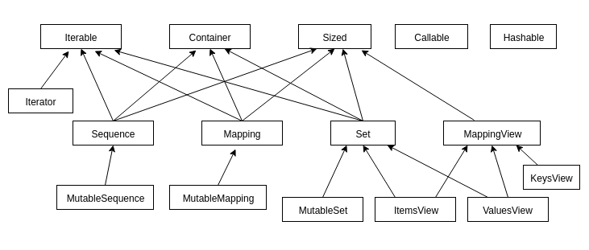
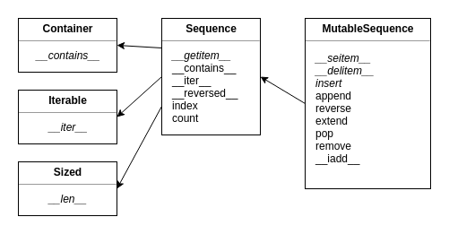

# Collections

Objetivos:

* conhecer o módulo collections
* conhecer o módulo collections.abc

No capítulo 5, vimos uma introdução das principais estruturas de dados do Python como listas, tuplas, conjuntos e dicionários. Também aprendemos em orientação a objetos que tudo em Python é um objeto, inclusive estas estruturas.

O Python possui uma biblioteca chamada `collections`, que reúne outros tipos de dados alternativos ao já apresentados no capítulo 5. Esses tipos trazem novas funcionalidades que podem ser implementadas para melhorar a eficiência do nosso código.

O módulo collections também provê um módulo de classes abstratas, o módulo `abc.collections`, que podem ser usadas para testar se determinada classe provê uma interface particular. Aprenderemos um pouco sobre elas e seu uso.

## UserList, UserDict e UserString

As estruturas de dados padrão do Python são de grande valia e muito utilizadas na linguagem, mas existem momentos em que precisamos de funcionalidades extras que são comuns de projeto para projeto. Nesse sentido, surge o módulo `collections`, pra acrescentar essas funcionalidades.

Por exemplo, no livro [`Python Fluente`](http://shop.oreilly.com/product/0636920032519.do) de Luciano Ramalho, é apresentado um exemplo em que precisamos acrescentar funcionalidades extras:

> "Um caso de uso concreto é o projeto Pingo.io (http://www.pingo.io/docs/), em que uma placa programável com pinos
> GPIO (por exemplo, Raspberry Pi ou Arduino) é representada por um objeto `board` com um atributo `board.pins`; esse
> atributo contém um mapeamento das localizações físicas dos pinos para objetos que representam os pinos. A 
> localização física pode ser um número ou uma _string_ como "A0" ou "P9_12". Por questões de consistência, é 
> desejável que todas as chaves com `board.pins` sejam _strings_, mas é conveniente que a consulta a 
> `my_arduino.pin[13]` também funcione de modo que programadores iniciantes não tenham problemas quando quiserem 
> fazer piscar o LED no pino 13 de seus Arduinos."

Precisamos usar índices que são _strings_, portanto, um dicionário. Além disso, nosso dicionário poderia **apenas** aceitar _strings_ como chaves para este objetivo específico. Para não tratar isso durante a execução de nosso programa, podemos criar uma classe que tenha o comportamento de um dicionário com essa característica específica.

Para isso, criamos uma classe que herda de uma classe chamada `UserDict` do pacote `collections`:

``` python
class MeuDicionario(UserDict):
    pass
```

A classe `UserDict` não herda de `dict`, mas simula um dicionário. A `UserDict` possui uma instância de `dict` interna chamada `data`, que armazena os itens propriamente ditos.

Criar subclasses de tipos embutidos como `dict` ou `list` diretamente é propenso a erros, porque seus métodos geralmente ignoram as versões sobrescritas. Além de que cada implementação pode se comportar de maneira diferente. O fato de herdarmos de `UserDict` e não diretamente de `dict` é para evitarmos esses problemas.

Criando a classe desta maneira, temos uma classe nossa que funciona como um dicionário. Mas não faz sentido criá-la sem acrescentar funcionalidades, já que o Python já possui essa estrutura pronta que é o `dict`.

Vamos criar nosso dicionário, de modo que só aceite chaves como `strings` e vai representar os pinos da placa do Rasbperry Pi, por exemplo:

``` python
from collections import UserDict

class Pins(UserDict):

    def __contains__(self, key):
        return str(key) in self.keys()

    def __setitem__(self, key, value):
        self.data[str(key)] = value
```

Note que a sobrescrita de `__setitem__` garante que a chave sempre será uma `string`. Podemos testar essa classe:

``` python
if __name__ == '__main__':
    pins = Pins(one=1)
    print(pins)
    pins[3] = 1
    lista = [1, 2, 3]
    pins[lista] = 2
    print(pins)
```

Perceba que quando imprimimos o dicionário, todas suas chaves são `strings`.

  

## Para saber mais

Outros tipos que existem no módulo collections são: `defaultdict`, `counter`, `deque` e `namedtuple`.

Ao contrário do `dict`,  no `defaultdict` não é necessário verificar se uma chave está presente ou não. 

``` python
from collections import defaultdict

cores = [('1', 'azul'), ('2', 'amarelo'), ('3', 'vermelho'), ('1', 'branco'), ('3', 'verde')]

cores_favoritas = defaultdict(list)


for chave, valor in cores:
    cores_favoritas[chave].append(valor)

print(cores_favoritas)
```

O código vai gerar a saída:

``` python
[('1', ['azul', 'branco']), ('2', ['amarelo']), ('3', ['vermelho', 'verde'])]
```

Sem acusar `KeyError`.

* **Counter**

O `Counter` é um contador e  permite contar as ocorrências de um determinado item em uma estrutura de dados:

``` python
from collections import Counter

cores = ['amarelo', 'azul', 'azul', 'vermelho', 'azul', 'verde', 'vermelho']

contador = Counter(cores)

print(contador)
```

Vai imprimir:

``` python
Counter({'azul': 3, 'vermelho': 2, 'amarelo': 1, 'verde': 1}) 
```

  

Um `Counter` é um `dict` e pode receber um objeto iterável ou um mapa como argumento para realizar a contagem de seus elementos.

* **deque**

O `deque` é uma estrutura de dados que fornece uma `fila` com duas extremidades e é possível adicionar e remover elementos de ambos os lados:

``` python
from collections import deque

fila = deque()

fila.append('1')
fila.append('2')
fila.append('3')

print(len(fila))        #saída: 3

fila.pop()              #exclui elemento da direita

fila.append('3')        #adiciona elemento na direita

fila.popleft()          #exclui elemento da esquerda

fila.appendleft('1')    #adiciona elemento na esquerda    
```

* **namedtuple**

A `namedtuple`, como o nome sugere, são tuplas nomeadas. Não é necessário usar índices inteiros para acessar seus elementos e podemos utilizar *strings*  - similar aos dicionários. Mas ao contrário dos dicionários, `namedtuple` é imutável:

``` python
from collections import namedtuple

Conta = namedtuple('Conta', 'numero titular saldo limite')
conta = Conta('123-4', 'João', 1000.0, 1000.0)

print(conta)            # saída: Conta(numero='123-4', titular='João', saldo=1000.0, limite=1000.0)

print(conta.titular)    #saída: João
```

  


Note que para acessar o elemento nomeado utilizamos o operador '.' (ponto). Uma `namedtuple` possui dois argumentos obrigatórios que são: o nome da tupla e seus campos (separados por vírgula ou espaço). No exemplo, a tupla se chama `Conta` e possui 4 campos: `numero`, `titular`, `saldo` e `limite`. Como são imutáveis, não podemos modificar os valores de seus campos:

``` python
conta.titular = "José"
```

Isso vai gerar o seguinte erro:

``` python
Traceback (most recent call last):
  File <stdin>, line 5, in <module>
    conta.titular = "José"
AttributeError: can't set attribute
```

  

A `namedtuple` também é compatível com uma tupla normal. Isso quer dizer que você também pode usar índices inteiros para acessar seus elementos.

``` python
print(conta[0])     #saída: '123-4'
```

Mais detalhes de cada uma dessas estruturas estão na documentação e pode ser acessadas por este link: https://docs.python.org/3/library/collections.html. Outra alternativa é usar a função `help()` no objeto para acessar a documentação.

## Collections abc

O módulo `collections.abc` fornece classes abstratas que podem ser usadas para testar se uma classe fornece uma interface específica. Por exemplo, se ela é iterável ou não.

Imagine que o banco nos entregou um arquivo com vários funcionários e pediu que calculássemos a bonificação de cada um deles. Precisamos acrescentar este arquivo em nossa aplicação para iniciar a leitura.

Conteúdo do arquivo funcionarios.txt:

```
João,111111111-11,2500.0
Jose,222222222-22,3500.0
Maria,333333333-33,4000.0
Pedro,444444444-44,2500.0
Mauro,555555555-55,1700.0
Denise,666666666-66,3000.0
Tomas,777777777-77,4200.0
```

Cada linha do arquivo representa um `Funcionario` com seus atributos separados por vírgula. Este arquivo está no padrão _Comma-separated-values_, também conhecido como _csv_ e são comumente usados. O Python dá suporte de leitura para este tipo de arquivo. Assim, vamos acrescentar o módulo `csv`, que vai ajudar na tarefa de ler o arquivo:

``` python    
import csv

arquivo = open('funcionarios.txt', 'r')
leitor = csv.reader(arquivo)

for linha in leitor:
    print(linha)

arquivo.close()  
```

O programa acima abre um arquivo e um leitor do módulo `csv`, o `reader` - recebe o arquivo como parâmetro e devolve um leitor que vai ler linha a linha e guardar seu conteúdo. Podemos iterar sobre este leitor e pedir para imprimir o conteúdo de cada linha -  que é exatamente o que é feito no laço _for_. Por último, fechamos o arquivo.

A saída será:

```
['João', '111111111-11', '2500.0']
['Jose', '222222222-22', '3500.0']
['Maria', '333333333-33', '4000.0']
['Pedro', '444444444-44', '2500.0']
['Mauro', '555555555-55', '1700.0']
['Denise', '666666666-66', '3000.0']
['Tomas', '777777777-77', '4200.0']
```

Repare que o `reader` guarda cada linha de um arquivo em uma lista, e cada valor delimitado por vírgula se torna um elemento desta lista, o que facilita o acesso aos dados.

Agora com estes dados em mãos, podemos construir nossos objetos de tipo `Funcionario`:

``` python
for linha in leitor:
    funcionario = Funcionario(linha[0], linha[1], float(linha[2]))
```

Mas ainda precisamos de uma estrutura para guardá-los. Vamos utilizar uma lista:

``` python
funcionarios = []

for linha in leitor:
    funcionario = Funcionario(linha[0], linha[1], float(linha[2]))
    funcionarios.append(funcionario)
```

Por fim, imprimimos os saldos da lista:

``` python
for f in funcionarios:
    print(f.salario)
```

Acontece que nada impede, posteriormente, de inserirmos nesta lista qualquer outro objeto que não um funcionário:

``` python
funcionarios.append('Python')
funcionarios.append(1234)
funcionarios.append(True)
```

A `list` da biblioteca padrão aceita qualquer tipo de objeto como elemento. Não queremos este comportamento, já que iremos calcular a bonificação de cada um deles, onde dependendo do tipo de objetos inserido na lista, gerará erros.

O ideal é que tivéssemos uma estrutura de dados que aceitasse apenas objetos de tipo Funcionario. O módulo `collections.abc` fornece classes abstratas que nos ajudam a construir estruturas específicas, com características da regra de negócio da aplicação.

## Construindo um Container

O módulo `collections.abc` possui uma classe absrata chamada `Container`. Um `Container` é qualquer objeto que contém um número arbitrário de outros objetos. Listas, tuplas, conjuntos e dicionários são tipos de _containers_. A classe `Container` suporta o operador `in` com o método `__contains__`.

Precisamos construir um _container_ de objetos de tipo `Funcionario`. Podemos construir uma classe que representará essa estrutura, que deve ser subclasse de `Container`:

``` python
from collections.abc import Container

class Funcionarios(Container):
    pass

if __name__ == '__main__':
    funcionarios = Funcionarios()    
```

O código acima acusa um `TypeError`:

``` python
TypeError: Can't instantiate abstract class Funcionarios with abstract methods __contains__
```

Precisamos implementar o método `__contains__`, já que `Funcionarios` deve implementar a classe abstrata `Container`. A ideia é que nosso _container_ se comporte como uma lista, então teremos um atributo do tipo lista em nossa classe para guardar os objetos e implementar o método _contains_:

``` python
from collections.abc import Container

class Funcionarios(Container):
    
    _dados = []

    def __contains__(self, item):
        return self._dados.__contains__(self, item)

if __name__ == '__main__':
    funcionarios = Funcionarios()    
```

## Sized

O tamanho do nosso _container_ também é uma informação importante. Nossa classe `Funcionarios` deve saber retornar esse valor. Utilizamos a classe abstrata `Sized` para garantir essa funcionalidade. A classe `Sized` provê o método `len()` através do método especial `__len__()`:

``` python
from collections.abc import Container

class Funcionarios(Container, Sized):
    
    _dados = []

    def __contains__(self, item):
        return self._dados.__contains__(self, item)

    def __len__(self):
        return len(self._dados)    

if __name__ == '__main__':
    funcionarios = Funcionarios()    
```

## Iterable 

Além de conter objetos e saber retornar a quantidade de seus elementos, queremos que nosso _container_ seja iterável, ou seja, que consigamos iterar sobre seus elementos em um laço _for_, por exemplo. O módulo `collection.abc` também provê uma classe abstrata para este comportamento, é a classe `Iterable`.
`Iterable` suporta iteração com o método `__iter__`:

``` python
from collections.abc import Container

class Funcionarios(Container, Sized, Iterable):
    
    _dados = []

    def __contains__(self, item):
        return self._dados.__contains__(self, item)

    def __len__(self):
        return len(self._dados)

    def __iter__(self):
        return self._dados.__iter__(self)        

if __name__ == '__main__':
    funcionarios = Funcionarios()    
```

Toda coleção deve herdar dessas classes ABCs: `Container`, `Iterable` e `Sized`. Ou implementar seus protocolos: `__contains__`, `__iter__` e `__len__`.

Além dessas classes, existem outras que facilitam esse trabalho e implementam outros protocolos. Veja a hierarquia de classe do módulo collections.abc:



Além do que já foi implementado, a ideia é que nossa classe `Funcionario` funcione como uma lista contando apenas objetos do tipo `Funcionario`. Como aprendemos no capítulo 4, uma lista é uma sequência. Além de uma sequência, é uma sequência **mutável** - podemos adicionar elementos em uma lista. Nossa classe `Funcionario` também deve possuir essa funcionalidade.

Segundo o diagrama de classes do módulo `collections.abc`, a classe que representa essa estrutura é a `MutableSequence`. Note que `MutableSequence` herda de `Sequence` que representa uma sequência; que por sua vez herda de `Container`, `Iterable` e `Sized`.



Portanto, devemos implementar 5 métodos abstratos (em itálico na imagem) segundo a documentação de `MutableSequence`: `__len__`, `__getitem__`, `__setitem__`, `__delitem__` e `insert`. O método `__getitem__` garante que a classe é um `Container` e `Iterable`. Segundo a PEP 234 (https://www.python.org/dev/peps/pep-0234/) um objeto pode ser iterável com um laço _for_ se implementa `__iter__` ou `__getitem__`.

Então, basta nossa classe `Funcionario` herdar de `MutableSequence` e implementar seus métodos abstratos:

``` python
from collections.abc import MutableSequence

class Funcionarios(MutableSequence):

    _dados = []

    def __len__(self):
        return len(self._dados)

    def __getitem__(self, posicao):
        return self._dados[posicao]

    def __setitem__(self, posicao, valor):
        self._dados[posicao] = valor

    def __delitem__(self, posicao):
        del self._dados[posicao]

    def insert(self, posicao, valor):
        return self._dados.insert(posicao, valor)
```

E podemos voltar ao nosso código para acrescentar os dados de um arquivo em nosso _container_ `Funcionarios`:

``` python
import csv

arquivo = open('funcionarios.txt', 'r')
leitor = csv.reader(arquivo)

funcionarios = Funcionarios()

for linha in leitor:
    funcionario = Funcionario(linha[0], linha[1], float(linha[2]))
    funcionarios.append(funcionario)

arquivo.close()  
```

O método `insert()` garante o funcionamento do método `append()`. E podemos imprimir os valores dos salários de cada funcionário:

``` python
for f in funcionarios:
    print(f.salario)
```

Mas até aqui não há nada de diferente de uma lista comum. Ainda não há nada que impeça de inserir qualquer outro objeto em nossa lista. Nossa classe `Funcionarios` se comporta como uma lista comum. A ideia de implementarmos as interfaces de `collections.abc` era exatamente modificar alguns comportamentos.

Queremos que nossa lista de funcionários apenas aceite objetos da classe `Funcionario`. Vamos sobrescrever os métodos `__setitem__()` que atribuiu um valor em determinada posição na lista. Este método pode apenas atribuir a uma determinada posição um objeto `Funcionario`.

Para isso, vamos usar o método `isinstance()` que vai verificar se o objeto a ser atribuído é uma instância de `Funcionario`. Caso contrário, vamos lançar uma exceção `TypeError` com uma mensagem de erro:

``` python
def __setitem__(self, posicao, valor):
    if (isinstance(valor, Funcionario)):
        self._dados[posicao] = valor
    else:
        raise TypeError('Valor atribuído não é um Funcionario')
```

Agora, ao tentar atribuir uma valor a determinada posição de nossa lista, recebemos um `TypeError`:

``` python
funcionarios[0] = 'Python'
```

Saída:

``` python
Traceback (most recent call last):
  File <stdin>, line 18, in __setitem__
    raise TypeError('Valor atribuído não é um Funcionario')
TypeError: Valor atribuído não é um Funcionario
```

Faremos o mesmo com o método `insert()`:

``` python
def insert(self, posicao, valor):
    if(isinstance(valor, Funcionario)):
        return self._dados.insert(posicao, valor)
    else:
        raise TypeError('Valor inserido não é um Funcionario')
```

E podemos testar nossa classe imprimindo não apenas o salário mas o valor da bonificação de cada `Funcionario` através do método `get_bonificacao()` que definimos nos capítulos passados:

``` python 
if __name__ == '__main__':
    import csv

    arquivo = open('funcionarios.txt', 'r')
    leitor = csv.reader(arquivo)

    funcionarios = Funcionarios()

    for linha in leitor:
        funcionario = Funcionario(linha[0], linha[1], float(linha[2]))
        funcionarios.append(funcionario)

    print('salário - bonificação')    
    for f in funcionarios:
        print('{} - {}'.formar(f.salario, f.get_bonificacao()))    

    arquivo.close()  
```

As classes ABCs foram criadas para encapsular conceitos genéricos e abstrações como aprendemos no capítulo de classes abstratas. São comumente utilizadas em grandes aplicações e frameworks para garantir a consistência do sistema através dos métodos `isinstance()` e `issubclass()`. No dia a dia é raramente usado e basta o uso correto das estruturas já fornecidas pela biblioteca padrão do Python para a maior parte das tarefas.

## Exercício: Criando nossa Sequência

1. Vá na pasta no curso e copie o arquivo `contas.txt` na pasta `src` do projeto `banco` que contém vários dados de contas correntes de clientes do banco.

1. Crie um arquivo chamado _contas.py_ na pasta `src` do projeto `banco`. Crie uma classe chamada `Contas` que herde da classe abstrata `MutableSequence`:

    ``` python
    from collections.abc import MutableSequence

    class Contas(MutableSequence):
        pass
    ```

1. Vamos criar um atributo na classe chamado `_dados` do tipo `list` para armazenar nossas contas:

    ``` python
    from collections.abc import MutableSequence

    class Contas(MutableSequence):
        
        _dados = []
    ```

1. Tente instanciar um objeto de tipo `Contas`:

    ``` python
    if __name__=='__main__':
        contas = Contas()
    ```
    Note que não podemos instanciar este objeto. A interface `MutableSequence` nos obriga a implementar alguns métodos:

    ```python
    Traceback (most recent call last):
      File <stdin>, line 44, in <module>
        contas = Contas()
    TypeError: Can't instantiate abstract class Contas with abstract methods __delitem__, __getitem__, __len__, __setitem__, insert
    ```

1. Implemente os métodos exigidos pela interface `MutableSequence` na classe `Contas`:

    ``` python
    from collections.abc import MutableSequence

    class Contas(MutableSequence):
        
        _dados = []

        def __len__(self):
            return len(self._dados)

        def __getitem__(self, posicao):
            return self._dados[posicao]

        def __setitem__(self, posicao, valor):
            self._dados[posicao] = valor

        def __delitem__(self, posicao):
            del self._dados[posicao]

        def insert(self, posicao, valor):
            return self._dados.insert(posicao, valor)         
    ```
    
    Agora conseguimos instanciar nossa classe sem nenhum erro:

    ``` python
    if __name__=='__main__':
        contas = Contas()
    ```

1. Nossa sequência só deve permitir adicionar elementos que sejam do tipo `Conta`. Vamos acrescentar essa validação nos métodos `__setitem__` e `insert`. Caso o valor não seja uma `Conta`, vamos lançar um `TypeError` com as devidas mensagens de erro:

    ``` python
    def __setitem__(self, posicao, valor):
        if (isinstance(valor, Conta)):
            self._dados[posicao] = valor
        else:
            raise TypeError("valor atribuído não é uma Conta")

    def insert(self, posicao, valor):
        if(isinstance(valor, Conta)):
            return self._dados.insert(posicao, valor)
        else:
            raise TypeError('valor inserido não é uma Conta')     
    ```

1. Vamos iniciar a leitura dos dados do arquivo para armazenar em nosso objeto `contas`:

    ``` python
    if __name__=='__main__':
        import csv

        contas = Contas()

        arquivo = open('contas.txt', 'r')
        leitor = csv.reader(arquivo)

        arquivo.close()
    ```

1. Vamos criar uma laço _for_ para ler cada linha do arquivo e construir um objeto do tipo `ContaCorrente`.

    ``` python
    if __name__=='__main__':
        import csv
        from conta import ContaConrrete

        contas = Contas()

        arquivo = open('contas.txt', 'r')
        leitor = csv.reader(arquivo)

        for linha in leitor:
            conta = ContaCorrente(linha[0], linha[1], float(linha[2]), float(linha[3]))

        arquivo.close()
    ```

1. Queremos inserir cada conta criada em nossa sequência mutável `contas`. Vamos pedir para que o programa acrescente cada conta criada em contas:

    ``` python
    for linha in leitor:
        conta = ContaCorrente(linha[0], linha[1], float(linha[2]), float(linha[3]))
        contas.append(conta)

    arquivo.close()    
    ```

1. Nossa classe `Contas` implementa `MutableSequence`. Isso quer dizer que ela é iterável já que `MutableSequence` implementa o protocolo `__iter__` através do método `__getitem__`. Vamos iterar através de uma laço _for_ nosso objeto `contas` e pedir para imprimir o saldo e o valor do imposto de cada uma delas:

    ``` python
    if __name__ == '__main__':
        #código anterior omitido

        arquivo.close()

        print('saldo -  imposto')
    
        for c in contas:
            print('{} - {}'.format(c.saldo, c.get_valor_imposto()))
    ```
    Que vai gerar a saída:
    ``` 
    saldo  - imposto
    1200.0 - 12.0
    2200.0 - 22.0
    1500.0 - 15.0
    5300.0 - 53.0
    7800.0 - 78.0
    1700.0 - 17.0
    2300.0 - 23.0
    8000.0 - 80.0
    4600.0 - 46.0
    9400.0 - 94.0
    ```

1. (Opcional) Modifique o código do exercício anterior de modo que imprima o valor do saldo atualizado das contas.

1. (Opcional) Faça o mesmo com as contas poupanças. Crie um arquivo com extensão `.csv` com algumas contas poupanças, faça a leitura, construa os objetos e acrescente em uma estrutura de dados do tipo `MutableSequence`. 

1. (Desafio Opcional) Refaça o exercício utilizando `MutableMapping` ao invés de `MutableSequence`.


