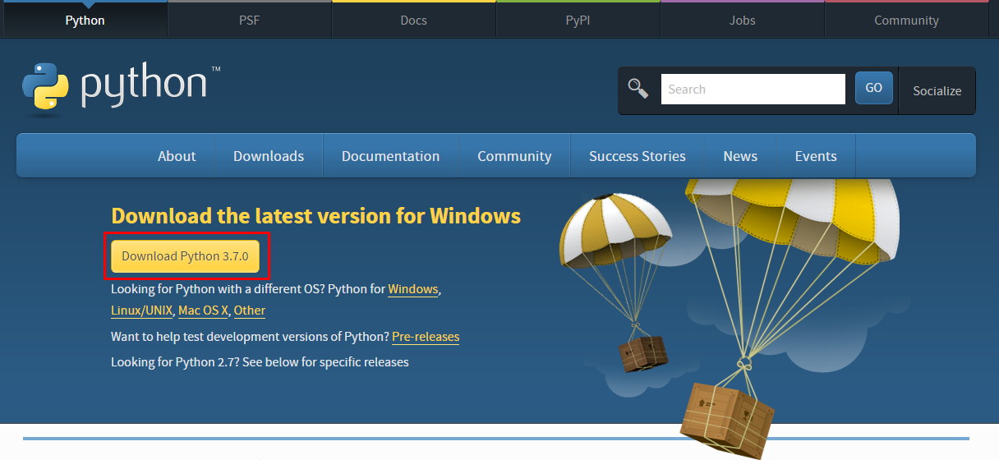
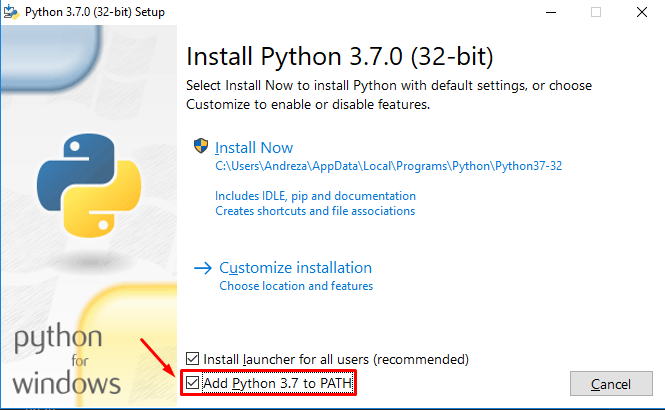
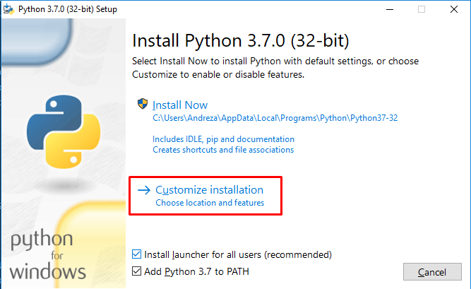
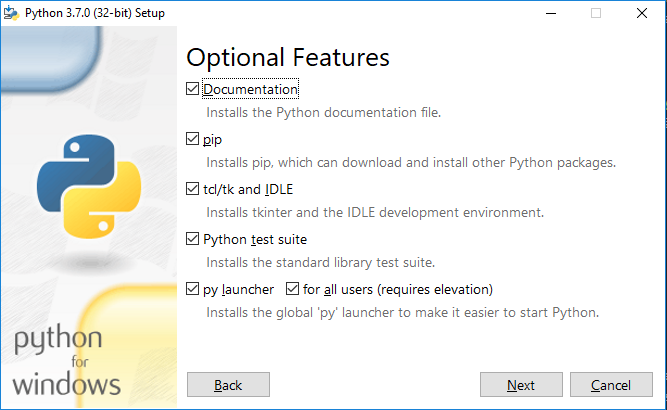
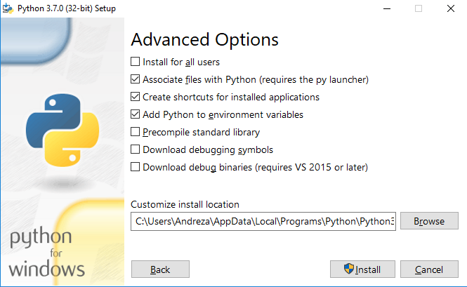
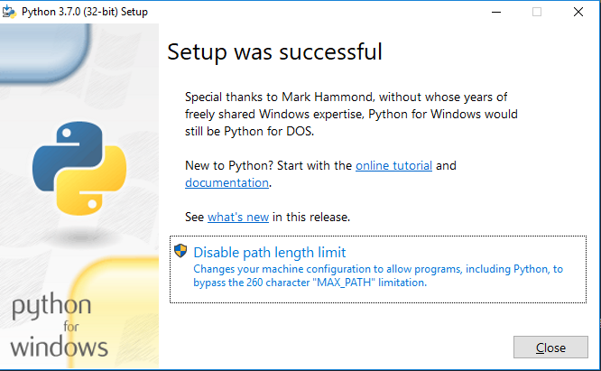

# Apêndice - Instalação

O Python já vem instalado nos sistemas Linux e Mac OS mas será necessário fazer o download da última versão (Python 3.6) para acompanhar a apostila. O Python não vem instalado por padrão no Windows e o download deverá ser feito no site https://www.python.org/ além de algumas configurações extras.

## Instalando o Python no Windows

O primeiro passo é acessar o site do Python: https://www.python.org/. Na sessão de `Downloads` já será disponibilizado o instalador específico do Windows automaticamente, portanto é só baixar o Python3, na sua versão mais atual.



Após o download ser finalizado, abra-o e na primeira tela marque a opção `Add Python 3.X to PATH`. Essa opção é importante para conseguirmos executar o Python dentro do Prompt de Comando do Windows. Caso você não tenha marcado esta opção, terá que configurar a variável de ambiente no Windows de forma manual.



Selecione a instalação customizada somente para ver a instalação com mais detalhes.



Na tela seguinte são as features opcionais, se certifique que o gerenciador de pacotes `pip` esteja selecionado, ele que permite instalar pacotes e bibliotecas no Python. Clique em `Next` para dar seguimento na instalação.



Já na terceira tela, deixe tudo como está, mas se atente ao diretório de instalação do Python, para caso queira procurar o executável ou algo que envolva o seu diretório.



Por fim, basta clicar em `Install` e aguardar o término da instalação.



Terminada a instalação, teste se o Python foi instalado corretamente. Abra o Prompt de Comando e execute:

 ```bash
	python -V
 ```

**OBS:** Para que funcione corretamente é necessário que seja no Prompt de Comando e não em algum programa Git Bash instalado em sua máquina. E o comando `python -V` é importante que esteja com o `V` com letra maiúscula.

Esse comando imprime a versão do Python instalada no Windows. Se a versão for impressa, significa que o Python foi instalado corretamente. Agora, rode o comando `python`:

 ```bash
    python
 ```

Assim você terá acesso ao console do próprio Python, conseguindo assim utilizá-lo.

## Instalando o Python no Linux

Os sistemas operacionais baseados no Debian já possuem o Python3 pré-instalado. Verifique se o seu sistema já possui o Python3 instalado executando o seguinte comando no terminal:

 ```bash
    python3 -V
 ```

**OBS:** O comando `python3 -V` é importante que esteja com o `V` com letra maiúscula.

Este comando retorna a versão do Python3 instalada. Se você ainda não tiver ele instalado, digite os seguintes comandos no terminal:

 ```bash
	sudo apt-get update
	sudo apt-get install python3
 ```

## Instalando o Python no MacOS

A maneira mais fácil de instalar o Python3 no MacOS é utilizando o `Homebrew`. Com o `Homebrew` instalado, abra o terminal e digite os seguintes comandos:

 ```python
	brew update
	brew install python3
 `